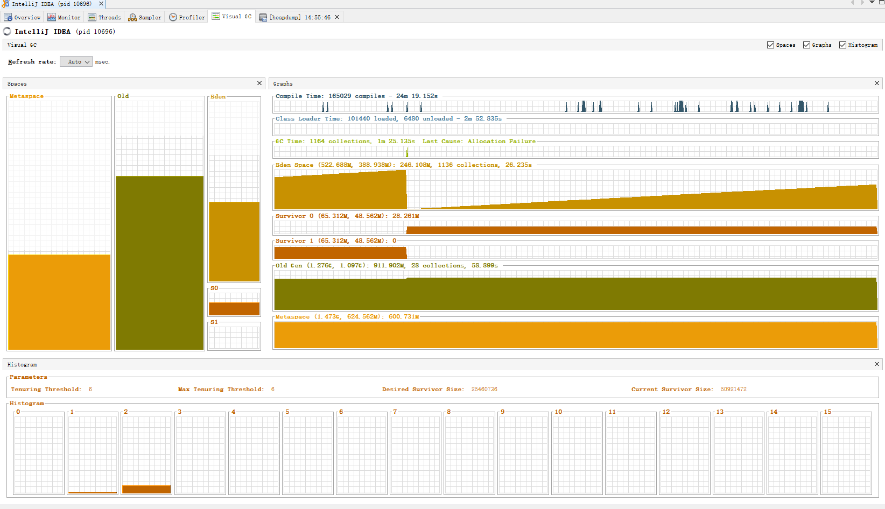

# 5.调优案例与实战

Minror GC是否安全取决于老年代是否有足够的连续空间分配对象

冒险：新生代的对象可能全部存活并超出survivor空间则直接进入老年代，最坏情况全部进入
担保：老年代作为新生代标记-复制算法的担保，需要有足够的空间容纳新生代对象，不够的话通过Full GC来清理空间方便对象分配

## 5.2 案例分析

### 5.2.1 大内存硬件上的程序部署策略

> 这是笔者很久之前处理过的一个案例，但今天仍然具有代表性。一个15万PV/日左右的在线文档类 型网站最近更换了硬件系统，服务器的硬件为四路志强处理器、16GB物理内存，操作系统为64位 CentOS 5.4，Resin作为Web服务器。整个服务器暂时没有部署别的应用，所有硬件资源都可以提供给 这访问量并不算太大的文档网站使用。软件版本选用的是64位的JDK 5，管理员启用了一个虚拟机实 例，使用-Xmx和-Xms参数将Java堆大小固定在12GB。使用一段时间后发现服务器的运行效果十分不 理想，网站经常不定期出现长时间失去响应。

目前单体应用在较大内存的硬件上主要的 部署方式有两种： 

1）通过一个单独的Java虚拟机实例来管理大量的Java堆内存。 

2）同时使用若干个Java虚拟机，建立逻辑集群来利用硬件资源。

> 在许多网站和B/S形式的应用里，多数对象的生存周期都应该是请求级或者页面级的，会话级和全 局级的长生命对象相对较少。只要代码写得合理，实现在超大堆中正常使用没有Full GC应当并不困 难，这样的话，使用超大堆内存时，应用响应速度才可能会有所保证。

注意代码质量，别让大对象长时间生存，或瞬间产生大量大对象

**方法1的问题**

- 回收大块内存带来的STW 直到G1及之后的GC出现才缓解
- 大内存必定64位 64位支持内存管理但存在压缩指针以及缓存行容量增加从而带来额外负担
- 发生OOM无法堆转存储，因为文件过大，也难以分析
- 64位程序内存消耗比32位大，可通过压缩指针等方式解决


**方法2的问题**

- 更为复杂需采用足够强大的架构，例如微服务，但又面临新的问题

  若考虑到按领域划分，状态保留，热转移等需要大量额外组件支持

  例如hystrix centinel nacos sleuth等

- 竞争全局资源 磁盘竞争

- 连接池难以高效利用

- 32位系统受到内存限制（最大4GB）

- 大量使用缓存


问题解决：

- 采用方案2，开启逻辑集群对外服务
- 更换GC改为CMS

### 5.2.2 集群间同步导致的内存溢出

> 一个基于B/S的MIS系统，硬件为两台双路处理器、8GB内存的HP小型机，应用中间件是WebLogic 9.2，每台机器启动了3个WebLogic实例，构成一个6个节点的亲合式集群。由于是亲合式集群，节点之 间没有进行Session同步，但是有一些需求要实现部分数据在各个节点间共享。最开始这些数据是存放 在数据库中的，但由于读写频繁、竞争很激烈，性能影响较大，后面使用JBossCache构建了一个全局 缓存。全局缓存启用后，服务正常使用了一段较长的时间。但在最近不定期出现多次的内存溢出问题。

6个实例，2台物理机，每个2核心

亲和集群，无事务冲突，不需要互相传递状态

产生OOM

让服务带着-XX：+HeapDumpOnOutOfMemoryError 参数运行了一段时间。在最近一次溢出之后，管理员发回了堆转储快照，发现里面存在着大量的 org.jgroups.protocols.pbcast.NAKACK对象。

网络情况+失败重试机制保留的对象不断膨胀导致OOM


### 5.2.3 堆外内存导致的溢出错误

> 这是一个学校的小型项目：基于B/S的电子考试系统，为了实现客户端能实时地从服务器端接收考 试数据，系统使用了逆向AJAX技术（也称为Comet或者Server Side Push），选用CometD 1.1.1作为服 务端推送框架，服务器是Jetty 7.1.4，硬件为一台很普通PC机，Core i5 CPU，4GB内存，运行32位 Windows操作系统。

OOM

> 测试期间发现服务端不定时抛出内存溢出异常，服务不一定每次都出现异常，但假如正式考试时 崩溃一次，那估计整场电子考试都会乱套。网站管理员尝试过把堆内存调到最大，32位系统最多到 1.6GB基本无法再加大了，而且开大了基本没效果，抛出内存溢出异常好像还更加频繁。加入-XX： +HeapDumpOnOutOfMemoryError参数，居然也没有任何反应，抛出内存溢出异常时什么文件都没有 产生。无奈之下只好挂着jstat紧盯屏幕，发现垃圾收集并不频繁，Eden区、Survivor区、老年代以及方 法区的内存全部都很稳定，压力并不大，但就是照样不停抛出内存溢出异常。最后，在内存溢出后从 系统日志中找到异常堆栈如代码清单5-1所示。

```java
[org.eclipse.jetty.util.log] handle failed java.lang.OutOfMemoryError: null
at sun.misc.Unsafe.allocateMemory(Native Method)
at java.nio.DirectByteBuffer.<init>(DirectByteBuffer.java:99)
at java.nio.ByteBuffer.allocateDirect(ByteBuffer.java:288)
at org.eclipse.jetty.io.nio.DirectNIOBuffer.<init>
```

由于最大2GB 分配了1.6 还剩0.4的直接内存，直接内存的回收只能等待FGC


NIO框架直接使用内存

从实践经验的角度出发，在处理小内存或者32位的应用问题时，除了Java堆和方法区之外，我们 注意到下面这些区域还会占用较多的内存，这里所有的内存总和受到操作系统进程最大内存的限制：

- 直接内存：可通过-XX：MaxDirectMemorySize调整大小，内存不足时抛出OutOf-MemoryError或 者OutOfMemoryError：Direct buffer memory。
- 线程堆栈：可通过-Xss调整大小，内存不足时抛出StackOverflowError（如果线程请求的栈深度大 于虚拟机所允许的深度）或者OutOfMemoryError（如果Java虚拟机栈容量可以动态扩展，当栈扩展时 无法申请到足够的内存）。
- Socket缓存区：每个Socket连接都Receive和Send两个缓存区，分别占大约37KB和25KB内存，连接 多的话这块内存占用也比较可观。如果无法分配，可能会抛出IOException：Too many open files异常。
- JNI代码：如果代码中使用了JNI调用本地库，那本地库使用的内存也不在堆中，而是占用Java虚 拟机的本地方法栈和本地内存的。

### 5.2.4 外部命令导致系统缓慢

> 一个数字校园应用系统，运行在一台四路处理器的Solaris 10操作系统上，中间件为GlassFish服务 器。系统在做大并发压力测试的时候，发现请求响应时间比较慢，通过操作系统的mpstat工具发现处 理器使用率很高，但是系统中占用绝大多数处理器资源的程序并不是该应用本身。这是个不正常的现 象，通常情况下用户应用的处理器占用率应该占主要地位，才能说明系统是在正常工作。

linux fork  执行新进程，Java只创建线程

shell通过Java的Runtime.getRuntime().exec()方法来调用的从而产生过多进程

去掉shell脚本调用改为使用Java自带命令获取


### 5.2.5 服务器虚拟机进程崩溃

> 一个基于B/S的MIS系统，硬件为两台双路处理器、8GB内存的HP系统，服务器是WebLogic 9.2（与第二个案例中那套是同一个系统）。正常运行一段时间后，最近发现在运行期间频繁出现集群 节点的虚拟机进程自动关闭的现象，留下了一个hs_err_pid###.log文件后，虚拟机进程就消失了，两台 物理机器里的每个节点都出现过进程崩溃的现象。从系统日志中注意到，每个节点的虚拟机进程在崩 溃之前，都发生过大量相同的异常，见代码清单5-2。

```java
java.net.SocketException: Connection reset
at java.net.SocketInputStream.read(SocketInputStream.java:168)
at java.io.BufferedInputStream.fill(BufferedInputStream.java:218)
at java.io.BufferedInputStream.read(BufferedInputStream.java:235)
at org.apache.axis.transport.http.HTTPSender.readHeadersFromSocket(HTTPSender.java:583)
at org.apache.axis.transport.http.HTTPSender.invoke(HTTPSender.java:143)
... 99 more
```

调用外部接口时间过久导致崩溃

直接耦合导致崩溃，通过消息队列解耦解决

### 5.2.6 不恰当数据结构导致内存占用过大

> 一个后台RPC服务器，使用64位Java虚拟机，内存配置为-Xms4g-Xmx8g-Xmn1g，使用ParNew加 CMS的收集器组合。平时对外服务的Minor GC时间约在30毫秒以内，完全可以接受。但业务上需要每 10分钟加载一个约80MB的数据文件到内存进行数据分析，这些数据会在内存中形成超过100万个 HashMapEntry，在这段时间里面Minor GC就会造成超过500毫秒的停顿，对于这种长度 的停顿时间就接受不了了，具体情况如下面的收集器日志所示。

```java
{Heap before GC invocations=95 (full 4):
par new generation total 903168K, used 803142K [0x00002aaaae770000, 0x00002aaaebb70000, 0x00002aaaebb70000)
eden space 802816K, 100% used [0x00002aaaae770000, 0x00002aaadf770000, 0x00002aaadf770000)
from space 100352K, 0% used [0x00002aaae5970000, 0x00002aaae59c1910, 0x00002aaaebb70000)
to space 100352K, 0% used [0x00002aaadf770000, 0x00002aaadf770000, 0x00002aaae5970000)
concurrent mark-sweep generation total 5845540K, used 3898978K [0x00002aaaebb70000, 0x00002aac507f9000, 0x00002aacae770000)
concurrent-mark-sweep perm gen total 65536K, used 40333K [0x00002aacae770000, 0x00002aacb2770000, 0x00002aacb2770000)
2011-10-28T11:40:45.162+0800: 226.504: [GC 226.504: [ParNew: 803142K-> 100352K(903168K), 0.5995670 secs] 4702120K->4056332K(6748708K), 0.5997560 secs] [Times: user=1.46 sys=0.04, real=0.60 secs]
Heap after GC invocations=96 (full 4):
par new generation total 903168K, used 100352K [0x00002aaaae770000, 0x00002-aaaebb70000, 0x00002aaaebb70000)
eden space 802816K, 0% used [0x00002aaaae770000, 0x00002aaaae770000, 0x00002aaadf770000)
from space 100352K, 100% used [0x00002aaadf770000, 0x00002aaae5970000, 0x00002aaae5970000)
to space 100352K, 0% used [0x00002aaae5970000, 0x00002aaae5970000, 0x00002aaaebb70000)
concurrent mark-sweep generation total 5845540K, used 3955980K [0x00002aaaebb70000, 0x00002aac507f9000, 0x00002aacae770000)
concurrent-mark-sweep perm gen total 65536K, used 40333K [0x00002aacae770000, 0x00002aacb2770000, 0x00002aacb2770000)
}
Total time for which application threads were stopped: 0.6070570 seconds
```


parNew+CMS的GC

Eden区饱满，大量数据对象产生

回收后大量对象存活


观察这个案例的日志，平时Minor GC时间很短，原因是新生代的绝大部分对象都是可清除的，在 Minor GC之后Eden和Survivor基本上处于完全空闲的状态。但是在分析数据文件期间，800MB的Eden 空间很快被填满引发垃圾收集，但Minor GC之后，新生代中绝大部分对象依然是存活的。我们知道 ParNew收集器使用的是复制算法，这个算法的高效是建立在大部分对象都“朝生夕灭”的特性上的，如 果存活对象过多，把这些对象复制到Survivor并维持这些对象引用的正确性就成为一个沉重的负担，因 此导致垃圾收集的暂停时间明显变长。


通过去掉survivor，一次回收直接进入老年带

数-XX：SurvivorRatio=65536、-XX：MaxTenuringThreshold=0或者-XX：+Always-Tenure

**因为这里产生问题的根本原因是用 HashMap结构来存储数据文件空间效率太低了。**

long的数据类型8字节，封装为Long变为24 24*2

封装为entry +16 

hashMap自身的next 8 byte + 4 hash +4 padding

hashMap ref 8 byte
$$
24*2+32+8
$$
所需存储为88 byte

实际占用16/88 = 18%


### 5.2.7 由Windows虚拟内存导致的长时间停顿

有一个带心跳检测功能的GUI桌面程序，每15秒会发送一次心跳检测信号，如果对方30秒以内都 没有信号返回，那就认为和对方程序的连接已经断开。程序上线后发现心跳检测有误报的可能，查询 日志发现误报的原因是程序会偶尔出现间隔约一分钟的时间完全无日志输出，处于停顿状态。

因为是桌面程序，所需的内存并不大（-Xmx256m），所以开始并没有想到是垃圾收集导致的程序 停顿，但是加入参数-XX：+PrintGCApplicationStoppedTime-XX：+PrintGCDate-Stamps-Xloggc： gclog.log后，从收集器日志文件中确认了停顿确实是由垃圾收集导致的，大部分收集时间都控制在100 毫秒以内，但偶尔就出现一次接近1分钟的长时间收集过程。

从收集器日志中找到长时间停顿的具体日志信息（再添加了-XX：+PrintReferenceGC参数），找 到的日志片段如下所示。从日志中看到，真正执行垃圾收集动作的时间不是很长，但从准备开始收 集，到真正开始收集之间所消耗的时间却占了绝大部分。

除收集器日志之外，还观察到这个GUI程序内存变化的一个特点，当它最小化的时候，资源管理 中显示的占用内存大幅度减小，但是虚拟内存则没有变化，因此怀疑程序在最小化时它的工作内存被 自动交换到磁盘的页面文件之中了，这样发生垃圾收集时就有可能因为恢复页面文件的操作导致不正 常的垃圾收集停顿。 在MSDN上查证[2]确认了这种猜想，在Java的GUI程序中要避免这种现象，可以加入参数“- Dsun.awt.keepWorkingSetOnMinimize=true”来解决。这个参数在许多AWT的程序上都有应用，例如 JDK（曾经）自带的VisualVM，启动配置文件中就有这个参数，保证程序在恢复最小化时能够立即响 应。在这个案例中加入该参数，问题马上得到解决。

### 5.2.8 由安全点导致长时间停顿

有一个比较大的承担公共计算任务的离线HBase集群，运行在JDK 8上，使用G1收集器。每天都 有大量的MapReduce或Spark离线分析任务对其进行访问，同时有很多其他在线集群Replication过来的 数据写入，因为集群读写压力较大，而离线分析任务对延迟又不会特别敏感，所以将-XX： MaxGCPauseMillis参数设置到了500毫秒。不过运行一段时间后发现垃圾收集的停顿经常达到3秒以 上，而且实际垃圾收集器进行回收的动作就只占其中的几百毫秒，现象如以下日志所示。

```java
[Times: user=1.51 sys=0.67, real=0.14 secs]
2019-06-25T 12:12:43.376+0800: 3448319.277: Total time for which application threads were stopped: 2.264
```


实际垃圾收集占用时间少但GC过程久

·user：进程执行用户态代码所耗费的处理器时间。 

·sys：进程执行核心态代码所耗费的处理器时间。 

·real：执行动作从开始到结束耗费的时钟时间。

时间浪费在了用户态和内核态的切换上

单核和多核，前者的多核执行时间是内核数量*实际时间

日志显示这次垃圾收集一共花费了0.14秒，但其中用户线程却足足停顿了有2.26秒，两者差距已经 远远超出了正常的TTSP（Time To Safepoint）耗时的范畴。所以先加入参数-XX： +PrintSafepointStatistics和-XX：PrintSafepointStatisticsCount=1去查看安全点日志，具体如下所示：

```java
vmop [threads: total initially_running wait_to_block]
65968.203: ForceAsyncSafepoint [931 1 2]
[time: spin block sync cleanup vmop] page_trap_count
[2255 0 2255 11 0] 1
```

垃圾收集造成线程停顿，线程执行速度不一致导致安全点与自选，都到达后才进行GC

找到慢线程

解决问题的第一步是把这两个特别慢的线程给找出来，这个倒不困难，添加-XX： +SafepointTimeout和-XX：SafepointTimeoutDelay=2000两个参数，让虚拟机在等到线程进入安全点的 时间超过2000毫秒时就认定为超时，这样就会输出导致问题的线程名称，得到的日志如下所示：

**safepoint为维护oopMap加快GC，但维护oopMap导致的safepoint需要线程都运行到可以执行的状态并STW，通过STW维护减少维护OOPMap的成本**

```java
# SafepointSynchronize::begin: Timeout detected:
# SafepointSynchronize::begin: Timed out while spinning to reach a safepoint.
# SafepointSynchronize::begin: Threads which did not reach the safepoint:
# "RpcServer.listener,port=24600" #32 daemon prio=5 os_prio=0 tid=0x00007f4c14b22840
nid=0xa621 runnable [0x0000000000000000]
java.lang.Thread.State: RUNNABLE
# SafepointSynchronize::begin: (End of list)
```

RpcServer.listener,port=24600为超时线程

> 但是HotSpot虚拟机为了避免安全点过多带来过重的负担，对循环 还有一项优化措施，认为循环次数较少的话，执行时间应该也不会太长，所以使用int类型或范围更小 的数据类型作为索引值的循环默认是不会被放置安全点的。这种循环被称为可数循环（Counted Loop），相对应地，使用long或者范围更大的数据类型作为索引值的循环就被称为不可数循环 （Uncounted Loop），将会被放置安全点。通常情况下这个优化措施是可行的，但循环执行的时间不 单单是由其次数决定，如果循环体单次执行就特别慢，那即使是可数循环也可能会耗费很多的时间。

循环判断错误导致到达安全点时间过久

> HotSpot原本提供了-XX：+UseCountedLoopSafepoints参数去强制在可数循环中也放置安全点，不 过这个参数在JDK 8下有Bug [2]，有导致虚拟机崩溃的风险，所以就不得不找到RpcServer线程里面的 缓慢代码来进行修改。最终查明导致这个问题是HBase中一个连接超时清理的函数，由于集群会有多 个MapReduce或Spark任务进行访问，而每个任务又会同时起多个Mapper/Reducer/Executer，其每一个 都会作为一个HBase的客户端，这就导致了同时连接的数量会非常多。更为关键的是，清理连接的索 引值就是int类型，所以这是一个可数循环，HotSpot不会在循环中插入安全点。当垃圾收集发生时， 如果RpcServer的Listener线程刚好执行到该函数里的可数循环时，则必须等待循环全部跑完才能进入安 全点，此时其他线程也必须一起等着，所以从现象上看就是长时间的停顿。找到了问题，解决起来就 非常简单了，把循环索引的数据类型从int改为long即可，但如果不具备安全点和垃圾收集的知识，这 种问题是很难处理的。

重要的还是程序代码的完善，循环慢执行过多任务使用long而不是int让虚拟机更方便设置safepoint


### 5.2.9 小结

1. 大内存部署

   - 使用更优化的GC，回收大内存对象慢
   - 通过集群，微服务化部署（带来复杂性）

2. 集群同步导致

   网络重试导致处理对象累积

3. 堆外内存

   NIO框架直接对剩余可用内存分配

4. 外部命令

   不通过Java命令而是通过Java调用shell命令导致问题

5. 调用导致崩溃

   大量长时间等待导致崩溃，使用MQ解耦

6. 不恰当数据结构

   包装对象增加不必要内存，不要构造复杂包装大对象，不行就分页

7. windows自带的问题

8. safepoint导致的问题

   大循环使用long而不是int，int是可数，命中safepoint策略不认为是长循环导致其他线程等待

## 5.3 实战：Eclipse/IDEA运行速度调优

> 很多Java开发人员都有一种错觉，认为系统调优的工作都是针对服务端应用的，规模越大的系 统，就需要越专业的调优运维团队参与。这个观点不能说不对，只是有点狭隘了。上一节中笔者所列 举的案例确实大多是服务端运维、调优的例子，但不只服务端需要调优，其他应用类型也是需要的， 作为一个普通的Java开发人员，学习到的各种虚拟机的原理和最佳实践方法距离我们并不遥远，开发 者身边就有很多场景可以使用上这些知识。

任何使用JVM的地方都可以进行调优

案例：环境：JDK 5/6 windows系统的eclipse eclipse启动过慢，或者造成内存溢出，查看JVM的内存曲线发现heap的空间在不断扩容说明xms与xmx参数不一致，实际使用的曲线则是上升后突然下降说明触发GC


而永久带大小到了顶端后大小和使用主键靠近重合，说明没有足够的空间分配给永久带导致OOM

永久代OOM，通过扩展永久代大小解决问题

查明了原因，解决方案就简单了，launcher不认识就只好由人来告诉它，在eclipse.ini中明确指定XX：MaxPermSize=256M这个参数，问题随即解决。

jdk8后永久代移动到元空间不后悔触发永久代的OOM转为元空间OOM，方法区存储类信息，常量，静态变量等。永久带也受到内存限制


若是为了多开考虑那么xmx以及xms不应该设置过高从而让每个进程都占用大量资源

### 5.3.1 初始状态

**初始配置**

```properties
-Xms128m
-Xmx750m
-XX:ReservedCodeCacheSize=512m
-XX:+UseG1GC
-XX:SoftRefLRUPolicyMSPerMB=50
-XX:CICompilerCount=2
-XX:+HeapDumpOnOutOfMemoryError
-XX:-OmitStackTraceInFastThrow
-ea
-Dsun.io.useCanonCaches=false
-Djdk.http.auth.tunneling.disabledSchemes=""
-Djdk.attach.allowAttachSelf=true
-Djdk.module.illegalAccess.silent=true
-Dkotlinx.coroutines.debug=off


-Xms2g
-Xmx2g
-XX:ReservedCodeCacheSize=240m
-XX:+UseConcMarkSweepGC
-XX:SoftRefLRUPolicyMSPerMB=50
-ea
-XX:CICompilerCount=2
-Dsun.io.useCanonPrefixCache=false
-Djava.net.preferIPv4Stack=true
-Djdk.http.auth.tunneling.disabledSchemes=""
-XX:+HeapDumpOnOutOfMemoryError
-XX:-OmitStackTraceInFastThrow
-Djdk.attach.allowAttachSelf=true
-Dkotlinx.coroutines.debug=off
-Djdk.module.illegalAccess.silent=true
-Dfile.encoding=UTF-8


```

**初始状态**


**运行了一段时间后的数据**



idea启动可以观察到gc次数较多并且 GC后对象超出survivor大小限制进而直接进入老年代

### 5.3.2调整内存设置gc频率 更换GC

调高堆大小并且使用G1


查看类加载

```cmd
jstat -class 92828
Loaded  Bytes  Unloaded  Bytes     Time
 67960 140701.2       19    18.4      63.38
```

可以看到类加载速度过慢

去掉类加载验证

```properties
-Xverify:none
```

运行

```cmd
jstat -class 118092
Loaded  Bytes  Unloaded  Bytes     Time
 62368 128460.4       37    38.6      40.48
```

可以看到类加载速度快乐1/3

加载耗时主要在

- 编译
- 类加载
- GC


> ：编译时间是指虚拟机的即时编译器（Just In Time Compiler）编译热点代码（Hot Spot Code）的耗时。我们知道Java语言为了实现跨平台的特性，Java代码编译出来后形成Class文件中储存 的是字节码（Byte Code），虚拟机通过解释方式执行字节码命令，比起C/C++编译成本地二进制代码 来说，速度要慢不少。为了解决程序解释执行的速度问题，JDK 1.2以后，HotSpot虚拟机内置了两个 即时编译器[4]，如果一段Java方法被调用次数到达一定程度，就会被判定为热代码交给即时编译器即 时编译为本地代码，提高运行速度（这就是HotSpot虚拟机名字的来由）。

通过即时编译提高运行效率，并且执行

运行时编译提高效率，随着Java运行时间变长

**参数-Xint来禁止编译器运作，然而虽然编译时间降低，但大大提高执行时间总之效率降低**


观察GC问题

```cmd
jstat -gccause 17192
  S0     S1     E      O      M     CCS    YGC     YGCT    FGC    FGCT     GCT    LGCC                 GCC              
  0.00 100.00  43.65  55.87  95.55  88.43     18    0.963     0    0.000    0.963 G1 Evacuation Pause  No GC
```

可以看到因为G1的疏散暂停导致GC在数据移动阶段产生


### 5.3.3小结

> 到这里为止，对于虚拟机内存的调优基本就结束了，这次实战可以看作一次简化的服务端调优过 程，服务端调优有可能还会在更多方面，如数据库、资源池、磁盘I/O等，但对于虚拟机内存部分的优 化，与这次实战中的思路没有什么太大差别。

1. 使用合适的程序运行观察工具

2. 判断程序耗时在哪里

3. 若GC时间过久则需要判断

   - 空间重分配触发（设定的内存不足）

   - 年轻代频繁GC（xmn）太小

     通过-xmn提高新生代大小

   - 去掉类加载验证

   - 不断GC，存在大对象

Java虚拟机的内存管理与垃圾收集是虚拟机结构体系中最重要的组成部分，对程序的性能和稳定 有着非常大的影响。在本书的第2～5章里，笔者从

- 理论知识

  Java内存模型

  类加载机制

  分代收集理论

  跨代收集理论

  GC算法

  GC具体实现特点 safe point oopMap 三色算法 

  具体GC ZGC的着色指针

- 异常现象

  各类OOM线程

  - 堆溢出
  - 栈溢出
  - 方法区溢出
  - 直接内存溢出
  - 线程OOM

- 代码

- 工具

  - jps

    Java运行程序

  - jinfo

    配置

  - jstat

    Java统计信息

  - jmap

    Java内存映射

  - jhat

    Java内存分析

- 案例

  - 大内存Java实例运行案例
  - safepoint导致GC停顿过久
  - 堆外内存溢出
  - 不合理的数据结构

- 实战

  idea尝试调优

等 几个方面对其进行讲解，希望读者能有所收获。

