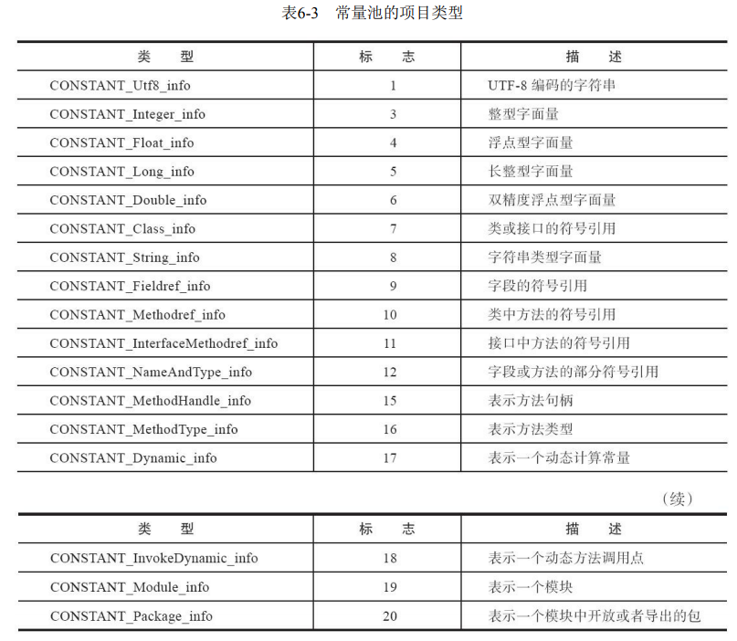
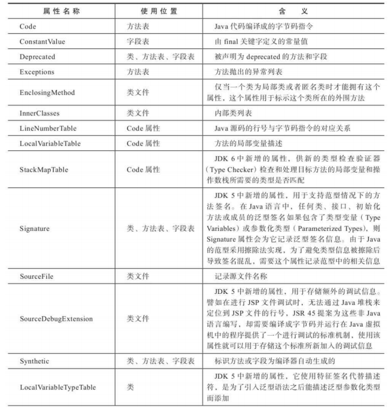
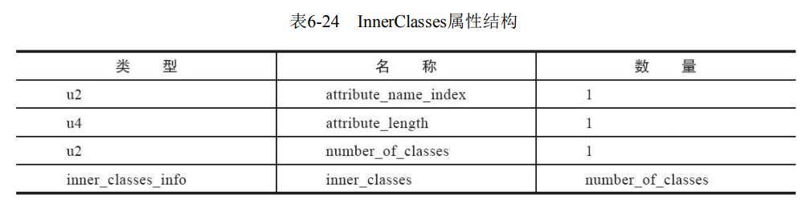

# 6.类文件结构

代码编译的结果从本地机器码转变为字节码，是存储格式发展的一小步，却是编程语言发展的一 大步。

- 编译是语言转换
- 不是.java变为.class么


## 6.1概述

> 曾记得在第一堂计算机程序课上老师就讲过：“计算机只认识0和1，所以我们写的程序需要被编译 器翻译成由0和1构成的二进制格式才能被计算机执行。”十多年过去了，今天的计算机仍然只能识别0 和1，但由于最近十年内虚拟机以及大量建立在虚拟机之上的程序语言如雨后春笋般出现并蓬勃发展， 把**我们编写的程序编译成二进制本地机器码（Native Code）已不再是唯一的选择**，越来越多的程序语 言选择了**与操作系统和机器指令集无关的、平台中立的格式作为程序编译后的存储格式**。

- 什么是操作系统和指令集无关


## 6.2 无关性的基石

**一次编写，到处运行 （Write Once，Run Anywhere）**

通过虚拟机，载入和执行平台无关字节码从而实现一次编写到处运行

> **各种不同平台的Java虚拟机，以及所有平台都统一支持的程序存储格式——字节码（Byte Code） 是构成平台无关性的基石**，但本节标题中笔者刻意省略了“平台”二字，那是因为笔者注意到虚拟机的 另外一种中立特性——语言无关性正在越来越被开发者所重视。直到今天，或许还有相当一部分程序 员认为Java虚拟机执行Java程序是一件理所当然和天经地义的事情。但在Java技术发展之初，设计者们 就曾经考虑过并实现了让其他语言运行在Java虚拟机之上的可能性，他们在发布规范文档的时候，也 刻意把Java的规范拆分成了《Java语言规范》（The Java Language Specification）及《Java虚拟机规范》 （The Java Virtual Machine Specification）两部分。并且早在1997年发表的第一版《Java虚拟机规范》中 就曾经承诺过：“在未来，我们会对Java虚拟机进行适当的扩展，以便更好地支持其他语言运行于Java 虚拟机之上”（In the future，we will consider bounded extensions to the Java virtual machine to provide better support for other languages）。Java虚拟机发展到今天，尤其是在2018年，基于HotSpot扩展而来 的GraalVM公开之后，当年的虚拟机设计者们已经基本兑现了这个承诺。
>
> 时至今日，商业企业和开源机构已经在Java语言之外发展出一大批运行在Java虚拟机之上的语言， 如Kotlin、Clojure、Groovy、JRuby、JPython、Scala等。相比起基数庞大的Java程序员群体，使用过这 些语言的开发者可能还不是特别多，但是听说过的人肯定已经不少，随着时间的推移，谁能保证日后 Java虚拟机在语言无关性上的优势不会赶上甚至超越它在平台无关性上的优势呢？

**平台统一字节码，字节码由虚拟机运行，Java与虚拟机交互，虚拟机与底层操作系统交互，中间解耦**

> 实现语言无关性的基础仍然是虚拟机和字节码存储格式。Java虚拟机不与包括Java语言在内的任何 程序语言绑定，它只与“Class文件”这种特定的二进制文件格式所关联，Class文件中包含了Java虚拟机 指令集、符号表以及若干其他辅助信息。


**通过编译器+虚拟机+字节码 实现语言无关**

## 6.3 Class类文件的结构

解析Class文件的数据结构，字典，枯燥，理解JVM必备


> Java技术能够一直保持着非常良好的向后兼容性，Class文件结构的稳定功不可没，任何一门程序 语言能够获得商业上的成功，都不可能去做升级版本后，旧版本编译的产品就不再能够运行这种事 情。本章所讲述的关于Class文件结构的内容，绝大部分都是在第一版的《Java虚拟机规范》（1997年 发布，对应于JDK 1.2时代的Java虚拟机）中就已经定义好的，内容虽然古老，但时至今日，Java发展 经历了十余个大版本、无数小更新，那时定义的Class文件格式的各项细节几乎没有出现任何改变。尽 管不同版本的《Java虚拟机规范》对Class文件格式进行了几次更新，但基本上只是在原有结构基础上 新增内容、扩充功能，并未对已定义的内容做出修改。

- 向后兼容
- 结构稳定
- 新增和扩展

> 任何一个Class文件都对应着唯一的一个类或接口的定义信息[1]，但是反过来说，类或 接口并不一定都得定义在文件里（譬如类或接口也可以动态生成，直接送入类加载器中）。本章中， 笔者只是通俗地将任意一个有效的类或接口所应当满足的格式称为“Class文件格式”，实际上它完全不 需要以磁盘文件的形式存在。

- 类或接口可以运行时动态载入
- 一个class文件对应一个类或接口，反之不一定

> Class文件是一组以8个字节为基础单位的二进制流，各个数据项目严格按照顺序紧凑地排列在文 件之中，中间没有添加任何分隔符，这使得整个Class文件中存储的内容几乎全部是程序运行的必要数 据，没有空隙存在。当遇到需要占用8个字节以上空间的数据项时，则会按照高位在前[2]的方式分割 成若干个8个字节进行存储。

- 8个字节一个基础单位

- 怎么确保没有任何空隙

  通过伪结构体来定义结构

> 根据《Java虚拟机规范》的规定，Class文件格式采用一种类似于C语言结构体的伪结构来存储数 据，这种伪结构中只有两种数据类型：“无符号数”和“表”。后面的解析都要以这两种数据类型为基 础，所以这里笔者必须先解释清楚这两个概念。
>
> ·无符号数属于基本的数据类型，以u1、u2、u4、u8来分别代表1个字节、2个字节、4个字节和8个 字节的无符号数，无符号数可以用来描述数字、索引引用、数量值或者按照UTF-8编码构成字符串 值。
>
> ·表是由多个无符号数或者其他表作为数据项构成的复合数据类型，为了便于区分，所有表的命名 都习惯性地以“_info”结尾。表用于描述有层次关系的复合结构的数据，整个Class文件本质上也可以视 作是一张表，这张表由表6-1所示的数据项按严格顺序排列构成。
>
> 本节结束之前，笔者需要再强调一次，Class的结构不像XML等描述语言，由于它没有任何分隔符 号，所以在表6-1中的数据项，无论是顺序还是数量，甚至于数据存储的字节序（Byte Ordering，Class 文件中字节序为Big-Endian）这样的细节，都是被严格限定的，哪个字节代表什么含义，长度是多少， 先后顺序如何，全部都不允许改变。接下来，我们将一起看看这个表中各个数据项的具体含义。
>
> 

- 无符号数=》基本数据类型
- 表=》基本数据类型的集合 更为复杂的数据结构
- 通过严格的结构体定义来确保没有空隙

### 6.3.1 魔数与Class文件的版本

class文件内容（单位byte）

- 标识头 0xCAFEBABE 4
- 版本号 
  - 次版本号 2
  - 主版本号 2
- 

> 每个Class文件的头4个字节被称为魔数（Magic Number），它的唯一作用是确定这个文件是否为 一个能被虚拟机接受的Class文件。不仅是Class文件，很多文件格式标准中都有使用魔数来进行身份识 别的习惯，譬如图片格式，如GIF或者JPEG等在文件头中都存有魔数。**使用魔数而不是扩展名来进行识别主要是基于安全考虑，因为文件扩展名可以随意改动。**文件格式的制定者可以自由地选择魔数 值，只要这个魔数值还没有被广泛采用过而且不会引起混淆。Class文件的魔数取得很有“浪漫气息”， 值为0xCAFEBABE（咖啡宝贝？）。这个魔数值在Java还被称作“Oak”语言的时候（大约是1991年前 后）就已经确定下来了。它还有一段很有趣的历史，据Java开发小组最初的关键成员Patrick Naughton 所说：“我们一直在寻找一些好玩的、容易记忆的东西，选择0xCAFEBABE是因为它象征着著名咖啡 品牌Peet’s Coffee深受欢迎的Baristas咖啡。” [1]这个魔数似乎也预示着日后“Java”这个商标名称的出 现。

- 二进制文件的开头部分标识出这个文件是什么文件
- 出于安全考虑使用不易更改的文件内部字节来定义
- 0xCAFEBABE

> 紧接着魔数的4个字节存储的是Class文件的版本号：第5和第6个字节是次版本号（Minor Version），第7和第8个字节是主版本号（Major Version）。Java的版本号是从45开始的，JDK 1.1之后 的每个JDK大版本发布主版本号向上加1（JDK 1.0～1.1使用了45.0～45.3的版本号），高版本的JDK能 向下兼容以前版本的Class文件，但不能运行以后版本的Class文件，因为《Java虚拟机规范》在Class文 件校验部分明确要求了即使文件格式并未发生任何变化，虚拟机也必须拒绝执行超过其版本号的Class 文件。

- 虚拟机以版本号判断能否执行class文件，低版本虚拟机不执行高版本class文件，即使内部内容不变只是版本升级
- 高版本兼容低版本


文件编译

```java
public class TestClass {
	private int m;
	public int inc(){
		return m+1;
	}
}
```


版本对比


### 6.3.2 常量池

> 紧接着主、次版本号之后的是常量池入口，常量池可以比喻为Class文件里的资源仓库，它是Class 文件结构中与其他项目关联最多的数据，通常也是占用Class文件空间最大的数据项目之一，另外，它 还是在Class文件中第一个出现的表类型数据项目。
>
> 由于常量池中常量的数量是不固定的，所以在常量池的入口需要放置一项u2类型的数据，代表常 量池容量计数值（constant_pool_count）。与Java中语言习惯不同，这个容量计数是从1而不是0开始 的，如图6-3所示，常量池容量（偏移地址：0x00000008）为十六进制数0x0016，即十进制的22，这就 代表常量池中有21项常量，索引值范围为1～21。在Class文件格式规范制定之时，设计者将第0项常量 空出来是有特殊考虑的，这样做的目的在于，如果后面某些指向常量池的索引值的数据在特定情况下 需要表达“不引用任何一个常量池项目”的含义，可以把索引值设置为0来表示。Class文件结构中只有 常量池的容量计数是从1开始，对于其他集合类型，包括接口索引集合、字段表集合、方法表集合等的 容量计数都与一般习惯相同，是从0开始。


- 入口处是一个U2计数
- 值是0x0013=19
- 18个常量
- 索引1-18
- 第0个常量代表**如果后面某些指向常量池的索引值的数据在特定情况下 需要表达“不引用任何一个常量池项目”的含义**

> 常量池中主要存放两大类常量：字面量（Literal）和符号引用（Symbolic References）。字面量比 较接近于Java语言层面的常量概念，如文本字符串、被声明为final的常量值等。而符号引用则属于编译 原理方面的概念，主要包括下面几类常量：
>
> - 被模块导出或者开放的包（Package） 
> - 类和接口的全限定名（Fully Qualified Name） 
> - 字段的名称和描述符（Descriptor） ·方法的名称和描述符 
> - 方法句柄和方法类型（Method Handle、Method Type、Invoke Dynamic） 
> - 动态调用点和动态常量（Dynamically-Computed Call Site、Dynamically-Computed Constant）

两类常量

- 正常常量，String或者final修饰的Java常量
- 编译原理意义上的常量，代表某个class的元数据常量
  - 包信息
  - 类和接口的全限定名
  - 字段的名称和描述符
  - 方法句柄和方法类型
  - 动态调用点和动态常量

> Java代码在进行Javac编译的时候，并不像C和C++那样有“连接”这一步骤，而是在虚拟机加载Class 文件的时候进行动态连接（具体见第7章）。也就是说，在Class文件中不会保存各个方法、字段最终 在内存中的布局信息，这些字段、方法的符号引用不经过虚拟机在运行期转换的话是无法得到真正的 内存入口地址，也就无法直接被虚拟机使用的。**当虚拟机做类加载时，将会从常量池获得对应的符号 引用，再在类创建时或运行时解析、翻译到具体的内存地址之中。关于类的创建和动态连接的内容， 在下一章介绍虚拟机类加载过程时再详细讲解。**

- 类加载，指向符号引用
- 对象创建动态链接

> 17类表都有一个共同的特点，表结构起始的第一位是个u1类型的标志位（tag，取值见表6-3中标 志列），代表着当前常量属于哪种常量类型。17种常量类型所代表的具体含义如表6-3所示。
>
> 之所以说常量池是最烦琐的数据，是因为这17种常量类型各自有着完全独立的数据结构，两两之 间并没有什么共性和联系，因此只能逐项进行讲解。

常量池项目类型



根据类型索引找到常量类型，然后根据常量类型阅读其对应结构


字符串

> 顺便提一下，由于Class文件中方法、字段等都需要引用CONSTANT_Utf8_info型常量来描述名 称，所以CONSTANT_Utf8_info型常量的最大长度也就是Java中方法、字段名的最大长度。而这里的 最大长度就是length的最大值，既u2类型能表达的最大值65535。所以Java程序中如果定义了超过64KB 英文字符的变量或方法名，即使规则和全部字符都是合法的，也会无法编译。

由于字符串结构如下


因此length是u2类型因此最多表示65535个，再多就无法表示

javap -verbose xxxclass来反编译

```java
D:\Learning\Design_Pattern\src\priv\wzb\jvm\class_structure>javap -verbose TestClass.class
Classfile /D:/Learning/Design_Pattern/src/priv/wzb/jvm/class_structure/TestClass.class
  Last modified 2021-7-23; size 304 bytes
  MD5 checksum ac06d2948ca56ddf3fc503bfa3232b3c
  Compiled from "TestClass.java"
public class priv.wzb.jvm.class_structure.TestClass
  minor version: 0
  major version: 55
  flags: ACC_PUBLIC, ACC_SUPER
Constant pool:
   #1 = Methodref          #4.#15         // java/lang/Object."<init>":()V
   #2 = Fieldref           #3.#16         // priv/wzb/jvm/class_structure/TestClass.m:I
   #3 = Class              #17            // priv/wzb/jvm/class_structure/TestClass
   #4 = Class              #18            // java/lang/Object
   #5 = Utf8               m
   #6 = Utf8               I
   #7 = Utf8               <init>
   #8 = Utf8               ()V
   #9 = Utf8               Code
  #10 = Utf8               LineNumberTable
  #11 = Utf8               inc
  #12 = Utf8               ()I
  #13 = Utf8               SourceFile
  #14 = Utf8               TestClass.java
  #15 = NameAndType        #7:#8          // "<init>":()V
  #16 = NameAndType        #5:#6          // m:I
  #17 = Utf8               priv/wzb/jvm/class_structure/TestClass
  #18 = Utf8               java/lang/Object
{
  public priv.wzb.jvm.class_structure.TestClass();
    descriptor: ()V
    flags: ACC_PUBLIC
    Code:
      stack=1, locals=1, args_size=1
         0: aload_0
         1: invokespecial #1                  // Method java/lang/Object."<init>":()V
         4: return
      LineNumberTable:
        line 10: 0

  public int inc();
    descriptor: ()I
    flags: ACC_PUBLIC
    Code:
      stack=2, locals=1, args_size=1
         0: aload_0
         1: getfield      #2                  // Field m:I
         4: iconst_1
         5: iadd
         6: ireturn
      LineNumberTable:
        line 13: 0
}
SourceFile: "TestClass.java"
```

**常量池索引**


### 6.3.3 访问标识


> access_flags中一共有16个标志位可以使用，当前只定义了其中9个[1]，没有使用到的标志位要求一 律为零。以代码清单6-1中的代码为例，TestClass是一个普通Java类，不是接口、枚举、注解或者模 块，被public关键字修饰但没有被声明为final和abstract，并且它使用了JDK 1.2之后的编译器进行编 译，因此它的ACC_PUBLIC、ACC_SUPER标志应当为真，而ACC_FINAL、ACC_INTERFACE、 ACC_ABSTRACT、ACC_SYNTHETIC、ACC_ANNOTATION、ACC_ENUM、ACC_MODULE这七 个标志应当为假，因此它的access_flags的值应为：0x0001|0x0020=0x0021。从图6-5中看到，access_flags 标志（偏移地址：0x000000EF）的确为0x0021。

- 访问标识采用位标识的方案，为true 就将相应的标识位置为对应值

### 6.3.4 类索引、父类索引与接口索引集合

> 类索引（this_class）和父类索引（super_class）都是一个u2类型的数据，而接口索引集合 （interfaces）是一组u2类型的数据的集合，Class文件中由这三项数据来确定该类型的继承关系。类索 引用于确定这个类的全限定名，父类索引用于确定这个类的父类的全限定名。由于Java语言不允许多 重继承，所以父类索引只有一个，除了java.lang.Object之外，所有的Java类都有父类，因此除了 java.lang.Object外，所有Java类的父类索引都不为0。接口索引集合就用来描述这个类实现了哪些接 口，这些被实现的接口将按implements关键字（如果这个Class文件表示的是一个接口，则应当是 extends关键字）后的接口顺序从左到右排列在接口索引集合中。

索引确定全限定名，确定接口继承关系。

通过观察类文件解析+索引位置可直到类索引和父类索引`00 03 00 04 00 00`分别代表什么

```java
   #3 = Class              #17            // priv/wzb/jvm/class_structure/TestClass
   #4 = Class              #18            // java/lang/Object
```

### 6.3.5 字段表集合

> 字段表（field_info）用于描述接口或者类中声明的变量。Java语言中的“字段”（Field）包括类级变 量以及实例级变量，但不包括在方法内部声明的局部变量。读者可以回忆一下在Java语言中描述一个 字段可以包含哪些信息。字段可以包括的修饰符有字段的作用域（public、private、protected修饰 符）、是实例变量还是类变量（static修饰符）、可变性（final）、并发可见性（volatile修饰符，是否 强制从主内存读写）、可否被序列化（transient修饰符）、字段数据类型（基本类型、对象、数组）、 字段名称。上述这些信息中，各个修饰符都是布尔值，要么有某个修饰符，要么没有，很适合使用标 志位来表示。而字段叫做什么名字、字段被定义为什么数据类型，这些都是无法固定的，只能引用常 量池中的常量来描述。表6-8中列出了字段表的最终格式。

字段表类型

- 范围修饰符 public
- 是否静态 static
- 是否不可变 final
- 是否线程可见 volatile
- 是否不可序列化 transient
- 具体类型 primitive/数组/对象


> 很明显，由于语法规则的约束，ACC_PUBLIC、ACC_PRIVATE、ACC_PROTECTED三个标志最 多只能选择其一，ACC_FINAL、ACC_VOLATILE不能同时选择。接口之中的字段必须有 ACC_PUBLIC、ACC_STATIC、ACC_FINAL标志，这些都是由Java本身的语言规则所导致的。

- 既然final则不可能volatile因为不可变所以不需要通知其他线程字段变化

> 跟随access_flags标志的是两项索引值：name_index和descriptor_index。它们都是对常量池项的引 用，分别代表着字段的简单名称以及字段和方法的描述符。现在需要解释一下“简单名称”“描述符”以 及前面出现过多次的“全限定名”这三种特殊字符串的概念。 全限定名和简单名称很好理解，以代码清单6-1中的代码为例，“org/fenixsoft/clazz/TestClass”是这 个类的全限定名，仅仅是把类全名中的“.”替换成了“/”而已，为了使连续的多个全限定名之间不产生混 淆，在使用时最后一般会加入一个“；”号表示全限定名结束。简单名称则就是指没有类型和参数修饰 的方法或者字段名称，这个类中的inc()方法和m字段的简单名称分别就是“inc”和“m”。 相比于全限定名和简单名称，方法和字段的描述符就要复杂一些。描述符的作用是用来描述字段 的数据类型、方法的参数列表（包括数量、类型以及顺序）和返回值。根据描述符规则，基本数据类 型（byte、char、double、float、int、long、short、boolean）以及代表无返回值的void类型都用一个大 写字符来表示，而对象类型则用字符L加对象的全限定名来表示，详见表6-10。


根据标识符描述可读取方法的具体定义

> 用描述符来描述方法时，按照先参数列表、后返回值的顺序描述，参数列表按照参数的严格顺序 放在一组小括号“()”之内。如方法void inc()的描述符为“()V”，方法java.lang.String toString()的描述符 为“()Ljava/lang/String；”，方法int indexOf(char[]source，int sourceOffset，int sourceCount，char[]target， int targetOffset，int targetCount，int fromIndex)的描述符为“([CII[CIII)I”。
>
> 字段表集合中不会列出从父类或者父接口中继承而来的字段，但有可能出现原本Java代码之中不 存在的字段，譬如在内部类中为了保持对外部类的访问性，编译器就会自动添加指向外部类实例的字 段。另外，在Java语言中字段是无法重载的，两个字段的数据类型、修饰符不管是否相同，都必须使 用不一样的名称，但是对于Class文件格式来讲，只要两个字段的描述符不是完全相同，那字段重名就 是合法的。

- 字段表不保存父类/接口中继承的字段
- 可能注入Java中不存在的字段例如对外部类的引用
- Java的字段不允许重载，字段名必须不同，但class文件只要描述符不同允许重名

### 6.3.6 方法表集合

> 如果理解了上一节关于字段表的内容，那本节关于方法表的内容将会变得很简单。Class文件存储 格式中对方法的描述与对字段的描述采用了几乎完全一致的方式，方法表的结构如同字段表一样，依 次包括访问标志（access_flags）、名称索引（name_index）、描述符索引（descriptor_index）、属性表 集合（attributes）几项，如表6-11所示。这些数据项目的含义也与字段表中的非常类似，仅在访问标 志和属性表集合的可选项中有所区别。

- 访问标识
- 索引集合
- 属性集合


> 因为volatile关键字和transient关键字不能修饰方法，所以方法表的访问标志中没有了 ACC_VOLATILE标志和ACC_TRANSIENT标志。与之相对，synchronized、native、strictfp和abstract 关键字可以修饰方法，方法表的访问标志中也相应地增加了ACC_SYNCHRONIZED、 ACC_NATIVE、ACC_STRICTFP和ACC_ABSTRACT标志。对于方法表，所有标志位及其取值可参见 表6-12。

- 方法表和字段表的区别
  - 方法表不支持transient/volatile
  - 方法额外支持一些字段例如synchronized native abstract strictfp


> 行文至此，也许有的读者会产生疑问，方法的定义可以通过访问标志、名称索引、描述符索引来 表达清楚，但方法里面的代码去哪里了？方法里的Java代码，经过Javac编译器编译成字节码指令之 后，存放在方法属性表集合中一个名为“Code”的属性里面，属性表作为Class文件格式中最具扩展性的 一种数据项目，将在下一节中详细讲解。

通过code属性存储方法具体代码

> 与字段表集合相对应地，如果父类方法在子类中没有被重写（Override），方法表集合中就不会出 现来自父类的方法信息。但同样地，有可能会出现由编译器自动添加的方法，最常见的便是类构造 器“()”方法和实例构造器“()”方法

- 若方法重写则携带父类信息
- 方法表会被编译器添加额外的方法信息 例如类构造器和实例构造器

> 在《Java虚拟机规范》第2版的4.4.4节及《Java语言规范》第3版的8.4.2节中分别都定义了字节码层 面的方法特征签名以及Java代码层面的方法特征签名，Java代码的方法特征签名只包括方法名称、参数 顺序及参数类型，而字节码的特征签名还包括方法返回值以及受查异常表，请读者根据上下文语境注 意区分。

- Java和class文件对于方法签名的描述不同
- Java文件的方法签名是方法名+参数列表类型+参数列表顺序
- class文件的方法签名是方法名+参数列表类型+参数列表顺序+返回值+受查异常表（编译时受查异常表）

### 6.3.7 属性表集合

属性表（attribute_info）在前面的讲解之中已经出现过数次，Class文件、字段表、方法表都可以 **携带自己的属性表集合，以描述某些场景专有的信息。**

属性表预定义属性




> 对于每一个属性，它的名称都要从常量池中引用一个CONSTANT_Utf8_info类型的常量来表示， 而属性值的结构则是完全自定义的，只需要通过一个u4的长度属性去说明属性值所占用的位数即可。 一个符合规则的属性表应该满足表6-14中所定义的结构。

- 属性是kv形式，key用utf-8常量描述
- 属性值则无论什么形式只要是u4能描述长度的即可


#### 1.Code属性


栈深度


```java
    Code:
      stack=1, locals=1, args_size=1
         0: aload_0
         1: invokespecial #1                  // Method java/lang/Object."<init>":()V
         4: return
      LineNumberTable:
        line 10: 0

  public int inc();
    descriptor: ()I
    flags: ACC_PUBLIC
    Code:
      stack=2, locals=1, args_size=1
         0: aload_0
         1: getfield      #2                  // Field m:I
         4: iconst_1
         5: iadd
         6: ireturn
      LineNumberTable:
        line 13: 0
```

> max_stack代表了操作数栈（Operand Stack）深度的最大值。在方法执行的任意时刻，操作数栈都 不会超过这个深度。虚拟机运行的时候需要根据这个值来分配栈帧（Stack Frame）中的操作栈深度。

- 栈深度来决定栈帧

> max_locals代表了局部变量表所需的存储空间。在这里，max_locals的单位是变量槽（Slot），变量 槽是虚拟机为局部变量分配内存所使用的最小单位。对于byte、char、float、int、short、boolean和 returnAddress等长度不超过32位的数据类型，每个局部变量占用一个变量槽，而double和long这两种64 位的数据类型则需要两个变量槽来存放。方法参数（包括实例方法中的隐藏参数“this”）、显式异常处 理程序的参数（Exception Handler Parameter，就是try-catch语句中catch块中所定义的异常）、方法体中 定义的局部变量都需要依赖局部变量表来存放。注意，并不是在方法中用了多少个局部变量，就把这 些局部变量所占变量槽数量之和作为max_locals的值，操作数栈和局部变量表直接决定一个该方法的栈 帧所耗费的内存，不必要的操作数栈深度和变量槽数量会造成内存的浪费。Java虚拟机的做法是将局 部变量表中的变量槽进行重用，当代码执行超出一个局部变量的作用域时，这个局部变量所占的变量 槽可以被其他局部变量所使用，Javac编译器会根据变量的作用域来分配变量槽给各个变量使用，根据 同时生存的最大局部变量数量和类型计算出max_locals的大小。

- 单位 slot
- 根据局部变量数量+类型计算得出

> code_length和code用来存储Java源程序编译后生成的字节码指令。code_length代表字节码长度， code是用于存储字节码指令的一系列字节流。既然叫字节码指令，那顾名思义每个指令就是一个u1类 型的单字节，当虚拟机读取到code中的一个字节码时，就可以对应找出这个字节码代表的是什么指 令，并且可以知道这条指令后面是否需要跟随参数，以及后续的参数应当如何解析。我们知道一个u1 数据类型的取值范围为0x00～0xFF，对应十进制的0～255，也就是一共可以表达256条指令。目前， 《Java虚拟机规范》已经定义了其中约200条编码值对应的指令含义，编码与指令之间的对应关系可查 阅本书的附录C“虚拟机字节码指令表”

- code_length理论u4 代表2^32 = 65535个指令
- 实际上使用u2 超出则无法编译通过
- jsp的编译可能导致方法超出限制

**反编译**

```java
{
  public priv.wzb.jvm.class_structure.TestClass();
    descriptor: ()V
    flags: ACC_PUBLIC
    Code:
      stack=1, locals=1, args_size=1
         0: aload_0
         1: invokespecial #1                  // Method java/lang/Object."<init>":()V
         4: return
      LineNumberTable:
        line 10: 0

  public int inc();
    descriptor: ()I
    flags: ACC_PUBLIC
    Code:
      stack=2, locals=1, args_size=1
         0: aload_0
         1: getfield      #2                  // Field m:I
         4: iconst_1
         5: iadd
         6: ireturn
      LineNumberTable:
        line 13: 0
}
```


> 如果大家注意到javap中输出的“Args_size”的值，可能还会有疑问：这个类有两个方法——实例构 造器()和inc()，这两个方法很明显都是没有参数的，为什么Args_size会为1？而且无论是在参数列 表里还是方法体内，都没有定义任何局部变量，那Locals又为什么会等于1？如果有这样疑问的读者， 大概是忽略了一条Java语言里面的潜规则：在任何实例方法里面，都可以通过“this”关键字访问到此方 法所属的对象。这个访问机制对Java程序的编写很重要，而它的实现非常简单，仅仅是通过在Javac编 译器编译的时候把对this关键字的访问转变为对一个普通方法参数的访问，然后在虚拟机调用实例方法 时自动传入此参数而已。因此在实例方法的局部变量表中至少会存在一个指向当前对象实例的局部变 量，局部变量表中也会预留出第一个变量槽位来存放对象实例的引用，所以实例方法参数值从1开始计 算。这个处理只对实例方法有效，如果代码清单6-1中的inc()方法被声明为static，那Args_size就不会等 于1而是等于0了。

- arg_size代表参数数量
- 在非静态方法中arg_size至少为1 因为每个方法都有this指向当前对象
  - this的具体实现则通过直接引用一个参数指向对象实现
  - 默认第0个索引就是指向对象的参数
- 静态方法没有这个参数从arg_size从0开始计数

> 在字节码指令之后的是这个方法的显式异常处理表（下文简称“异常表”）集合，异常表对于Code 属性来说并不是必须存在的，如代码清单6-4中就没有异常表生成。


> 编译器为这段Java源码生成了三条异常表记录，对应三条可能出现的代码执行路径。从Java代码的 语义上讲，这三条执行路径分别为： 
>
> - 如果try语句块中出现属于Exception或其子类的异常，转到catch语句块处理； 
> - 如果try语句块中出现不属于Exception或其子类的异常，转到finally语句块处理； 
> - 如果catch语句块中出现任何异常，转到finally语句块处理。

#### 2.Exceptions属性

> 这里的Exceptions属性是在方法表中与Code属性平级的一项属性，读者不要与前面刚刚讲解完的异 常表产生混淆。Exceptions属性的作用是列举出方法中可能抛出的受查异常（Checked Excepitons），也 就是方法描述时在throws关键字后面列举的异常。它的结构见表6-17。


- 异常表是方法code的一个属性，异常表是内部实现具体处理
- Exceptions是异常索引，外部统计

#### 3.LineNumberTable属性

```java
      LineNumberTable:
        line 10: 0
```


> LineNumberTable属性用于描述Java源码行号与字节码行号（字节码的偏移量）之间的对应关系。 它并不是运行时必需的属性，但默认会生成到Class文件之中，可以在Javac中使用-g：none或-g：lines 选项来取消或要求生成这项信息。如果选择不生成LineNumberTable属性，对程序运行产生的最主要影 响就是当抛出异常时，堆栈中将不会显示出错的行号，并且在调试程序的时候，也无法按照源码行来 设置断点。LineNumberTable属性的结构如表6-18所示。


- 通过LineNumberTable方便在异常抛出打印堆栈信息时给出代码行号

#### 4.LocalVariableTable及LocalVariableTypeTable属性

> LocalVariableTable属性用于描述栈帧中局部变量表的变量与Java源码中定义的变量之间的关系，它 也不是运行时必需的属性，但默认会生成到Class文件之中，可以在Javac中使用-g：none或-g：vars选项 来取消或要求生成这项信息。如果没有生成这项属性，最大的影响就是当其他人引用这个方法时，所 有的参数名称都将会丢失，譬如IDE将会使用诸如arg0、arg1之类的占位符代替原有的参数名，这对程 序运行没有影响，但是会对代码编写带来较大不便，而且在调试期间无法根据参数名称从上下文中获 得参数值。LocalVariableTable属性的结构如表6-19所示。

- 记录栈帧中局部变量表中局部变量与Java源码的关系

#### 5.SourceFile及SourceDebugExtension属性

> SourceFile属性用于记录生成这个Class文件的源码文件名称。这个属性也是可选的，可以使用Javac 的-g：none或-g：source选项来关闭或要求生成这项信息。在Java中，对于大多数的类来说，类名和文 件名是一致的，但是有一些特殊情况（如内部类）例外。如果不生成这项属性，当抛出异常时，堆栈 中将不会显示出错代码所属的文件名。这个属性是一个定长的属性，其结构如表6-21所示。

- sourceFile记录class文件的源码文件
- SourceDebugExtension则的为了由非Java语言编写但是需要转为class文件的源码进行关联

#### 6.ConstantValue属性

> ConstantValue属性的作用是通知虚拟机自动为静态变量赋值。只有被static关键字修饰的变量（类 变量）才可以使用这项属性。类似“int x=123”和“static int x=123”这样的变量定义在Java程序里面是非 常常见的事情，但虚拟机对这两种变量赋值的方式和时刻都有所不同。对非static类型的变量（也就是 实例变量）的赋值是在实例构造器()方法中进行的；而对于类变量，则有两种方式可以选择：在 类构造器()方法中或者使用ConstantValue属性。目前Oracle公司实现的Javac编译器的选择是，如 果同时使用final和static来修饰一个变量（按照习惯，这里称“常量”更贴切），并且这个变量的数据类 型是基本类型或者java.lang.String的话，就将会生成ConstantValue属性来进行初始化；如果这个变量没 有被final修饰，或者并非基本类型及字符串，则将会选择在()方法中进行初始化。

- 成员变量在对象初始化时赋值
- 静态变量在类构造时初始化
- oracle 的 javac编译器 是将static final修饰的变量通过生成ConstantValue初始化，非final修饰则在clinit中初始化

#### 7.InnerClasses属性

> InnerClasses属性用于记录内部类与宿主类之间的关联。如果一个类中定义了内部类，那编译器将 会为它以及它所包含的内部类生成InnerClasses属性。InnerClasses属性的结构如表6-24所示。



- 内部类与外部类相互关联通过属性表关联
- 内部类若是匿名则内部类名称在常量池中的索引为0(代表没有)
- 内部类有访问类型（public、staitic、enum、annotation等

#### 8.Deprecated及Synthetic属性

- Deprecated属性用于表示某个类、字段或者方法，已经被程序作者定为不再推荐使用，它可以通 过代码中使用“@deprecated”注解进行设置。

> Synthetic属性代表此字段或者方法并不是由Java源码直接产生的，而是由编译器自行添加的，在 JDK 5之后，标识一个类、字段或者方法是编译器自动产生的，也可以设置它们访问标志中的 ACC_SYNTHETIC标志位。编译器通过生成一些在源代码中不存在的Synthetic方法、字段甚至是整个 类的方式，实现了越权访问（越过private修饰器）或其他绕开了语言限制的功能，这可以算是一种早 期优化的技巧，其中最典型的例子就是枚举类中自动生成的枚举元素数组和嵌套类的桥接方法 （Bridge Method）。**所有由不属于用户代码产生的类、方法及字段都应当至少设置Synthetic属性或者 ACC_SYNTHETIC标志位中的一项，唯一的例外是实例构造器“()”方法和类构造器“()”方 法。**

- synthetic 属于编译器生成
- 可越权访问

#### 9.StackMapTable属性

> StackMapTable属性在JDK 6增加到Class文件规范之中，它是一个相当复杂的**变长属性**，位于Code 属性的属性表中。**这个属性会在虚拟机类加载的字节码验证阶段被新类型检查验证器（Type Checker）**使用（详见第7章字节码验证部分），目的在于代替以前比较消耗性能的基于数据流分析的 类型推导验证器。

- 变长属性
- 类型检查验证器使用
- 若没有这个可能是隐式的
- 一个方法的Code属性最 多只能有一个StackMapTable属性，否则将抛出ClassFormatError异常。
- 版本号大于50才有

#### 10.Signature属性

> Signature属性在JDK 5增加到Class文件规范之中，它是一个可选的定长属性，可以出现于类、字段 表和方法表结构的属性表中。在JDK 5里面大幅增强了Java语言的语法，在此之后，任何类、接口、初 始化方法或成员的泛型签名如果包含了类型变量（Type Variable）或参数化类型（Parameterized Type），则Signature属性会为它记录泛型签名信息。之所以要专门使用这样一个属性去记录泛型类 型，是因为Java语言的泛型采用的是擦除法实现的伪泛型，字节码（Code属性）中所有的泛型信息编 译（类型变量、参数化类型）在编译之后都通通被擦除掉。使用擦除法的好处是实现简单（主要修改 Javac编译器，虚拟机内部只做了很少的改动）、非常容易实现Backport，运行期也能够节省一些类型 所占的内存空间。但坏处是运行期就无法像C#等有真泛型支持的语言那样，将泛型类型与用户定义的 普通类型同等对待，例如运行期做反射时无法获得泛型信息。Signature属性就是为了弥补这个缺陷而 增设的，现在Java的反射API能够获取的泛型类型，最终的数据来源也是这个属性。关于Java泛型、 Signature属性和类型擦除，在第10章讲编译器优化的时候我们会通过一个更具体的例子来讲解。 Signature属性的结构如表6-29所示。

- Signature记录泛型信息 防止反射时由于类型擦除从而无法获取

#### 11.BootstrapMethods属性

> BootstrapMethods属性在JDK 7时增加到Class文件规范之中，它是一个复杂的变长属性，位于类 文件的属性表中。这个属性用于保存invokedynamic指令引用的引导方法限定符。

#### 12.MethodParameters属性

> MethodParameters是在JDK 8时新加入到Class文件格式中的，它是一个用在方法表中的变长属性。 MethodParameters的作用是记录方法的各个形参名称和信息。
>
> JDK 8中新增的这个属性，使得编译器可以 （编译时加上-parameters参数）将方法名称也写进Class文件中，而且MethodParameters是方法表的属 性，与Code属性平级的，可以运行时通过反射API获取。

#### 13.模块化相关属性

> JDK 9的一个重量级功能是Java的模块化功能，因为模块描述文件（module-info.java）最终是要编 译成一个独立的Class文件来存储的，所以，Class文件格式也扩展了Module、ModulePackages和 ModuleMainClass三个属性用于支持Java模块化相关功能。

#### 14.运行时注解相关属性

> 早在JDK 5时期，Java语言的语法进行了多项增强，其中之一是提供了对注解（Annotation）的支 持。为了存储源码中注解信息，Class文件同步增加了RuntimeVisibleAnnotations、 RuntimeInvisibleAnnotations、RuntimeVisibleParameterAnnotations和RuntimeInvisibleParameterAnnotations四个属性。到了JDK 8时期，进一步加强了Java语言的注解使用范围，又新增类型注解 （JSR 308），所以Class文件中也同步增加了RuntimeVisibleTypeAnnotations和 RuntimeInvisibleTypeAnnotations两个属性。由于这六个属性不论结构还是功能都比较雷同，因此我们 把它们合并到一起，以RuntimeVisibleAnnotations为代表进行介绍。

- 注解，边长属性，通过RuntimeVisibleAnnotations的形式来记录

### 6.4 字节码指令简介

> Java虚拟机的指令由一个字节长度的、代表着某种特定操作含义的数字（称为操作码，Opcode） 以及跟随其后的零至多个代表此操作所需的参数（称为操作数，Operand）构成。由于Java虚拟机采用 面向操作数栈而不是面向寄存器的架构（这两种架构的执行过程、区别和影响将在第8章中探讨），所 以大多数指令都不包含操作数，只有一个操作码，指令参数都存放在操作数栈中。

- 操作码+操作数=指令
- 大部分指令只有操作码，通过操作数栈存储操作数

> 字节码指令集可算是一种具有鲜明特点、优势和劣势均很突出的指令集架构，由于限制了Java虚 拟机操作码的长度为一个字节（即0～255），这意味着指令集的操作码总数不能够超过256条；又由于 Class文件格式放弃了编译后代码的操作数长度对齐，这就意味着虚拟机在处理那些超过一个字节的数 据时，不得不在运行时从字节中重建出具体数据的结构，譬如要将一个16位长度的无符号整数使用两 个无符号字节存储起来（假设将它们命名为byte1和byte2），那它们的值应该是这样的：
>
> (byte1 << 8) | byte2
>
> 这种操作在某种程度上会导致解释执行字节码时将损失一些性能，但这样做的优势也同样明显： 放弃了操作数长度对齐[1]，就意味着可以省略掉大量的填充和间隔符号；用一个字节来代表操作码， 也是为了尽可能获得短小精干的编译代码。这种追求尽可能小数据量、高传输效率的设计是由Java语 言设计之初主要面向网络、智能家电的技术背景所决定的，并一直沿用至今。
>
> 如果不考虑异常处理的话，那Java虚拟机的解释器可以使用下面这段伪代码作为最基本的执行模 型来理解，这个执行模型虽然很简单，但依然可以有效正确地工作：
>
> do { 自动计算PC寄存器的值加1; 根据PC寄存器指示的位置，从字节码流中取出操作码; if (字节码存在操作数) 从字节码流中取出操作数; 执行操作码所定义的操作; } while (字节码流长度 > 0);

- 字节码操作数超过一个字节会被拆分为多个1byte的操作数，最后执行或操作聚合
- 带来执行的性能损耗，但是节省空间，代码简练
- Java解释器执行流程
  - PC+1
  - 获取操作码
  - 有操作数取操作数
  - 执行指令
  - 判断是否读完字节码

#### 6.4.1 字节码与数据类型

> 在Java虚拟机的指令集中，大多数指令都包含其操作所对应的数据类型信息。举个例子，iload指 令用于从局部变量表中加载int型的数据到操作数栈中，而fload指令加载的则是float类型的数据。这两 条指令的操作在虚拟机内部可能会是由同一段代码来实现的，但在Class文件中它们必须拥有各自独立 的操作码。

- 操作码包含对应类型
- a开头代表引用类型，boolean没有对应的开头
- 指令的操作码并非都带有对应类型，否则操作码数量超出1byte

Java虚拟机指令集所支持的数据类型


> 请注意，从表6-40中看来，大部分指令都没有支持整数类型byte、char和short，甚至没有任何指令 支持boolean类型。编译器会在编译期或运行期将byte和short类型的数据带符号扩展（Sign-Extend）为 相应的int类型数据，将boolean和char类型数据零位扩展（Zero-Extend）为相应的int类型数据。与之类 似，在处理boolean、byte、short和char类型的数组时，也会转换为使用对应的int类型的字节码指令来 处理。因此，大多数对于boolean、byte、short和char类型数据的操作，实际上都是使用相应的对int类 型作为运算类型（Computational Type）来进行的。

- 没有指令支持boolean
- 指令执行不同类型的操作数会进行转换成共同支持的某种类型


#### 6.4.2 加载和存储指令

> 加载和存储指令用于将数据在栈帧中的局部变量表和操作数栈（见第2章关于内存区域的介绍）之 间来回传输，这类指令包括：
>
> - ·将一个局部变量加载到操作栈：iload、iload_、lload、lload_、fload、fload_、dload、 dload_、aload、aload_
> - 将一个数值从操作数栈存储到局部变量表：istore、istore_、lstore、lstore_、fstore、 fstore_、dstore、dstore_、astore、astore_<n>
> - 将一个常量加载到操作数栈：bipush、sipush、ldc、ldc_w、ldc2_w、aconst_null、iconst_m1、 iconst_*、lconst_、fconst_、dconst_*
> - ·扩充局部变量表的访问索引的指令：wide

> 存储数据的操作数栈和局部变量表主要由加载和存储指令进行操作，除此之外，还有少量指令， 如访问对象的字段或数组元素的指令也会向操作数栈传输数据。

#### 6.4.3 运算指令

> 算术指令用于对两个操作数栈上的值进行某种特定运算，并把结果重新存入到操作栈顶。大体上 运算指令可以分为两种：对整型数据进行运算的指令与对浮点型数据进行运算的指令。整数与浮点数 的算术指令在溢出和被零除的时候也有各自不同的行为表现。无论是哪种算术指令，均是使用Java虚 拟机的算术类型来进行计算的，换句话说是不存在直接支持byte、short、char和boolean类型的算术指 令，对于上述几种数据的运算，应使用操作int类型的指令代替。所有的算术指令包括：

- 指令分为整型、浮点型
- short char byte boolean转为int运算
- 因此所有的指令包括int/long/float/double

> ·加法指令：iadd、ladd、fadd、dadd 
>
> ·减法指令：isub、lsub、fsub、dsub 
>
> ·乘法指令：imul、lmul、fmul、dmul 
>
> ·除法指令：idiv、ldiv、fdiv、ddiv 
>
> ·求余指令：irem、lrem、frem、drem 
>
> ·取反指令：ineg、lneg、fneg、dneg 
>
> ·位移指令：ishl、ishr、iushr、lshl、lshr、lushr 
>
> ·按位或指令：ior、lor 
>
> ·按位与指令：iand、land 
>
> ·按位异或指令：ixor、lxor 
>
> ·局部变量自增指令：iinc 
>
> ·比较指令：dcmpg、dcmpl、fcmpg、fcmpl、lcmp
>
> Java虚拟机的指令集直接支持了在《Java语言规范》中描述的各种对整数及浮点数操作（详情参见 《Java语言规范》4.2.2节和4.2.4节）的语义。数据运算可能会导致溢出，例如两个很大的正整数相 加，结果可能会是一个负数，这种数学上不可能出现的溢出现象，对于程序员来说是很容易理解的， **但其实《Java虚拟机规范》中并没有明确定义过整型数据溢出具体会得到什么计算结果，仅规定了在 处理整型数据时，只有除法指令（idiv和ldiv）以及求余指令（irem和lrem）中当出现除数为零时会导致 虚拟机抛出ArithmeticException异常，其余任何整型数运算场景都不应该抛出运行时异常。**

- 虚拟机运算只有除法和取余会抛出ArithmeticException
- 其余的运算会发生溢出，但并不会抛出异常
- 浮点运算舍入到最接近的数字
- 浮点数转整数则舍弃小数部分
- long类型比较带符号
- 浮点数比较不带符号

#### 6.4.4 类型转换指令

> 类型转换指令可以将两种不同的数值类型相互转换，这些转换操作一般用于实现用户代码中的显 式类型转换操作，或者用来处理本节开篇所提到的字节码指令集中数据类型相关指令无法与数据类型 一一对应的问题。
>
> Java虚拟机直接支持（即转换时无须显式的转换指令）以下数值类型的宽化类型转换（Widening Numeric Conversion，即小范围类型向大范围类型的安全转换）：
>
> ·int类型到long、float或者double类型 
>
> ·long类型到float、double类型 
>
> ·float类型到double类型
>
> 与之相对的，处理窄化类型转换（Narrowing Numeric Conversion）时，就必须显式地使用转换指 令来完成，这些转换指令包括i2b、i2c、i2s、l2i、f2i、f2l、d2i、d2l和d2f。窄化类型转换可能会导致 转换结果产生不同的正负号、不同的数量级的情况，转换过程很可能会导致数值的精度丢失。

- 用于代码的类型转换
- 指令的自动类型转换
- 数据类型宽化转换 安全
- 数据类型窄化转换 经度丢失
- int/long窄化丢失符号位，符号位发生变更
- float向int/long转化会向0靠近
- 尽管数据类型窄化转换可能会发生上限溢出、下限溢出和精度丢失等情况，但是《Java虚拟机规 范》中明确规定数值类型的窄化转换指令永远不可能导致虚拟机抛出运行时异常。


#### 6.4.5 对象创建与访问指令

> 虽然类实例和数组都是对象，但Java虚拟机对类实例和数组的创建与操作使用了不同的字节码指 令（在下一章会讲到数组和普通类的类型创建过程是不同的）。对象创建后，就可以通过对象访问指 令获取对象实例或者数组实例中的字段或者数组元素，这些指令包括：
>
> ·创建类实例的指令：new 
>
> ·创建数组的指令：newarray、anewarray、multianewarray 
>
> ·访问类字段（static字段，或者称为类变量）和实例字段（非static字段，或者称为实例变量）的 指令：getfield、putfield、getstatic、putstatic 
>
> ·把一个数组元素加载到操作数栈的指令：baload、caload、saload、iaload、laload、faload、 daload、aaload 
>
> ·将一个操作数栈的值储存到数组元素中的指令：bastore、castore、sastore、iastore、fastore、 dastore、aastore 
>
> ·取数组长度的指令：arraylength 
>
> ·检查类实例类型的指令：instanceof、checkcast

- 类实例和数组的类型创建过程不同

#### 6.4.6 操作数栈管理指令

如同操作一个普通数据结构中的堆栈那样，Java虚拟机提供了一些用于直接操作操作数栈的指 令，包括： ·将操作数栈的栈顶一个或两个元素出栈：pop、pop2 ·复制栈顶一个或两个数值并将复制值或双份的复制值重新压入栈顶：dup、dup2、dup_x1、 dup2_x1、dup_x2、dup2_x2 ·将栈最顶端的两个数值互换：swap

#### 6.4.7 控制转移指令

> 控制转移指令可以让Java虚拟机有条件或无条件地从指定位置指令（而不是控制转移指令）的下 一条指令继续执行程序，从概念模型上理解，可以认为控制指令就是在有条件或无条件地修改PC寄存 器的值。

·条件分支：ifeq、iflt、ifle、ifne、ifgt、ifge、ifnull、ifnonnull、if_icmpeq、if_icmpne、if_icmplt、 if_icmpgt、if_icmple、if_icmpge、if_acmpeq和if_acmpne 

·复合条件分支：tableswitch、lookupswitch 
·无条件分支：goto、goto_w、jsr、jsr_w、ret

#### 6.4.8 方法调用和返回指令

> 方法调用（分派、执行过程）将在第8章具体讲解，这里仅列举以下五条指令用于方法调用：
>
> ·invokevirtual指令：用于调用对象的实例方法，根据对象的实际类型进行分派（虚方法分派）， 这也是Java语言中最常见的方法分派方式。 ·invokeinterface指令：用于调用接口方法，它会在运行时搜索一个实现了这个接口方法的对象，找 出适合的方法进行调用。 ·invokespecial指令：用于调用一些需要特殊处理的实例方法，包括实例初始化方法、私有方法和 父类方法。 ·invokestatic指令：用于调用类静态方法（static方法）。 ·invokedynamic指令：用于在运行时动态解析出调用点限定符所引用的方法。并执行该方法。前面 四条调用指令的分派逻辑都固化在Java虚拟机内部，用户无法改变，而invokedynamic指令的分派逻辑 是由用户所设定的引导方法决定的。

列出五种

- 对象方法调用
- 接口调用
- 特殊方法调用（初始化等
- 静态方法调用
- 动态调用

方法调用指令与数据类型无关，而方法返回指令是根据返回值的类型区分的，包括ireturn（当返 回值是boolean、byte、char、short和int类型时使用）、lreturn、freturn、dreturn和areturn，另外还有一 条return指令供声明为void的方法、实例初始化方法、类和接口的类初始化方法使用。

#### 6.4.9 异常处理指令

> 在Java程序中显式抛出异常的操作（throw语句）都由athrow指令来实现，除了用throw语句显式抛 出异常的情况之外，《Java虚拟机规范》还规定了许多运行时异常会在其他Java虚拟机指令检测到异常 状况时自动抛出。例如前面介绍整数运算中，当除数为零时，虚拟机会在idiv或ldiv指令中抛出 ArithmeticException异常。
>
> 而在Java虚拟机中，处理异常（catch语句）不是由字节码指令来实现的（很久之前曾经使用jsr和 ret指令来实现，现在已经不用了），而是采用异常表来完成。

- throw显式抛出异常

#### 6.4.10 同步指令

> Java虚拟机可以支持方法级的同步和方法内部一段指令序列的同步，这两种同步结构都是使用管 程（Monitor，更常见的是直接将它称为“锁”）来实现的。
>
> 方法级的同步是隐式的，无须通过字节码指令来控制，它实现在方法调用和返回操作之中。虚拟 机可以从方法常量池中的方法表结构中的ACC_SYNCHRONIZED访问标志得知一个方法是否被声明为 同步方法。当方法调用时，调用指令将会检查方法的ACC_SYNCHRONIZED访问标志是否被设置，如 果设置了，执行线程就要求先成功持有管程，然后才能执行方法，最后当方法完成（无论是正常完成 还是非正常完成）时释放管程。在方法执行期间，执行线程持有了管程，其他任何线程都无法再获取 到同一个管程。如果一个同步方法执行期间抛出了异常，并且在方法内部无法处理此异常，那这个同 步方法所持有的管程将在异常抛到同步方法边界之外时自动释放。

- 同步分为方法级别和方法内部的代码块级别
- 通过管程（锁，monitor）实现同步
- 允许方法允许前需要申请并持有锁，方法执行期间也持有锁
- 方法结束或抛出异常释放锁
- 方法通过ACC_SYNCHRONIZED来判断是否需要加锁

> 编译器必须确保无论方法通过何种方式完成，方法中调用过的每条monitorenter指令都必须有其对 应的monitorexit指令，而无论这个方法是正常结束还是异常结束。
>
> 从代码清单6-6的字节码序列中可以看到，为了保证在方法异常完成时monitorenter和monitorexit指 令依然可以正确配对执行，编译器会自动产生一个异常处理程序，这个异常处理程序声明可处理所有 的异常，它的目的就是用来执行monitorexit指令。

- monitorenter与monitorexit 分别对应
- 与reentrantLock的lock与trylock构成一对
- 存在同步则自动生成异常处理程序以执行monitorexit 

### 6.5 公有设计，私有实现

> 《Java虚拟机规范》描绘了Java虚拟机应有的共同程序存储格式：Class文件格式以及字节码指令 集。这些内容与硬件、操作系统和具体的Java虚拟机实现之间是完全独立的，虚拟机实现者可能更愿 意把它们看作程序在各种Java平台实现之间互相安全地交互的手段。

- 类文件格式+指令集是Java平台无关实现的基础
- 规范的描述是抽象，具体实现不管，并且鼓励开发者拥有自己的优化实现

> 虚拟机实现者可以使用这种伸缩性来让Java虚拟机获得更高的性能、更低的内存消耗或者更好的 可移植性，选择哪种特性取决于Java虚拟机实现的目标和关注点是什么，虚拟机实现的方式主要有以 下两种： 
>
> ·将输入的Java虚拟机代码在加载时或执行时翻译成另一种虚拟机的指令集； 
>
> ·将输入的Java虚拟机代码在加载时或执行时翻译成宿主机处理程序的本地指令集（即即时编译器 代码生成技术）。

- 编译成另一种虚拟机执行
- 编译成本地支持的指令集

### 6.6 Class文件结构的发展

> Class文件结构自《Java虚拟机规范》初版订立以来，已经有超过二十年的历史。这二十多年间， Java技术体系有了翻天覆地的改变，JDK的版本号已经从1.0提升到了13。相对于语言、API以及Java技 术体系中其他方面的变化，Class文件结构一直处于一个相对比较稳定的状态，Class文件的主体结构、 字节码指令的语义和数量几乎没有出现过变动[1]，所有对Class文件格式的改进，都集中在访问标志、 属性表这些设计上原本就是可扩展的数据结构中添加新内容。

- 稳定的class文件结构
- 只有扩展
- **Class文件格式所具备的平台中立（不依赖于特定硬件及操作系统）、紧凑、稳定和可扩展的特 点，是Java技术体系实现平台无关、语言无关两项特性的重要支柱。**

### 6.7 本章小结

> Class文件是Java虚拟机执行引擎的数据入口，也是Java技术体系的基础支柱之一。了解Class文件 的结构对后面进一步了解虚拟机执行引擎有很重要的意义。
>
> 本章详细讲解了Class文件结构中的各个组成部分，以及每个部分的定义、数据结构和使用方法。 通过代码清单6-1的Java代码及其Class文件样例，以实战的方式演示了Class的数据是如何存储和访问 的。从下一章开始，我们将以动态的、运行时的角度去看看字节码流在虚拟机执行引擎中是如何被解 释执行的。

- class文件的结构对理解后续的内容有帮助

- 了解class文件的静态组成部分及字节码指令类型

  - 类文件结构

    - 魔数

    - 版本号（次版本号，主版本号）

    - 常量池 （类常量，方法名，类的全限定名称，运行时添加的等）

    - 访问标识符（public abstract interface enum ）

    - 类索引，父类，实现的接口

    - 字段表

    - 方法表

    - 属性表

      可扩展，额外携带的属性

  - 指令类型

    - 载入，读取 操作数栈
    - 运算
    - 类型转换
    - 对象生成
    - 操作数栈管理
    - 方法调用
    - 执行顺序控制
    - 异常处理
    - 同步

- 接下去将动态的了解其运行过程