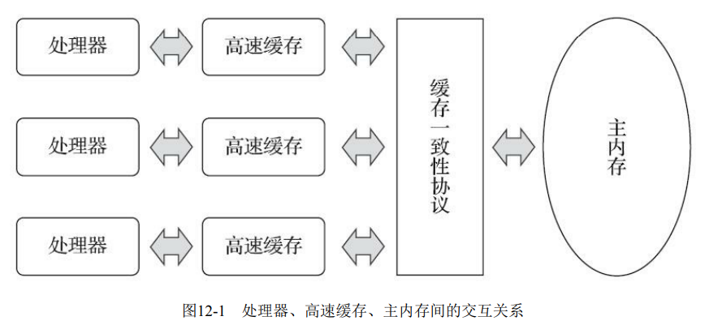
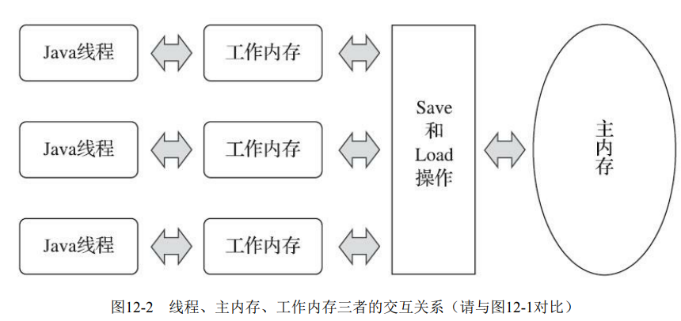

# 第12章 Java内存模型与线程

> 并发处理的广泛应用是Amdahl定律代替摩尔定律[1]成为计算机性能发展源动力的根本原因，也是 人类压榨计算机运算能力的最有力武器。

- amdahl定律：并行+串行提高效率
- 

## 12.1 概述

> 多任务处理在现代计算机操作系统中几乎已是一项必备的功能了。在许多场景下，让计算机同时 去做几件事情，不仅是因为计算机的运算能力强大了，还有一个很重要的原因是计算机的运算速度与 它的存储和通信子系统的速度差距太大，大量的时间都花费在磁盘I/O、网络通信或者数据库访问上。 如果不希望处理器在大部分时间里都处于等待其他资源的空闲状态，就必须使用一些手段去把处理器 的运算能力“压榨”出来，否则就会造成很大的性能浪费，而让计算机同时处理几项任务则是最容易想 到，也被证明是非常有效的“压榨”手段。

- 由于运算速度与IO速度的步匹配导致运算速度的可被压榨

> 衡量一个服务性能的高低好坏，每秒事务处理数（Transactions Per Second， TPS）是重要的指标之一，它代表着一秒内服务端平均能响应的请求总数，而TPS值与程序的并发能力 又有非常密切的关系。对于计算量相同的任务，程序线程并发协调得越有条不紊，效率自然就会越 高；反之，线程之间频繁争用数据，互相阻塞甚至死锁，将会大大降低程序的并发能力。

- 并发能力的衡量点=》TPS，线程运行竞争过多，阻塞甚至死锁大大降低并发能力
- 中间件/框架 尽可能隐藏复杂的并发
- 但是无论语言、中间件和框架再如何先进，开发人员都不应期望它们能独立完成所有 并发处理的事情，了解并发的内幕仍然是成为一个高级程序员不可缺少的课程。

## 12.2 硬件的效率与一致性

- 使用cache平缓CPU与IO的速度差距
- 然而每个CPU都可拥有自己的cache，引发缓存一致性问题，多个CPU处理完数据都在各自cache中， 写回主存时应使用谁的
- 
- CPU会对输入的指令乱序优化

## 12.3 Java内存模型

> 《Java虚拟机规范》[1]中曾试图定义一种“Java内存模型” [2]（Java Memory Model，JMM）来屏 蔽各种硬件和操作系统的内存访问差异，以实现让Java程序在各种平台下都能达到一致的内存访问效 果。在此之前，主流程序语言（如C和C++等）直接使用物理硬件和操作系统的内存模型。因此，由于 不同平台上内存模型的差异，有可能导致程序在一套平台上并发完全正常，而在另外一套平台上并发 访问却经常出错，所以在某些场景下必须针对不同的平台来编写程序。

### 12.3.1 主内存与工作内存

> Java内存模型的主要目的是定义程序中各种变量的访问规则，即关注在虚拟机中把变量值存储到 内存和从内存中取出变量值这样的底层细节。此处的变量（Variables）与Java编程中所说的变量有所区 别，它包括了实例字段、静态字段和构成数组对象的元素，但是不包括局部变量与方法参数，因为后 者是线程私有的[1]，不会被共享，自然就不会存在竞争问题。为了获得更好的执行效能，Java内存模 型并没有限制执行引擎使用处理器的特定寄存器或缓存来和主内存进行交互，也没有限制即时编译器 是否要进行调整代码执行顺序这类优化措施。
>
> Java内存模型规定了所有的变量都存储在主内存（Main Memory）中（此处的主内存与介绍物理 硬件时提到的主内存名字一样，两者也可以类比，但物理上它仅是虚拟机内存的一部分）。每条线程 还有自己的工作内存（Working Memory，可与前面讲的处理器高速缓存类比），线程的工作内存中保 存了被该线程使用的变量的主内存副本[2]，线程对变量的所有操作（读取、赋值等）都必须在工作内 存中进行，而不能直接读写主内存中的数据[3]。不同的线程之间也无法直接访问对方工作内存中的变 量，线程间变量值的传递均需要通过主内存来完成，线程、主内存、工作内存三者的交互关系如图12- 2所示，注意与图12-1进行对比。

- 公共参数与主存的交互
- 每个线程会从主存读取一份存入线程私有的工作空间，最后再写回主存




- 主存类似堆
- 工作内存类似栈
- Java内存模型与JVM内存模型是由差别的Java内存模型更偏向多线程从主存存取数据，更加偏向硬件的描述即CPU是如何工作的，而JVM的模型是基于虚拟机的

### 12.3.2 内存间交互操作

> 关于主内存与工作内存之间具体的交互协议，即一个变量如何从主内存拷贝到工作内存、如何从 工作内存同步回主内存这一类的实现细节，Java内存模型中定义了以下8种操作来完成。Java虚拟机实 现时必须保证下面提及的每一种操作都是原子的、不可再分的（对于double和long类型的变量来说， load、store、read和write操作在某些平台上允许有例外，这个问题在12.3.4节会专门讨论）[1]。

- 八种原子操作
  - ·lock（锁定）：作用于主内存的变量，它把一个变量标识为一条线程独占的状态。 
  - ·unlock（解锁）：作用于主内存的变量，它把一个处于锁定状态的变量释放出来，释放后的变量 才可以被其他线程锁定。 
  - ·read（读取）：作用于主内存的变量，它把一个变量的值从主内存传输到线程的工作内存中，以 便随后的load动作使用。 
  - ·load（载入）：作用于工作内存的变量，它把read操作从主内存中得到的变量值放入工作内存的 变量副本中。 
  - ·use（使用）：作用于工作内存的变量，它把工作内存中一个变量的值传递给执行引擎，每当虚 拟机遇到一个需要使用变量的值的字节码指令时将会执行这个操作。 
  - ·assign（赋值）：作用于工作内存的变量，它把一个从执行引擎接收的值赋给工作内存的变量， 每当虚拟机遇到一个给变量赋值的字节码指令时执行这个操作。 
  - ·store（存储）：作用于工作内存的变量，它把工作内存中一个变量的值传送到主内存中，以便随 后的write操作使用。 
  - ·write（写入）：作用于主内存的变量，它把store操作从工作内存中得到的变量的值放入主内存的 变量中。

> 如果要把一个变量从主内存拷贝到工作内存，那就要按顺序执行read和load操作，如果要把变量从 工作内存同步回主内存，就要按顺序执行store和write操作。注意，Java内存模型只要求上述两个操作 必须按顺序执行，但不要求是连续执行。也就是说read与load之间、store与write之间是可插入其他指令 的，如对主内存中的变量a、b进行访问时，一种可能出现的顺序是read a、read b、load b、load a。除此 之外，Java内存模型还规定了在执行上述8种基本操作时必须满足如下规则：

- 单个操作原子，还定有特定顺序，但整体并不一定要求原子
- 不允许read和load、store和write操作之一单独出现，即**不允许一个变量从主内存读取了但工作内 存不接受，或者工作内存发起回写了但主内存不接受的情况出现。**
- 不允许一个线程丢弃它最近的assign操作，即**变量在工作内存中改变了之后必须把该变化同步回 主内存。**
- 不允许一个线程无原因地（没有发生过任何assign操作）把数据从线程的工作内存同步回主内存 中。
- 一个新的变量只能在主内存中“诞生”，不允许在工作内存中直接使用一个未被初始化（load或 assign）的变量，换句话说就是对一个变量实施use、store操作之前，必须先执行assign和load操作。
  - 所有对象的内存分配都在堆上
- 一个变量在同一个时刻只允许一条线程对其进行lock操作，但lock操作可以被同一条线程重复执 行多次，多次执行lock后，只有执行相同次数的unlock操作，变量才会被解锁。
  - 可重入锁
- 如果对一个变量执行lock操作，那将会清空工作内存中此变量的值，在执行引擎使用这个变量 前，需要重新执行load或assign操作以初始化变量的值。
- 如果一个变量事先没有被lock操作锁定，那就不允许对它执行unlock操作，也不允许去unlock一个 被其他线程锁定的变量。
  - 多线程执行的互斥条件，也是不允许被破坏的一个条件
- 对一个变量执行unlock操作之前，必须先把此变量同步回主内存中（执行store、write操作）。
  - 加锁/解锁 会从主存刷新和刷回主存 从而保证可见性

> 这8种内存访问操作以及上述规则限定，再加上稍后会介绍的专门针对volatile的一些特殊规定，就 已经能准确地描述出Java程序中哪些内存访问操作在并发下才是安全的。这种定义相当严谨，但也是 极为烦琐，实践起来更是无比麻烦。可能部分读者阅读到这里已经对多线程开发产生恐惧感了，后来 Java设计团队大概也意识到了这个问题，将Java内存模型的操作简化为read、write、lock和unlock四 种，但这只是语言描述上的等价化简，Java内存模型的基础设计并未改变，即使是这四操作种，对于 普通用户来说阅读使用起来仍然并不方便。不过读者对此无须过分担忧，除了进行虚拟机开发的团队 外，大概没有其他开发人员会以这种方式来思考并发问题，我们只需要理解Java内存模型的定义即 可。12.3.6节将介绍这种定义的一个等效判断原则——先行发生原则，用来确定一个操作在并发环境下 是否安全的。

- 通过繁琐的原子定义+限定来保证线程安全，我们只需理解Java内存模型的定义

### 12.3.3 对于volatile型变量的特殊规则

> 关键字volatile可以说是Java虚拟机提供的最轻量级的同步机制，但是它并不容易被正确、完整地 理解，以至于许多程序员都习惯去避免使用它，遇到需要处理多线程数据竞争问题的时候一律使用 synchronized来进行同步。了解volatile变量的语义对后面理解多线程操作的其他特性很有意义，在本节 中我们将多花费一些篇幅介绍volatile到底意味着什么。

- volatile => 最轻量的同步机制

> 当一个变量被定义成volatile之后，它将具备两项特性：第一项是保证此变量对所有线程的可见 性，这里的“可见性”是指当一条线程修改了这个变量的值，新值对于其他线程来说是可以立即得知 的。而普通变量并不能做到这一点，普通变量的值在线程间传递时均需要通过主内存来完成。比如， 线程A修改一个普通变量的值，然后向主内存进行回写，另外一条线程B在线程A回写完成了之后再对 主内存进行读取操作，新变量值才会对线程B可见。
>
> 关于volatile变量的可见性，经常会被开发人员误解，他们会误以为下面的描述是正确的：“volatile 变量对所有线程是立即可见的，对volatile变量所有的写操作都能立刻反映到其他线程之中。换句话 说，volatile变量在各个线程中是一致的，所以基于volatile变量的运算在并发下是线程安全的”。这句话 的论据部分并没有错，但是由其论据并不能得出“基于volatile变量的运算在并发下是线程安全的”这样 的结论。volatile变量在各个线程的工作内存中是不存在一致性问题的（从物理存储的角度看，各个线 程的工作内存中volatile变量也可以存在不一致的情况，但由于每次使用之前都要先刷新，执行引擎看 不到不一致的情况，因此可以认为不存在一致性问题），但是Java里面的运算操作符并非原子操作， 这导致volatile变量的运算在并发下一样是不安全的，我们可以通过一段简单的演示来说明原因，请看 代码清单12-1中演示的例子。

- volatile保证线程可见性，一个线程对变量的修改可以让其他线程立即可见
- 普通变量则需要等待当前线程写回主存，其他线程从主存获取变量后才可见
- **volatile保证可见性=》基于volatile的变量在运算时线程安全（错误）**

```java
public class VolatileTest {
	public volatile static int race = 0;
	public static void increase(){
		race++;
	}

	public static void main(String[] args) throws InterruptedException {
		CountDownLatch latch = new CountDownLatch(20);
		// 开启20个线程，看看volatile能否保证并发操作的正确
		Thread[] threads = new Thread[20];
		for (int i = 0; i < threads.length; i++) {
			threads[i] = new Thread(new Runnable() {
				@Override
				public void run() {
					for (int j = 0; j < 10000; j++) {
						increase();
					}
					latch.countDown();
				}
			});
			threads[i].start();
//			threads[i].join();
		}
		// 等待所有线程执行完毕
//		while (Thread.activeCount()>1){
//			Thread.yield();
//		}
		latch.await();

		System.out.println("race = " + race);
	}
}
```

- 这段代码的执行结果race无法等于200000

- 问题在于++操作并非原子操作

  ```java
  public static void increase();
  Code:
  Stack=2, Locals=0, Args_size=0
  0: getstatic #13; //Field race:I
  3: iconst_1
  4: iadd
  5: putstatic #13; //Field race:I
  8: return
  LineNumberTable:
  line 14: 0
  line 15: 8
  
  ```

- 由于volatile变量只能保证可见性，在不符合以下两条规则的运算场景中，我们仍然要通过加锁 （使用synchronized、java.util.concurrent中的锁或原子类）来保证原子性：

  - 运算结果并不依赖变量的当前值，或者能够确保只有单一的线程修改变量的值
    - **操作的变量线程私有/不依赖之前结果**
  - 变量不需要与其他的状态变量共同参与不变约束
    - **不依赖外部变量**

- volatile的应用场景

  ```java
  volatile boolean shutdownRequested;
  public void shutdown() {
  shutdownRequested = true;
  }
  public void doWork() {
  while (!shutdownRequested) {
  // 代码的业务逻辑
  }
  }
  
  ```

  

> 使用volatile变量的第二个语义是禁止指令重排序优化，普通的变量仅会保证在该方法的执行过程 中所有依赖赋值结果的地方都能获取到正确的结果，而不能保证变量赋值操作的顺序与程序代码中的 执行顺序一致。因为在同一个线程的方法执行过程中无法感知到这点，这就是Java内存模型中描述的 所谓**“线程内表现为串行的语义”（Within-Thread As-If-Serial Semantics）**。

- 禁止指令重排序

  ```java
  	public void testInstruction(){
  		Map configOptions;
  		char[] configText;
  		// 此变量必须定义为volatile
  		volatile boolean initialized = false;
  		// 假设以下代码在线程A中执行
  		// 模拟读取配置信息，当读取完成后
  		// 将initialized设置为true,通知其他线程配置可用
  		configOptions = new HashMap();
  		configText = readConfigFile(fileName);
  		processConfigOptions(configText, configOptions);
  		initialized = true;
  		// 假设以下代码在线程B中执行
  		// 等待initialized为true，代表线程A已经把配置信息初始化完成
  		while (!initialized) {
  			sleep();
  		}
  		// 使用线程A中初始化好的配置信息
  		doSomethingWithConfig();
  
  	}
  ```

  

- 阻止指令重排序

- 上述代码若重拍可能让initialized提前执行，导致B使用未初始化的代码

**DCL**

```java
public class Singleton {
	private volatile static Singleton object;

	public static Singleton getInstance(){
		if (object == null){
			synchronized (Singleton.class){
				if (object == null){
					object = new Singleton();
				}
			}
		}
		return object;
	}
}
```

- new操作初始化对象实质上并非原子操作
- volatile原理上增加内存屏障在返回前将对象初始化完成
  - 没有内存屏障可能对象初始化完成之前(执行Init)之前就返回从而出问题
- 外层if防止过多的锁竞争
- synchronized保证线程安全，让对象初始化操作变为原子
- [内存if](https://www.zhihu.com/question/55439020)
  - 为了解决阻塞后的同步问题，多个线程在syn处阻塞，第一个初始化完成，第二个仍然可以获取锁，此时进入不判断就又初始化了一个
- volatile通过内存屏障在执行完毕后添加`lock addl $0x0,(%esp)`将刷新后的数据马上写回内存等于执行了store+write，将其他内核无效化其缓存，从而保证轻量一致性
- `lock addl$0x0，(%esp)`指令把修改同步到内存时，意味着所有之 前的操作都已经执行完成，这样便形成了“指令重排序无法越过内存屏障”的效果。
- volatile读操作与普通变量一样，写操作慢一些，因为加上内存屏障
- 我们在volatile与锁中选择的唯一判断依 据仅仅是volatile的语义能否满足使用场景的需求。

### 12.3.4 针对long和double型变量的特殊规则

> Java内存模型要求lock、unlock、read、load、assign、use、store、write这八种操作都具有原子性， 但是对于64位的数据类型（long和double），在模型中特别定义了一条宽松的规定：允许虚拟机将没有 被volatile修饰的64位数据的读写操作划分为两次32位的操作来进行，即允许虚拟机实现自行选择是否 要保证64位数据类型的load、store、read和write这四个操作的原子性，这就是所谓的“long和double的非 原子性协定”（Non-Atomic Treatment of double and long Variables）。

### 12.3.5 原子性、可见性与有序性

> 介绍完Java内存模型的相关操作和规则后，我们再整体回顾一下这个模型的特征。Java内存模型是 围绕着在并发过程中如何处理原子性、可见性和有序性这三个特征来建立的，我们逐个来看一下哪些 操作实现了这三个特性。

#### 1.原子性（Atomicity）

> 如果应用场景需要一个更大范围的原子性保证（经常会遇到），Java内存模型还提供了lock和 unlock操作来满足这种需求，尽管虚拟机未把lock和unlock操作直接开放给用户使用，但是却提供了更 高层次的字节码指令monitorenter和monitorexit来隐式地使用这两个操作。这两个字节码指令反映到Java 代码中就是同步块——synchronized关键字，因此在synchronized块之间的操作也具备原子性。

- 由内存模型提供的原子命令来直接保证 基础类型除 long/double
- 范围原子性=》lock/unlock  =》高层monitorenter/monitorexit =》synchronized

#### 2.可见性（Visibility）

> 可见性就是指当一个线程修改了共享变量的值时，其他线程能够立即得知这个修改。上文在讲解 volatile变量的时候我们已详细讨论过这一点。Java内存模型是通过在变量修改后将新值同步回主内 存，在变量读取前从主内存刷新变量值这种依赖主内存作为传递媒介的方式来实现可见性的，无论是 普通变量还是volatile变量都是如此。普通变量与volatile变量的区别是，volatile的特殊规则保证了新值 能立即同步到主内存，以及每次使用前立即从主内存刷新。因此我们可以说volatile保证了多线程操作 时变量的可见性，而普通变量则不能保证这一点。
>
> 除了volatile之外，Java还有两个关键字能实现可见性，它们是synchronized和final。同步块的可见 性是由“对一个变量执行unlock操作之前，必须先把此变量同步回主内存中（执行store、write操 作）”这条规则获得的。而final关键字的可见性是指：被final修饰的字段在构造器中一旦被初始化完 成，并且构造器没有把“this”的引用传递出去（this引用逃逸是一件很危险的事情，其他线程有可能通 过这个引用访问到“初始化了一半”的对象），那么在其他线程中就能看见final字段的值。如代码清单 12-7所示，变量i与j都具备可见性，它们无须同步就能被其他线程正确访问。

- volatile变量 每次修改刷回主存 `write store`，每次读取从主存读`read load`
- synchronized 通过屏障 实现 语法屏障 final 语义实现
- 