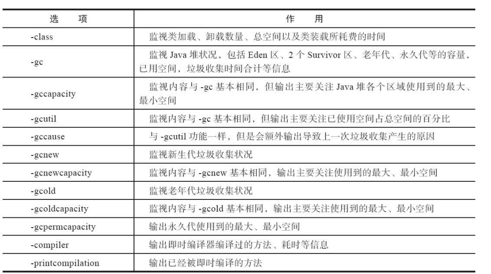
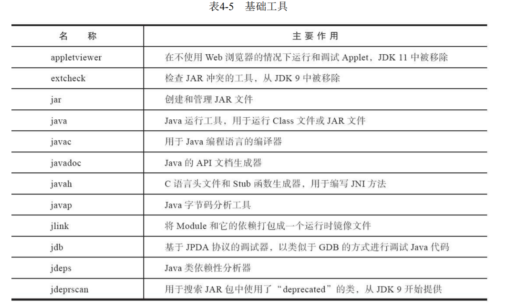

# 第4章 虚拟机性能监控、故障处理工具

实践角度认识虚拟机内存管理的世界。

给一个系统定位问题的时候，知识、经验是关键基础，数据是依据，工具是运用知识处理数据的手段。

> 没有什么工具是“秘密武器”，拥有了就能“包治百病”


## 4.1 基础故障处理工具

java/bin下有一些常用功能根据软件的可用性和授权分为以下几类

- 商业授权工具

  JMC java mission control

  jdk11前自带，但在商业环境付费

- 正式支持工具

  长期支持

- 实验性工具

  标注（Unsupported and Expermimental）日后可能转正也可能消失，但功能强大


应用部署后去服务器监控太麻烦，可通过工具+应用自身对自身进行监控

>如果读者在工作中需要监控运行于JDK 5的虚拟机之上的程序，在程序启动时请添加参 数“-Dcom.sun.management.jmxremote”开启JMX管理功能，否则由于大部分工具都是基于或者要用到 JMX（包括下一节的可视化工具），它们都将无法使用，如果被监控程序运行于JDK 6或以上版本的 虚拟机之上，那JMX管理默认是开启的，虚拟机启动时无须再添加任何参数。


### 4.1.1 jps

与unix的ps相似，列出在虚拟机中运行的Java程序

格式

`jps [ options ] [ hostid ]`

| 选项 | 作用                                     |
| ---- | ---------------------------------------- |
| -q   | 只输出LVMID 忽略主类名称                 |
| -m   | 启动main()函数的参数                     |
| -l   | 输出主类全名，执行的是jar包则输出jar路径 |
| -v   | 输出虚拟机启动时的JVM参数                |

### 4.1.2 jstat:虚拟机统计信息监控工具

jstat（JVM Statistics Monitoring Tool）是用于监视虚拟机各种运行状态信息的命令行工具。它可 以显示本地或者远程[1]虚拟机进程中的类加载、内存、垃圾收集、即时编译等运行时数据，在没有 GUI图形界面、只提供了纯文本控制台环境的服务器上，它将是运行期定位虚拟机性能问题的常用工 具。

格式

`jstat [ option vmid [interval[s|ms] [count]] ]`

远程的VMID会带上交互协议等

`[protocol:][//]lvmid[@hostname[:port]/servername]`

参数interval和count代表查询间隔和次数，如果省略这2个参数，说明只查询一次。假设需要每250 毫秒查询一次进程2764垃圾收集状况，一共查询20次，那命令应当是：

`jstat -gc 2764 250 20`


选项option代表用户希望查询的虚拟机信息，主要分为三类：**类加载、垃圾收集、运行期编译**状 况。详细请参考表4-2中的描述。



### 4.2.3 jinfo：Java配置信息工具

> jinfo（Configuration Info for Java）的作用是实时查看和调整虚拟机各项参数。使用jps命令的-v参 数可以查看虚拟机启动时显式指定的参数列表，但如果想知道未被显式指定的参数的系统默认值，除 了去找资料外，就只能使用jinfo的-flag选项进行查询

jinfo查看未显式指定参数

```shell
[root@permissiondev01v wangzibai01]# jinfo -flag useserialgc 20399
no such flag 'useserialgc'
[root@permissiondev01v wangzibai01]# jinfo -flag UseSerialGC 20399
-XX:-UseSerialGC
[root@permissiondev01v wangzibai01]# jinfo -flag UseParNewGC 20399
no such flag 'UseParNewGC'
[root@permissiondev01v wangzibai01]# jinfo -flag UseConcMarkSweepGC 20399
-XX:-UseConcMarkSweepGC
[root@permissiondev01v wangzibai01]# java -version
java version "11.0.10" 2021-01-19 LTS
Java(TM) SE Runtime Environment 18.9 (build 11.0.10+8-LTS-162)
Java HotSpot(TM) 64-Bit Server VM 18.9 (build 11.0.10+8-LTS-162, mixed mode)
[root@permissiondev01v wangzibai01]# jinfo -flag UseParallelGC 20399
-XX:-UseParallelGC
[root@permissiondev01v wangzibai01]# jinfo -flag UseParallelOldGC 20399
-XX:-UseParallelOldGC
[root@permissiondev01v wangzibai01]# jinfo -flag UseSurvivorRatio 20399
no such flag 'UseSurvivorRatio'
[root@permissiondev01v wangzibai01]# jinfo -flag SurvivorRatio 20399
-XX:SurvivorRatio=8
[root@permissiondev01v wangzibai01]# jinfo -flag UseG1GC 20399
-XX:+UseG1GC
```

可以看到jdk11默认使用G1垃圾收集器

### 4.2.4 jmap：Java内存映像工具

生成堆内存快照

jmap（Memory Map for Java）命令用于生成堆转储快照（一般称为heapdump或dump文件）。如 果不使用jmap命令，要想获取Java堆转储快照也还有一些比较“暴力”的手段：譬如在第2章中用过的XX：+HeapDumpOnOutOfMemoryError参数，可以让虚拟机在内存溢出异常出现之后自动生成堆转储 快照文件，通过-XX：+HeapDumpOnCtrlBreak参数则可以使用[Ctrl]+[Break]键让虚拟机生成堆转储快 照文件，又或者在Linux系统下通过Kill-3命令发送进程退出信号“恐吓”一下虚拟机，也能顺利拿到堆转 储快照。 jmap的作用并不仅仅是为了获取堆转储快照，它还可以查询finalize执行队列、Java堆和方法区的 详细信息，如空间使用率、当前用的是哪种收集器等。


### 4.2.5 jhat：虚拟机堆转储快照分析工具

内存快照分析

### 4.2.6 jstack：Java堆栈跟踪工具

jstack（Stack Trace for Java）命令用于生成虚拟机当前时刻的线程快照（一般称为threaddump或者 javacore文件）。线程快照就是当前虚拟机内每一条线程正在执行的方法堆栈的集合，生成线程快照的 目的通常是定位线程出现长时间停顿的原因，如线程间死锁、死循环、请求外部资源导致的长时间挂 起等，都是导致线程长时间停顿的常见原因。线程出现停顿时通过jstack来查看各个线程的调用堆栈， 就可以获知没有响应的线程到底在后台做些什么事情，或者等待着什么资源。




