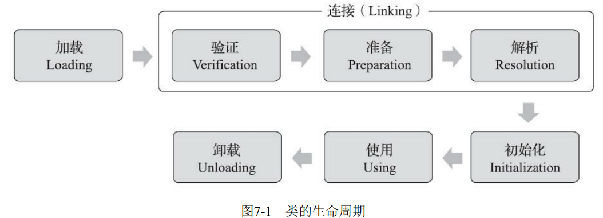
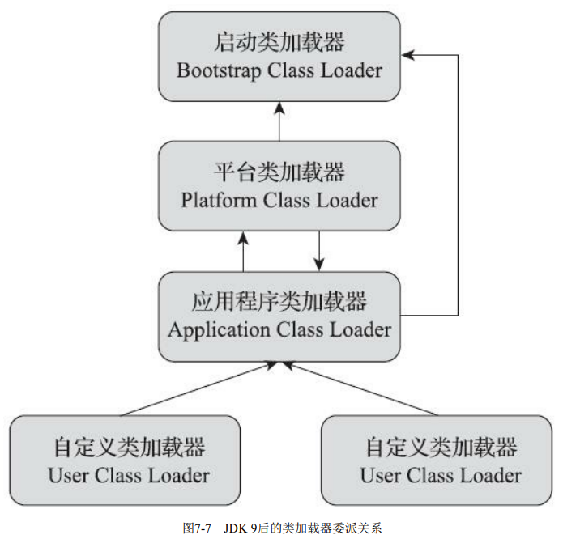

# 第7章 虚拟机类加载机制

> 代码编译的结果从本地机器码转变为字节码，是存储格式发展的一小步，却是编程语言发展的一 大步。

## 7.1 概述

> 上一章我们学习了Class文件存储格式的具体细节，在Class文件中描述的各类信息，最终都需要加 载到虚拟机中之后才能被运行和使用。而虚拟机如何加载这些Class文件，Class文件中的信息进入到虚 拟机后会发生什么变化，这些都是本章将要讲解的内容。
>
> J**ava虚拟机把描述类的数据从Class文件加载到内存，并对数据进行校验、转换解析和初始化，最 终形成可以被虚拟机直接使用的Java类型，这个过程被称作虚拟机的类加载机制。**与那些在编译时需 要进行连接的语言不同，在Java语言里面，类型的加载、连接和初始化过程都是在程序运行期间完成 的，这种策略让Java语言进行提前编译会面临额外的困难，也会让类加载时稍微增加一些性能开销， 但是却为Java应用提供了极高的扩展性和灵活性，**Java天生可以动态扩展的语言特性就是依赖运行期动 态加载和动态连接这个特点实现的**。例如，编写一个面向接口的应用程序，可以等到运行时再指定其 实际的实现类，用户可以通过Java预置的或自定义类加载器，让某个本地的应用程序在运行时从网络 或其他地方上加载一个二进制流作为其程序代码的一部分。这种动态组装应用的方式目前已广泛应用 于Java程序之中，从最基础的Applet、JSP到相对复杂的OSGi技术，都依赖着Java语言运行期类加载才 得以诞生。
>
> 为了避免语言表达中可能产生的偏差，在正式开始本章以前，笔者先设立两个语言上的约定： 第一，在实际情况中，每个Class文件都有代表着Java语言中的一个类或接口的可能，后文中直接 对“类型”的描述都同时蕴含着类和接口的可能性，而需要对类和接口分开描述的场景，笔者会特别指 明； 第二，与前面介绍Class文件格式时的约定一致，本章所提到的“Class文件”也并非特指某个存在于 具体磁盘中的文件，而应当是一串二进制字节流，无论其以何种形式存在，包括但不限于磁盘文件、 网络、数据库、内存或者动态产生等。

- 本章继承上一章继续讲述class文件载入jvm后的样子
- class文件加载到内存中进行校验、转换解析、初始化从而能让jvm能直接使用就是类加载机制
- 运行时加载可以实现从远程获取Java具体实现类并载入内存
- 一些约束
  - 类自带接口
  - class是一串二进制流并非一定指代某个class文件

## 7.2 类加载的时机

> 一个类型从被加载到虚拟机内存中开始，到卸载出内存为止，它的整个生命周期将会经历加载 （Loading）、验证（Verification）、准备（Preparation）、解析（Resolution）、初始化 （Initialization）、使用（Using）和卸载（Unloading）七个阶段，其中验证、准备、解析三个部分统称 为连接（Linking）。这七个阶段的发生顺序如图7-1所示。



> 图7-1中，加载、验证、准备、初始化和卸载这五个阶段的顺序是确定的，类型的加载过程必须按 照这种顺序按部就班地开始，而解析阶段则不一定：它在某些情况下可以在初始化阶段之后再开始， 这是为了支持Java语言的运行时绑定特性（也称为动态绑定或晚期绑定）。请注意，这里笔者写的是 按部就班地“开始”，而不是按部就班地“进行”或按部就班地“完成”，强调这点是因为这些阶段通常都 是互相交叉地混合进行的，会在一个阶段执行的过程中调用、激活另一个阶段。
>
> 关于在什么情况下需要开始类加载过程的第一个阶段“加载”，《Java虚拟机规范》中并没有进行 强制约束，这点可以交给虚拟机的具体实现来自由把握。但是对于初始化阶段，《Java虚拟机规范》 则是严格规定了有且只有六种情况必须立即对类进行“初始化”（而加载、验证、准备自然需要在此之 前开始）：
>
> 1）遇到new、getstatic、putstatic或invokestatic这四条字节码指令时，如果类型没有进行过初始 化，则需要先触发其初始化阶段。能够生成这四条指令的典型Java代码场景有： 
>
> ·使用new关键字实例化对象的时候。 
>
> ·读取或设置一个类型的静态字段（被final修饰、已在编译期把结果放入常量池的静态字段除外） 的时候。 
>
> ·调用一个类型的静态方法的时候。
>
> 2）使用java.lang.reflect包的方法对类型进行反射调用的时候，如果类型没有进行过初始化，则需 要先触发其初始化。
>
> 

- 类加载过程

  - 加载
  - 验证
  - 准备
  - 解析
  - 初始化
  - 使用
  - 卸载

- 其中加载、验证、准备、初始化、卸载的顺序固定，其他不定，还可能交替执行

- 正常操作类的初始化在遇到以下情况需要初始化

  - new关键字

  - 读取或设置final类型的常量关键字（并且不在运行时常量池）

  - 调用调用一个类的静态方法

  - **一开始所有的类不是都会初始化么**

    **Java类的加载是动态的，它并不会一次性将所有类全部加载后再运行，而是保证程序运行的基础类(像是基类)完全加载到jvm中，至于其他类，则在需要的时候才加载。这当然就是为了节省内存开销。**

- 反射加载class发现未初始化需要初始化

- 初始化类的时候发现其父类没有初始化则初始化其父类

- 虚拟机启动需指定main函数的类，会优先加载该主类

- JDK7动态语言支持

- JDK8的default关键字

- 以上为主动引用

- 被动引用不会触发类初始化

  - 子类引用父类静态字段，初始化父类，子类不会被初始化

  - 通过数组定义来引用类，不会触发此类的初始化，父类数组不会产生父类初始化

    数组越界抛出异常，不像C++访问到其他内存从而保障数据访问的内存安全性

  - 常量在编译阶段会存入调用类的常量池中，本质上没有直接引用到定义常量的类，因此不会触发定义常量的类的初始化

    - **常量池的初始化，不属于类初始化的一部分么**
    - 只是将常量加载到main函数所在类的常量池从而避免初始化

- 类加载分为隐式何显式，隐式代表 new  调用未在常量池中的 静态常量 调用静态方法，显示则是通过反射，class.forname等方法

- 类加载并不是一次性载入，而是用到的时候才加载

> 接口的加载过程与类加载过程稍有不同，针对接口需要做一些特殊说明：接口也有初始化过程， 这点与类是一致的，上面的代码都是用静态语句块“static{}”来输出初始化信息的，而接口中不能使 用“static{}”语句块，但编译器仍然会为接口生成“()”类构造器[2]，用于初始化接口中所定义的 成员变量。接口与类真正有所区别的是前面讲述的六种“有且仅有”需要触发初始化场景中的第三种： 当一个类在初始化时，要求其父类全部都已经初始化过了，但是一个接口在初始化时，并不要求其父 接口全部都完成了初始化，只有在真正使用到父接口的时候（如引用接口中定义的常量）才会初始 化。

- 接口也可以初始化，但只有在加载父类的时候才会触发

## 7.3 类加载的过程

> 接下来我们会详细了解Java虚拟机中类加载的全过程，即加载、验证、准备、解析和初始化这五 个阶段所执行的具体动作。

### 7.3.1 加载

> “加载”（Loading）阶段是整个“类加载”（Class Loading）过程中的一个阶段，希望读者没有混淆 这两个看起来很相似的名词。在加载阶段，Java虚拟机需要完成以下三件事情： 1）通过一个类的全限定名来获取定义此类的二进制字节流。 2）将这个字节流所代表的静态存储结构转化为方法区的运行时数据结构。 3）在内存中生成一个代表这个类的java.lang.Class对象，作为方法区这个类的各种数据的访问入 口。

- 加载完成的事件
  - 载入二进制流
  - 转为方法区数据结构
  - 生成class对象
- 二进制流的来源并没有具体说明，可以从全限定名的本地文件，压缩文件，jar包，网络等方式载入
- 可以通过重写classLoader中的findClass及loadClass方法实现自己的类加载机制
- 数组的加载，数组的组件类型是去掉一个维度的类型例如int[]的组件类型就是int,非引用类型则与引导类关联
- 加载与连接交叉进行

### 7.3.2 验证

> 验证是连接阶段的第一步，这一阶段的目的是确保Class文件的字节流中包含的信息符合《Java虚 拟机规范》的全部约束要求，保证这些信息被当作代码运行后不会危害虚拟机自身的安全。
>
>  Java语言本身是相对安全的编程语言（起码对于C/C++来说是相对安全的），使用纯粹的Java代码 无法做到诸如访问数组边界以外的数据、将一个对象转型为它并未实现的类型、跳转到不存在的代码 行之类的事情，如果尝试这样去做了，编译器会毫不留情地抛出异常、拒绝编译。但前面也曾说过， Class文件并不一定只能由Java源码编译而来，它可以使用包括靠键盘0和1直接在二进制编辑器中敲出 Class文件在内的任何途径产生。上述Java代码无法做到的事情在字节码层面上都是可以实现的，至少 语义上是可以表达出来的。Java虚拟机如果不检查输入的字节流，对其完全信任的话，很可能会因为 载入了有错误或有恶意企图的字节码流而导致整个系统受攻击甚至崩溃，所以验证字节码是Java虚拟 机保护自身的一项必要措施。

- 类加载后要进行验证，这一步确保了Java在某些意义上的安全性
  - Java无法数组越界访问
  - Java无法随意类型转换
  - Java无法跳转到不存在的代码行
- 上述事件在Java代码无法实现，但由于字节码文件的来源未知，可能有恶意的字节码文件载入，class文件可以做到上述的问题，所以要进行验证
- 从整体上看，验证阶段大致上会完成下面四个阶段的检验动作：文件格式验证、元数据验证、字节 码验证和符号引用验证。
  - class文件是否符合特定格式（魔数，版本号，常量池...)
  - class文件的继承关系，是否有 父类，是否实现某个方法，抽象类，final
  - 语义校验的字节码验证，确保上述安全性
  - 通过程序去校验程序逻辑是无法做到绝对准 确的，不可能用程序来准确判定一段程序是否存在Bug
  - 符号引用验证，是否可以通过符号找到引用类，是否可以找到类中的字段/方法，能否被调用
- 验证代表了某些语法规则的校验 是否合适 从基础结构到继承关系、语法、引用等

### 7.3.3 准备

> 准备阶段是正式为类中定义的变量（即静态变量，被static修饰的变量）分配内存并设置类变量初 始值的阶段，从概念上讲，这些变量所使用的内存都应当在方法区中进行分配，但必须注意到方法区 本身是一个逻辑上的区域，在JDK 7及之前，HotSpot使用永久代来实现方法区时，实现是完全符合这 种逻辑概念的；而在JDK 8及之后，类变量则会随着Class对象一起存放在Java堆中，这时候“类变量在 方法区”就完全是一种对逻辑概念的表述了，关于这部分内容，笔者已在4.3.1节介绍并且验证过。

- JDK 7及其以后版本的HotSpot虚拟机选择把静态变量与类型在Java语言一端的映射Class对 象存放在一起，存储于Java堆之中，类变量在方法区就有些问题了
- **准备阶段是正式为类中定义的变量（即静态变量，被static修饰的变量）分配内存并设置类变量初 始值的阶段**
- 类变量的赋值在初始化执行
- 常量则借助Constant value在准备阶段赋值

### 7.3.4 解析

> 解析阶段是Java虚拟机将常量池内的符号引用替换为直接引用的过程，符号引用在第6章讲解Class 文件格式的时候已经出现过多次，在Class文件中它以CONSTANT_Class_info、 CONSTANT_Fieldref_info、CONSTANT_Methodref_info等类型的常量出现，那解析阶段中所说的直接 引用与符号引用又有什么关联呢？ 
>
> ·符号引用（Symbolic References）：符号引用以一组符号来描述所引用的目标，符号可以是任何 形式的字面量，只要使用时能无歧义地定位到目标即可。符号引用与虚拟机实现的内存布局无关，引 用的目标并不一定是已经加载到虚拟机内存当中的内容。各种虚拟机实现的内存布局可以各不相同， 但是它们能接受的符号引用必须都是一致的，因为符号引用的字面量形式明确定义在《Java虚拟机规 范》的Class文件格式中。 
>
> ·直接引用（Direct References）：直接引用是可以直接指向目标的指针、相对偏移量或者是一个能 间接定位到目标的句柄。直接引用是和虚拟机实现的内存布局直接相关的，同一个符号引用在不同虚 拟机实例上翻译出来的直接引用一般不会相同。如果有了直接引用，那引用的目标必定已经在虚拟机 的内存中存在。

- 解析将符号引用转为直接引用
  - 符号引用代表目标的描述（抽象类/接口）
  - 直接引用可以是指针、偏移量、句柄（具体实现）
- 解析阶段还解析可访问性是否正确
- 解析阶段可在操作符号引用指令码之前完成，具体解析执行顺序可以自定义
- 解析符号引用执行多次以内存缓存放在常量池中
- 解析动作主要针对类或接口、字段、类方法、接口方法、方法类型、方法句柄和调用点限定符这7 类符号引用进行
- 

#### 1.类或接口的解析

- 解析一个从未解析过的符号引用
  - 不是数字类型，根据全限定名加载相关类，加载过程中发现该类未加载过又会触发相关类的加载
  - 类的数组 加载元素的类型，再生成一个数组对象
  - 确保使用类D与被引用类C之前是否具有访问权限，没有则抛出java.lang.IllegalAccessError异常
    - 访问权限
    - public且同一模块
    - public不同模块但允许访问
    - 同一包下


#### 2.字段解析

- 搜索字段表内的class_index对应类/接口的符号引用C
- 寻找C中的字段与直接引用
- else 搜索父接口
- else 不是Object则从下向上搜索接口何父类，找到字段与接口则结束
- else 查找失败，抛出java.lang.NoSuchFieldError

#### 3.方法解析

> 方法解析的第一个步骤与字段解析一样，也是需要先解析出方法表的class_index [4]项中索引的方 法所属的类或接口的符号引用，如果解析成功，那么我们依然用C表示这个类，接下来虚拟机将会按 照如下步骤进行后续的方法搜索

- 解析方法表中的方法所属的类或接口的符号引用
- 若发现类文件方法的引用是个接口则抛出java.lang.IncompatibleClassChangeError，一个正常类中不应该包含方法
- 查找C中是否有合适的引用
- 没有则递归查找父类
- 没有则递归查找父接口
- 否则查找失败抛出java.lang.NoSuchMethodError

#### 4.接口方法解析

> 接口方法也是需要先解析出接口方法表的class_index [5]项中索引的方法所属的类或接口的符号引 用，如果解析成功，依然用C表示这个接口，接下来虚拟机将会按照如下步骤进行后续的接口方法搜 索：

1. 与类的方法解析相反，如果在接口方法表中发现class_index中的索引C是个类而不是接口，那 么就直接抛出java.lang.IncompatibleClassChangeError异常
2. 否则，在接口C中查找是否有简单名称和描述符都与目标相匹配的方法，如果有则返回这个方 法的直接引用，查找结束
3. 否则，在接口C的父接口中递归查找，直到java.lang.Object类（接口方法的查找范围也会包括 Object类中的方法）为止，看是否有简单名称和描述符都与目标相匹配的方法，如果有则返回这个方 法的直接引用，查找结束
4. 对于规则3，由于Java的接口允许多重继承，如果C的不同父接口中存有多个简单名称和描述符 都与目标相匹配的方法，那将会从这多个方法中返回其中一个并结束查找，《Java虚拟机规范》中并 没有进一步规则约束应该返回哪一个接口方法。但与之前字段查找类似地，不同发行商实现的Javac编 译器有可能会按照更严格的约束拒绝编译这种代码来避免不确定性

### 7.3.5 初始化

> 类的初始化阶段是类加载过程的最后一个步骤，之前介绍的几个类加载的动作里，除了在加载阶 段用户应用程序可以通过自定义类加载器的方式局部参与外，其余动作都完全由Java虚拟机来主导控 制。直到初始化阶段，Java虚拟机才真正开始执行类中编写的Java程序代码，将主导权移交给应用程 序。
>
> 进行准备阶段时，变量已经赋过一次系统要求的初始零值，而在初始化阶段，则会根据程序员通 过程序编码制定的主观计划去初始化类变量和其他资源。我们也可以从另外一种更直接的形式来表 达：初始化阶段就是执行类构造器()方法的过程。()并不是程序员在Java代码中直接编写 的方法，它是Javac编译器的自动生成物，但我们非常有必要了解这个方法具体是如何产生的，以及 ()方法执行过程中各种可能会影响程序运行行为的细节，这部分比起其他类加载过程更贴近于 普通的程序开发人员的实际工作[1]。
>
> `·<clinit>()`方法是由编译器自动收集类中的所有类变量的赋值动作和静态语句块（static{}块）中的 语句合并产生的，编译器收集的顺序是由语句在源文件中出现的顺序决定的，静态语句块中只能访问 到定义在静态语句块之前的变量，定义在它之后的变量，在前面的静态语句块可以赋值，但是不能访 问，如代码清单7-5所示。

- 用户可控制的类加载过程

  - 加载时自定义类加载器
  - 初始化时执行用户代码

- 在初始化之前类已经在准备阶段给了零值

- 初始化可根据程序员的主管代码去初始化，但是`clinit`却是编译器的产物，两者如何衡量呢

  - 类初始化初始化的是类变量以及类的静态代码块
  - 普通代码块则交给实例初始化时执行

- 类初始化收集静态变量赋值何静态代码块作为类初始化方法执行

  - 如下代码所示

  - 超前访问静态变量导致`Illegal forward reference`,但是可以执行赋值操作

  - 静态相关初始化从上到下收集并执行

  - 普通代码块是实例化的内容，可运行多次并且可提前访问静态变量

    ```java
    /**
     * @program: Design_Pattern
     * @author: wangzibai01
     * @create: 2021-08-10 17:45
     * @description:
     * 静态代码块与静态变量
     **/
    
    public class StaticInit {
    	static {
    		i = 0;
    		// Illegal forward reference
    //		System.out.println("i = " + i);
    	}
    	{
    		// i=1
    		System.out.println("instance i = " + i);
    	}
    	static int i = 1;
    	static {
    		// i=1
    		System.out.println("i = " + i);
    	}
    
    	public static void main(String[] args) {
    		StaticInit staticInit = new StaticInit();
    	}
    
    }
    ```

    

#### 类初始化

> `·<clinit>()`方法与类的构造函数（即在虚拟机视角中的实例构造器()方法）不同，它不需要显 式地调用父类构造器，Java虚拟机会保证在子类的()方法执行前，父类的()方法已经执行 完毕。因此在Java虚拟机中第一个被执行的()方法的类型肯定是java.lang.Object。
>
> ·由于父类的`·<clinit>()`方法先执行，也就意味着父类中定义的静态语句块要优先于子类的变量赋值 操作，如代码清单7-6中，字段B的值将会是2而不是1。

- 父类初始化在子类之前

  - 父类的clinit比子类早执行，父类的静态变量+静态代码块优于子类

- 下面代码A与B都是2

  ```java
  public class Parent {
  	public static int A = 1;
  	static {
  		A = 2;
  		System.out.println("Parent.static initializer");
  	}
  }
  public class Sub extends Parent{
  	public static int B = A;
  	static {
  		System.out.println("Sub.static initializer");
  	}
  
  	public static void main(String[] args) {
  		// 2
  		System.out.println("Sub.A = " + Sub.A);
  		// 2
  		System.out.println("Sub.B = " + Sub.B);
  		Sub sub = new Sub();
  	}
  }
  ```

  

> `·<clinit>()`方法对于类或接口来说并不是必需的，如果一个类中没有静态语句块，也没有对变量的 赋值操作，那么编译器可以不为这个类生成()方法。 
>
> ·接口中不能使用静态语句块，但仍然有变量初始化的赋值操作，因此接口与类一样都会生成`·<clinit>()`方法。但接口与类不同的是，执行接口的`·<clinit>()`方法不需要先执行父接口的`·<clinit>()`方法， 因为只有当父接口中定义的变量被使用时，父接口才会被初始化。此外，接口的实现类在初始化时也 一样不会执行接口的`·<clinit>()`方法。
>
> Java虚拟机必须保证一个类的()方法在多线程环境中被正确地加锁同步，如果多个线程同 时去初始化一个类，那么只会有其中一个线程去执行这个类的`·<clinit>()`方法，其他线程都需要阻塞等 待，直到活动线程执行完毕`·<clinit>()`方法。如果在一个类的()方法中有耗时很长的操作，那就 可能造成多个进程阻塞[2]，在实际应用中这种阻塞往往是很隐蔽的。

- `·<clinit>()`方法若不存在静态变量+代码块可不执行（没有）

- 接口的初始化不需要执行父接口的`·<clinit>()`除非用到父接口变量

  - ·<clinit>()`方法是同步方法，多线程环境下阻塞

  - 仅在Java有效，其他虚拟机语言不一定若获取初始化的线程初始化完成释放锁，其他线程不会进入初始化方法


#### 小结

- 静态变量/代码块，按顺序执行
- 类初始化会附带父类初始化
- 类初始化方法执行一次，并且多线程加索保证安全
- 两个类父子关系，同样有静态代码块

### 7.4 类加载器

> Java虚拟机设计团队有意把类加载阶段中的“通过一个类的全限定名来获取描述该类的二进制字节 流”这个动作放到Java虚拟机外部去实现，以便让应用程序自己决定如何去获取所需的类。实现这个动 作的代码被称为“类加载器”（Class Loader）。
>
> 类加载器可以说是Java语言的一项创新，它是早期Java语言能够快速流行的重要原因之一。类加载 器最初是为了满足Java Applet的需求而设计出来的，在今天用在浏览器上的Java Applet技术基本上已 经被淘汰[1]，但类加载器却在类层次划分、OSGi、程序热部署、代码加密等领域大放异彩，成为Java 技术体系中一块重要的基石，可谓是失之桑榆，收之东隅。

- 类加载器的作用
  - 根据类的全限定名，将获取某个类二进制流的动作放到JVM之外处理
  - 热部署
  - 层次划分
  - OSGI
  - 代码加密
- 

#### 7.4.1 类与类加载器

> 类加载器虽然只用于实现类的加载动作，但它在Java程序中起到的作用却远超类加载阶段。对于 任意一个类，都必须由加载它的类加载器和这个类本身一起共同确立其在Java虚拟机中的唯一性，每 一个类加载器，都拥有一个独立的类名称空间。这句话可以表达得更通俗一些：比较两个类是否“相 等”，只有在这两个类是由同一个类加载器加载的前提下才有意义，否则，即使这两个类来源于同一个 Class文件，被同一个Java虚拟机加载，只要加载它们的类加载器不同，那这两个类就必定不相等。
>
> 这里所指的“相等”，包括代表类的Class对象的equals()方法、isAssignableFrom()方法、isInstance() 方法的返回结果，也包括了使用instanceof关键字做对象所属关系判定等各种情况。如果没有注意到类 加载器的影响，在某些情况下可能会产生具有迷惑性的结果，代码清单7-8中演示了不同的类加载器对 instanceof关键字运算的结果的影响。

- 类的签名是类本身+类加载器

- 不同的类签名影响`equals()` `isAssignableFrom` `isInstance` `instanceof`

- 样例

  ```java
  public class ClassLoaderTest {
  	public static void main(String[] args) throws Exception{
  		ClassLoader classLoader = new ClassLoader() {
  			@Override
  			public Class<?> loadClass(String name) throws ClassNotFoundException {
  				try {
  					String fileName = name.substring(name.lastIndexOf(".")+1)+".class";
  					// 在寻找过程中有parent class loader就从父类加载器获取
  					InputStream is = getClass().getResourceAsStream(fileName);
  					if (Objects.isNull(is)){
  						return super.loadClass(name);
  					}
  					byte[] bytes = new byte[is.available()];
  					is.read(bytes);
  					return defineClass(name,bytes,0,bytes.length);
  				} catch (IOException e) {
  					throw new ClassNotFoundException(name);
  				}
  			}
  		};
  		// 自定义类加载器加载类并生成实例对象
  		Object obj = classLoader.loadClass("priv.wzb.jvm.classload.ClassLoaderTest").newInstance();
  		// class priv.wzb.jvm.classload.ClassLoaderTest 类文件没问题
  		System.out.println("obj.getClass() = " + obj.getClass());
  		// 但是并非具体类实例 原因在于类加载器不同，导致类签名不一致
  		System.out.println(obj instanceof priv.wzb.jvm.classload.ClassLoaderTest);
  
  	}
  }
  ```

  - 它可以加载与自己在同一路径下的Class文件，我们使用这个类加载器去加载了一个名 为“priv.wzb.jvm.classload.ClassLoaderTest”的类，并实例化了这个类的对象。
  - instanceof 是false的原因是存在两个类加载器

- 

#### 7.4.2 双亲委派模型

> 站在Java虚拟机的角度来看，只存在两种不同的类加载器：一种是启动类加载器（Bootstrap ClassLoader），这个类加载器使用C++语言实现[1]，是虚拟机自身的一部分；另外一种就是其他所有 的类加载器，这些类加载器都由Java语言实现，独立存在于虚拟机外部，并且全都继承自抽象类 java.lang.ClassLoader。
>
> 站在Java开发人员的角度来看，类加载器就应当划分得更细致一些。自JDK 1.2以来，Java一直保 持着三层类加载器、双亲委派的类加载架构，尽管这套架构在Java模块化系统出现后有了一些调整变 动，但依然未改变其主体结构，我们将在7.5节中专门讨论模块化系统下的类加载器。
>
> 本节内容将针对JDK 8及之前版本的Java来介绍什么是三层类加载器，以及什么是双亲委派模型。 对于这个时期的Java应用，绝大多数Java程序都会使用到以下3个系统提供的类加载器来进行加载。

- 类加载器

  - 启动类加载器（Bootstrap Class Loader）
  - 其他的类加载器
    - 三层类加载器
    - 双亲委派加载模型

- 三种类加载器

  - 启动类加载器（Bootstrap Class Loader）
    - 这个类加载器负责加载存放在 \lib目录，或者被-Xbootclasspath参数所指定的路径中存放的，且虚拟机能识别
    - 启动类加载器无法被Java程序直接引用，用户在编写自定义类加载器时， 如果需要把加载请求委派给引导类加载器去处理，那直接使用null代替即可，代码展示的就是 java.lang.ClassLoader.getClassLoader()方法的代码片段，其中的注释和代码实现都明确地说明了以null值 来代表引导类加载器的约定规则。
  - 扩展类加载器（Extension Class Loader）
    - 这个类加载器是在类sun.misc.Launcher$ExtClassLoader 中以Java代码的形式实现的
    - 它负责加载\lib\ext目录中，或者被java.ext.dirs系统变量所 指定的路径中所有的类库
    - 可以直接借助代码调用该加载器
  - 应用程序类加载器（Application Class Loader）
    - 这个类加载器由 sun.misc.Launcher$AppClassLoader来实现
    - **由于应用程序类加载器是ClassLoader类中的getSystemClassLoader()方法的返回值，所以有些场合中也称它为“系统类加载器”。**
    - 加载用户类路径 class path上的所有类库
    - 默认加载器

- 类加载器双亲委派模型

  

  - 各种类加载器之间的层次关系被称为类加载器的“双亲委派模型（Parents Delegation Model）”

  - 通过组合而不是继承来实现复用

  - 类加载器使用的最佳实践而非强制约束

  - 工作流程

    - 类加载器收到加载请求
    - 委托给父类去完成，所有加载都如此，因此都会委托给顶层的启动类加载器
    - 父类加载器无法加载才会让子类加载器去完成加载

  - 双亲委派模型的优势

    - 保障java的层级关系
    - Java的所有类都继承自rt.jar包下的Object类，通过双亲委派模型，可以一直都加载这个Object类而不是用户在多处自定义Object后加载到多个不同的Object类型
    - 用户自定义rt.jar中的类一直无法被加载

  - 实现

    ```java
        protected Class<?> loadClass(String name, boolean resolve)
            throws ClassNotFoundException
        {
            synchronized (getClassLoadingLock(name)) {
                // First, check if the class has already been loaded
                // 首先 检查是否已加载过
                Class<?> c = findLoadedClass(name);
                if (c == null) {
                    long t0 = System.nanoTime();
                    try {
                        if (parent != null) {
                            // 没加载过就尝试从父类加载
                            c = parent.loadClass(name, false);
                        } else {
                            // 父加载器为null则使用启动类加载器加载
                            c = findBootstrapClassOrNull(name);
                        }
                    } catch (ClassNotFoundException e) {
                        // ClassNotFoundException thrown if class not found
                        // from the non-null parent class loader
                    }
    
                    // 父类无法加载则调用自身加载方法进行加载
                    if (c == null) {
                        // If still not found, then invoke findClass in order
                        // to find the class.
                        long t1 = System.nanoTime();
                        c = findClass(name);
    
                        // this is the defining class loader; record the stats
                        sun.misc.PerfCounter.getParentDelegationTime().addTime(t1 - t0);
                        sun.misc.PerfCounter.getFindClassTime().addElapsedTimeFrom(t1);
                        sun.misc.PerfCounter.getFindClasses().increment();
                    }
                }
                if (resolve) {
                    resolveClass(c);
                }
                return c;
            }
        }
    ```

    

#### 7.4.3 破坏双亲委派模型

> 上文提到过双亲委派模型并不是一个具有强制性约束的模型，而是Java设计者推荐给开发者们的 类加载器实现方式。在Java的世界中大部分的类加载器都遵循这个模型，但也有例外的情况，直到Java 模块化出现为止，双亲委派模型主要出现过3次较大规模“被破坏”的情况。

- 双亲委派模型可以被破坏
- 第一次破坏在双亲委派出现之前，为了兼容已有代码，添加`protected findClass`方法，父类加载器加载失败也会调用自身的findClass()方法寻找合适的类
- 模型自身缺陷导致，双亲委派保证Java代码的层次结构 基础类型一致性，基础代码总是被继承 调用，但基础代码要调用用户代码又该如何
  - JNDI与线程上下文类加载器，Java中的SPI基本都用这种方式解决例如JDBC JCE JAXB JBI
  - 在JDK 6时，JDK提供了 java.util.ServiceLoader类，以META-INF/services中的配置信息，辅以责任链模式，这才算是给SPI的加 载提供了一种相对合理的解决方案。
- 追求程序动态性， 追求热部署
  - jigsaw和OSGi
  - OSGi实现模块化热部署的关键是它自定义的类加载器机制的实现
  - OSGi的类加载从树状变为网状
    - 将以java.*开头的类，委派给父类加载器加载。
    - 否则，将委派列表名单内的类，委派给父类加载器加载。
    - 否则，将Import列表中的类，委派给Export这个类的Bundle的类加载器加载
    - 否则，查找当前Bundle的ClassPath，使用自己的类加载器加载
    - 否则，查找类是否在自己的Fragment Bundle中，如果在，则委派给Fragment Bundle的类加载器 加载。
    - 否则，查找Dynamic Import列表的Bundle，委派给对应Bundle的类加载器加载
    - 否则，类查找失败。
- 被破坏并不一定意味着坏事，OSGi破坏模型带来的动态性值得学习和使用

### 7.5 Java模块化系统

> 在JDK 9中引入的Java模块化系统（Java Platform Module System，JPMS）是对Java技术的一次重 要升级，为了能够实现模块化的关键目标——可配置的封装隔离机制，Java虚拟机对类加载架构也做 出了相应的变动调整，才使模块化系统得以顺利地运作。JDK 9的模块不仅仅像之前的JAR包那样只是 简单地充当代码的容器，除了代码外，Java的模块定义还包含以下内容： 
>
> ·依赖其他模块的列表。 
>
> ·导出的包列表，即其他模块可以使用的列表。 
>
> ·开放的包列表，即其他模块可反射访问模块的列表。 
>
> ·使用的服务列表。 ·提供服务的实现列表。

- 模块化，前置显示模块依赖解决大部分运行时类加载找不到带来的问题
- 模块化代表public的访问受到模块限制

#### 7.5.1 模块的兼容性

> 为了使可配置的封装隔离机制能够兼容传统的类路径查找机制，JDK 9提出了与“类路 径”（ClassPath）相对应的“模块路径”（ModulePath）的概念。简单来说，就是某个类库到底是模块还 是传统的JAR包，只取决于它存放在哪种路径上。只要是放在类路径上的JAR文件，无论其中是否包 含模块化信息（是否包含了module-info.class文件），它都会被当作传统的JAR包来对待；相应地，只 要放在模块路径上的JAR文件，即使没有使用JMOD后缀，甚至说其中并不包含module-info.class文 件，它也仍然会被当作一个模块来对待。

- 通过modulePath的概念来区分原有jar
- 模块化的兼容，通过JAR文件在类路径的访问规则
  - 所有类路径下的JAR文件及其他资源文件，都被视为自动打包在 一个匿名模块（Unnamed Module）里，这个匿名模块几乎是没有任何隔离的，它可以看到和使用类路 径上所有的包、JDK系统模块中所有的导出包，以及模块路径上所有模块中导出的包。
  - 类路径下的文件打成几乎无访问限制的匿名包
- ·模块在模块路径的访问规则
  - 具名模块看不到匿名模块
- ·JAR文件在模块路径的访问规则
  - 如果把一个传统的、不包含模块定义的JAR文件放置到模块路 径中，它就会变成一个自动模块（Automatic Module）。尽管不包含module-info.class，但自动模块将 默认依赖于整个模块路径中的所有模块，因此可以访问到所有模块导出的包，自动模块也默认导出自 己所有的包。
- 模块化必须和OSGi配合才能做到模块+热部署

#### 7.5.2 模块化下的类加载器

- 是扩展类加载器（Extension Class Loader）被平台类加载器（Platform Class Loader）取代。

  - 优于Java类库天生支持可扩展那自然无须再保留 \lib\ext目录，此前使用这个目录或者java.ext.dirs系统变量来扩展JDK功能的机制已经没 有继续存在的价值了

  

- 对双亲委派的第四次破坏：当平台及应用程序类加载器收到类加载请求，在委派给父加载器加载前，要先判断该类是否能 够归属到某一个系统模块中，如果可以找到这样的归属关系，就要优先委派给负责那个模块的加载器 完成加载


## 7.6 问题

### 简述java类加载机制?

从class文件加载数据并且进行验证、转换解析和初始化，达到jvm虚拟机可以使用从class对象

### 描述一下JVM加载Class文件的原理机制

- 双亲委派模型
- 显示加载和隐式加载
  - new / 调用运行时常量池不存在的静态常量 /调用静态方法 类对象不存在都会隐式加载
  - class.forname 等反射方式加载类文件
  - jvm加载机制并不是一开始就加载全部的类，而是随着使用需要逐步加载以减少内存负担
- 

### 什么是类加载器，类加载器有哪些?

- 启动类加载器
  - 加载java_home/lib下的类
- 扩展类加载器
  - 加载java_home/lib/ext下的类
- 应用（系统）类加载器
  - 加载用户class path下的类，可通过classloader.getSystemClassLoader获取
- 用户自定义类加载器

### 说一下类装载的执行过程？

- 加载
  - 从class文件加载类数据
  - 生成对应数据结构
  - 生成class对象
- 校验
  - 校验class文件完整性
  - 校验代码语义完整性，是否可继承、调用、跳转等
- 准备
  - 初始化零值
- 解析
  - 符号引用转为指针引用
- 初始化
  - 静态代码块+静态变量的初始化

### 什么是双亲委派模型？

- 加载器的层次模型
- 每次的类加载都首先判断是否加载过，没加载过委托给父类加载，若是父类无法完成加载再转为当前类尝试加载
- 由双亲委派模型来保障Java的层次结构完整性，比如Object类的加载，若用户自定义Object类并且随意加载则可能造成Java继承体系的错乱，所有类都继承自同一个Object才对

本章介绍了类加载过程的“加载”“验证”“准备”“解析”和“初始化”这5个阶段中虚拟机进行了哪些动 作，还介绍了类加载器的工作原理及其对虚拟机的意义。
