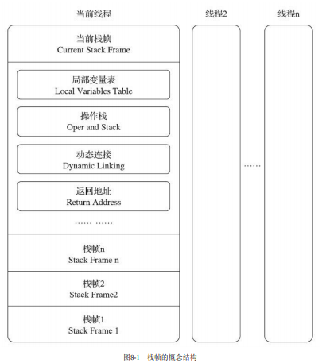
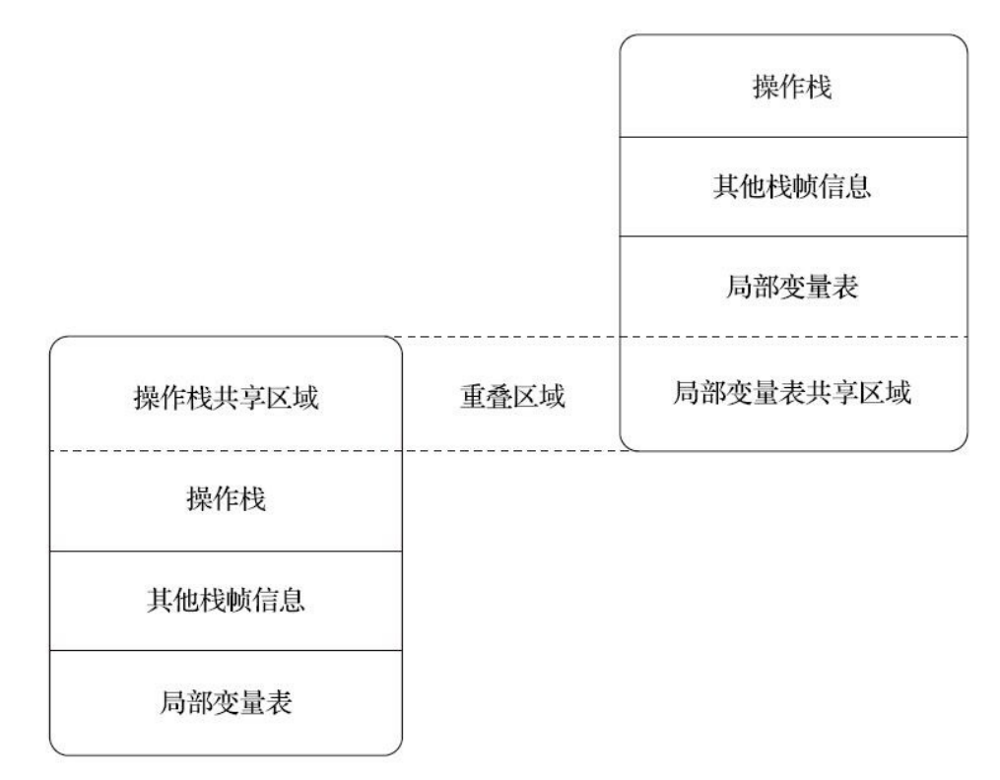
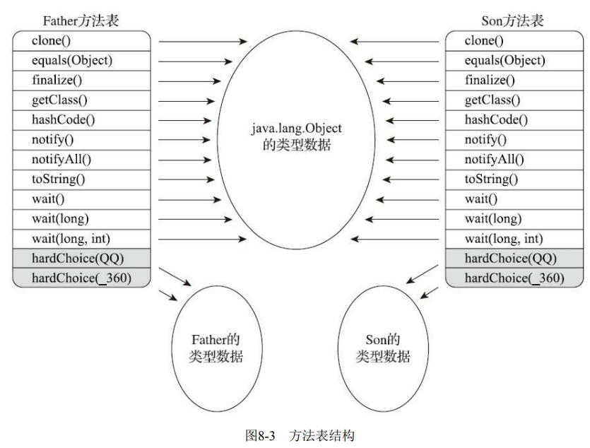
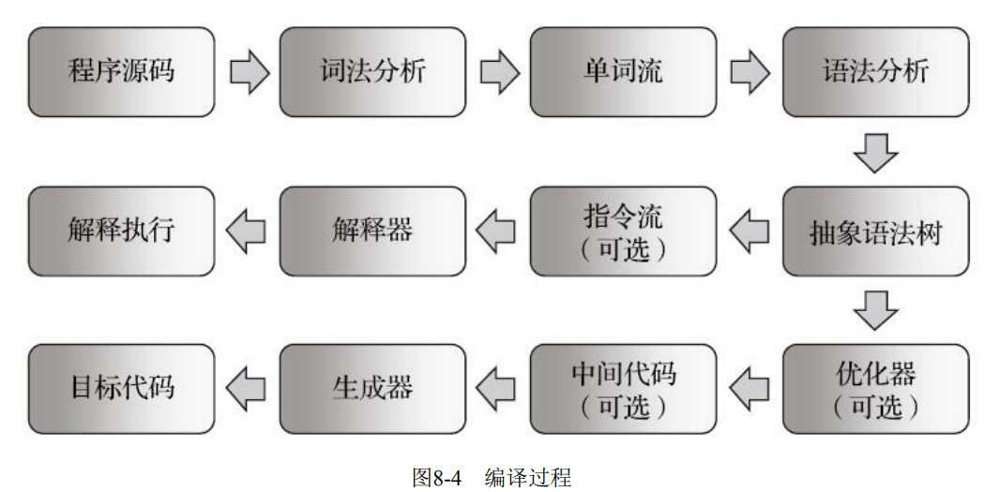
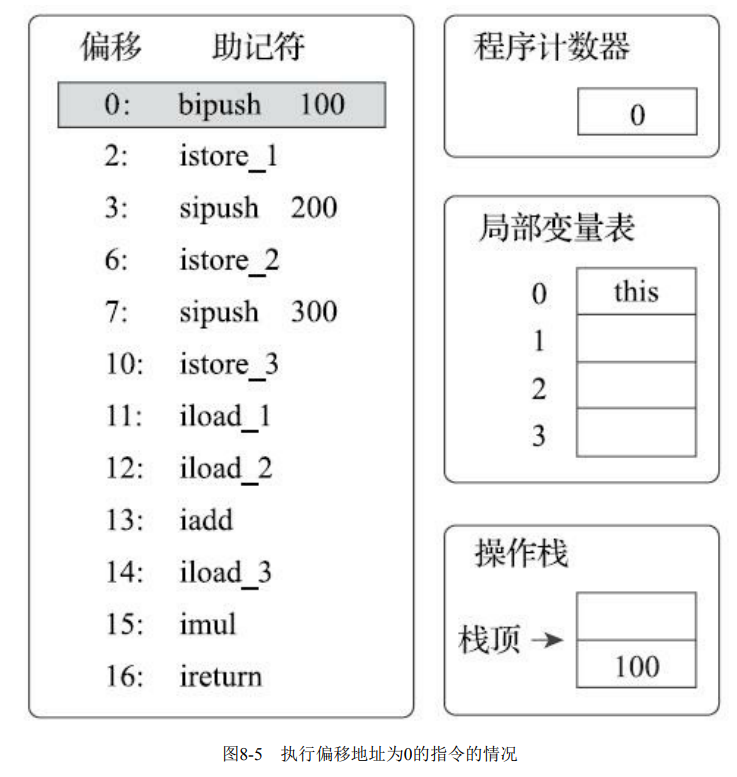
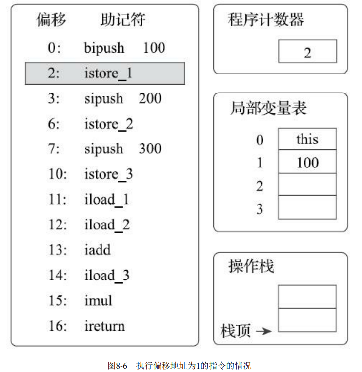
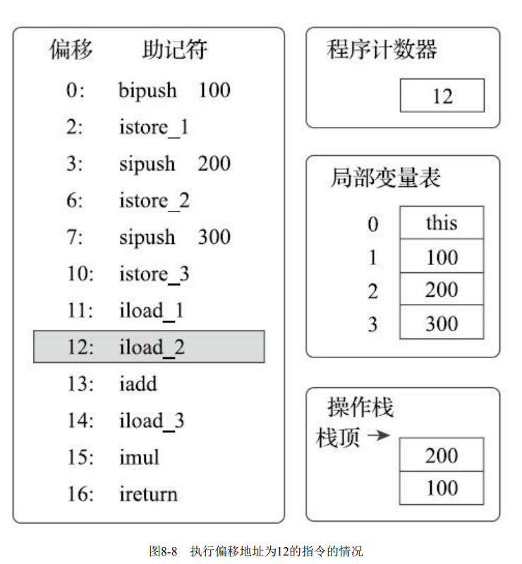
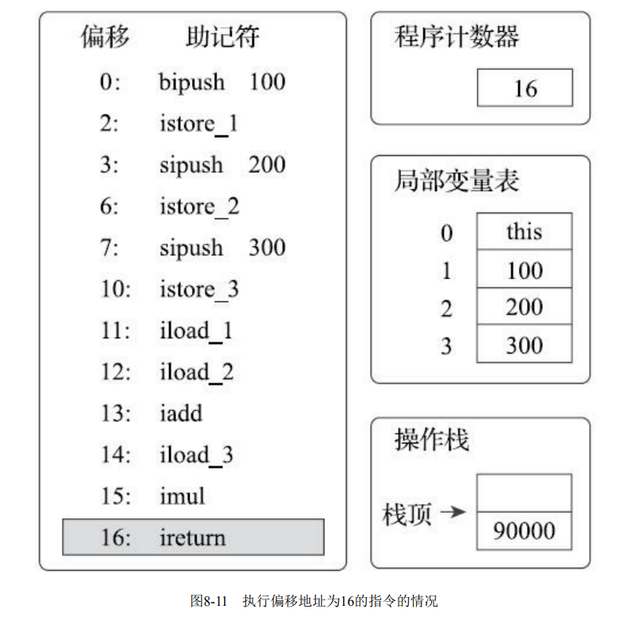

# 第8章 虚拟机字节码执行引擎

> 代码编译的结果从本地机器码转变为字节码，是存储格式发展的一小步，却是编程语言发展的一 大步。

## 8.1 概述

> 执行引擎是Java虚拟机核心的组成部分之一。“虚拟机”是一个相对于“物理机”的概念，这两种机 器都有代码执行能力，其区别是物理机的执行引擎是直接建立在处理器、缓存、指令集和操作系统层 面上的，而虚拟机的执行引擎则是由软件自行实现的，因此可以不受物理条件制约地定制指令集与执 行引擎的结构体系，能够执行那些不被硬件直接支持的指令集格式。
>
> 在《Java虚拟机规范》中制定了Java虚拟机字节码执行引擎的概念模型，这个概念模型成为各大发 行商的Java虚拟机执行引擎的统一外观（Facade）。在不同的虚拟机实现中，执行引擎在执行字节码的 时候，通常会有解释执行（通过解释器执行）和编译执行（通过即时编译器产生本地代码执行）两种 选择[1]，也可能两者兼备，还可能会有同时包含几个不同级别的即时编译器一起工作的执行引擎。但 从外观上来看，所有的Java虚拟机的执行引擎输入、输出都是一致的：输入的是字节码二进制流，处 理过程是字节码解析执行的等效过程，输出的是执行结果，本章将主要从概念模型的角度来讲解虚拟 机的方法调用和字节码执行。

- 物理机是基于硬件+操作系统
- 虚拟机则不必局限于各类不同的硬件+操作系统，实现跨平台
- 虚拟机字节码分为解释执行/编译执行
- 由于外观模式的封装对外而言就是字节码二进制流的输入、以及对应结果的输出

## 8.2 运行时栈帧结构

> Java虚拟机以方法作为最基本的执行单元，“栈帧”（Stack Frame）则是用于支持虚拟机进行方法 调用和方法执行背后的数据结构，它也是虚拟机运行时数据区中的虚拟机栈（Virtual Machine Stack）[1]的栈元素。栈帧存储了方法的局部变量表、操作数栈、动态连接和方法返回地址等信息，如 果读者认真阅读过第6章，应该能从Class文件格式的方法表中找到以上大多数概念的静态对照物。每 一个方法从调用开始至执行结束的过程，都对应着一个栈帧在虚拟机栈里面从入栈到出栈的过程。
>
> 在编译Java程序源码的时候，栈帧中需要多大的局部变量表，需要多深的操作数栈就已经被分析计算 出来，并且写入到方法表的Code属性之中[2]。换言之，一个栈帧需要分配多少内存，并不会受到程序 运行期变量数据的影响，而仅仅取决于程序源码和具体的虚拟机实现的栈内存布局形式。
>
> 一个线程中的方法调用链可能会很长，以Java程序的角度来看，同一时刻、同一条线程里面，在 调用堆栈的所有方法都同时处于执行状态。而对于执行引擎来讲，在活动线程中，只有位于栈顶的方 法才是在运行的，只有位于栈顶的栈帧才是生效的，其被称为“当前栈帧”（Current Stack Frame），与 这个栈帧所关联的方法被称为“当前方法”（Current Method）。执行引擎所运行的所有字节码指令都只 针对当前栈帧进行操作，在概念模型上，典型的栈帧结构如图8-1所示。

- 栈帧（stack frame）是方法调用背后的数据结构
- 栈帧存储局部变量表、操作数栈、动态链接和方法返回地址等信息
- 方法的调用=栈帧的入栈到出栈
- 栈帧中的数据量，在class文件编译时就计算出
- JVM虚拟机栈线程私有，线程的方法调用链路长，理论上来说都在运行中，实际运行的是栈顶的方法



### 8.2.1 局部变量表

> 局部变量表（Local Variables Table）是一组变量值的存储空间，用于存放方法参数和方法内部定义 的局部变量。在Java程序被编译为Class文件时，就在方法的Code属性的max_locals数据项中确定了该方 法所需分配的局部变量表的最大容量。
>
> 局部变量表的容量以变量槽（Variable Slot）为最小单位，《Java虚拟机规范》中并没有明确指出 一个变量槽应占用的内存空间大小，只是很有导向性地说到每个变量槽都应该能存放一个boolean、 byte、char、short、int、float、reference或returnAddress类型的数据，这8种数据类型，都可以使用32位 或更小的物理内存来存储，但这种描述与明确指出“每个变量槽应占用32位长度的内存空间”是有本质 差别的，它允许变量槽的长度可以随着处理器、操作系统或虚拟机实现的不同而发生变化，保证了即 使在64位虚拟机中使用了64位的物理内存空间去实现一个变量槽，虚拟机仍要使用对齐和补白的手段 让变量槽在外观上看起来与32位虚拟机中的一致。

- 局部变量表存储方法参数和内部定义的局部变量
- 局部变量表的大小由属性表的code的max_locals数据项决定
- 变量表的最小存储空间->变量槽，用32位长度即可实现，但随着操作系统的不同会有一定扩展
- reference类型必须能找到，堆中的对象以及方法区中对象对应的class对象
- 异常由异常表跳转
- 变量槽是32位若是变量是64位的long/double则分成两个变量槽，由于线程私有两次读取非原子性也不会引发线程安全问题

> 当一个方法被调用时，Java虚拟机会使用局部变量表来完成参数值到参数变量列表的传递过程， 即实参到形参的传递。如果执行的是实例方法（没有被static修饰的方法），那局部变量表中第0位索 引的变量槽默认是用于传递方法所属对象实例的引用，在方法中可以通过关键字“this”来访问到这个隐 含的参数。其余参数则按照参数表顺序排列，占用从1开始的局部变量槽，参数表分配完毕后，再根据 方法体内部定义的变量顺序和作用域分配其余的变量槽。

- 实参到形参使用局部变量表来完成
- 若是非static的方法调用则局部变量表的第0个索引就是方法所属对象的this指针
- 后续形参按序入表

> 为了尽可能节省栈帧耗用的内存空间，局部变量表中的变量槽是可以重用的，方法体中定义的变 量，其作用域并不一定会覆盖整个方法体，如果当前字节码PC计数器的值已经超出了某个变量的作用 域，那这个变量对应的变量槽就可以交给其他变量来重用。不过，这样的设计除了节省栈帧空间以 外，还会伴随有少量额外的副作用，例如在某些情况下变量槽的复用会直接影响到系统的垃圾收集行 为
>
> 代码清单8-1至8-3中，placeholder能否被回收的根本原因就是：局部变量表中的变量槽是否还存有 关于placeholder数组对象的引用。第一次修改中，代码虽然已经离开了placeholder的作用域，但在此之 后，再没有发生过任何对局部变量表的读写操作，placeholder原本所占用的变量槽还没有被其他变量 所复用，所以作为GC Roots一部分的局部变量表仍然保持着对它的关联。这种关联没有被及时打断， 绝大部分情况下影响都很轻微。但如果遇到一个方法，其后面的代码有一些耗时很长的操作，而前面 又定义了占用了大量内存但实际上已经不会再使用的变量，手动将其设置为null值（用来代替那句int a=0，把变量对应的局部变量槽清空）便不见得是一个绝对无意义的操作，这种操作可以作为一种在极 特殊情形（对象占用内存大、此方法的栈帧长时间不能被回收、方法调用次数达不到即时编译器的编 译条件）下的“奇技”来使用。Java语言的一本非常著名的书籍《Practical Java》中将把“不使用的对象 应手动赋值为null”作为一条推荐的编码规则（笔者并不认同这条规则），但是并没有解释具体原因， 很长时间里都有读者对这条规则感到疑惑。
>
> 虽然代码清单8-1至8-3的示例说明了赋null操作在某些极端情况下确实是有用的，但笔者的观点是 不应当对赋null值操作有什么特别的依赖，更没有必要把它当作一个普遍的编码规则来推广。原因有两 点，从编码角度讲，以恰当的变量作用域来控制变量回收时间才是最优雅的解决方法，如代码清单8-3 那样的场景除了做实验外几乎毫无用处。更关键的是，从执行角度来讲，使用赋null操作来优化内存回 收是建立在对字节码执行引擎概念模型的理解之上的，在第6章介绍完字节码之后，笔者在末尾还撰写 了一个小结“公有设计、私有实现”（6.5节）来强调概念模型与实际执行过程是外部看起来等效，内部 看上去则可以完全不同。当虚拟机使用解释器执行时，通常与概念模型还会比较接近，但经过即时编 译器施加了各种编译优化措施以后，两者的差异就会非常大，只保证程序执行的结果与概念一致。在 实际情况中，即时编译才是虚拟机执行代码的主要方式，赋null值的操作在经过即时编译优化后几乎是 一定会被当作无效操作消除掉的，这时候将变量设置为null就是毫无意义的行为。字节码被即时编译为 本地代码后，对GC Roots的枚举也与解释执行时期有显著差别，以前面的例子来看，经过第一次修改 的代码清单8-2在经过即时编译后，System.gc()执行时就可以正确地回收内存，根本无须写成代码清单 8-3的样子。

- 局部变量的作用域并不一定是整个方法，局部变量无效后变量槽可悲其他变量使用

- 由于线程的指向的局部变量也是gc roots所以方法执行过程中的对象也会被引用导致对象即使无效也不一定可以得到有效回收（由于变量槽复用机制导致变量槽的变量即使不被使用只要不做写操作的变更就会一直有效），在**对象占用内存大、此方法的栈帧长时间不能被回收、方法调用次数达不到即时编译器的编 译条件**的条件下可将对象置为null

  ```java
  public class LocalTableTest {
  	@Test
  	public void t1() throws InterruptedException {
  		// [ParOldGen: 65544K->67230K(167936K)] 对象过大 直接进入老年代，并没有被回收
  		// -verbose：gc -XX:+PrintGCDetails
  		byte[] placeholder = new byte[64 * 1024 * 1024];
  		System.gc();
  		Thread.sleep(500);
  	}
  
  	@Test
  	public void t2() throws InterruptedException {
  		// [ParOldGen: 65544K->67232K(167936K)] 对象过大 直接进入老年代，并没有被回收
  		// -verbose：gc -XX:+PrintGCDetails
  		{
  			byte[] placeholder = new byte[64 * 1024 * 1024];
  		}
  		System.gc();
  		Thread.sleep(500);
  	}
  
  	@Test
  	public void t3() throws InterruptedException {
  		// [ParOldGen: 65544K->1696K(167936K)] 对象过大 直接进入老年代，并没有被回收
  		// -verbose：gc -XX:+PrintGCDetails
  		{
  			byte[] placeholder = new byte[64 * 1024 * 1024];
  		}
  		// 复用局部变量槽，触发变量槽的写操作 更新数据 通知GC
  		int a = 0;
  		System.gc();
  		Thread.sleep(500);
  	}
  }
  ```

  

-  赋值为null并非一定有用的优化点

  - 恰当的变量作用域来优化更好
  - 若代码解释执行赋值null可行，若代码编译执行（大多数情况也是即时编译执行），则赋值为null的操作可能被当作无效操作

> 关于局部变量表，还有一点可能会对实际开发产生影响，就是局部变量不像前面介绍的类变量那 样存在“准备阶段”。通过第7章的学习，我们已经知道类的字段变量有两次赋初始值的过程，一次在准 备阶段，赋予系统初始值；另外一次在初始化阶段，赋予程序员定义的初始值。因此即使在初始化阶 段程序员没有为类变量赋值也没有关系，类变量仍然具有一个确定的初始值，不会产生歧义。但局部 变量就不一样了，如果一个局部变量定义了但没有赋初始值，那它是完全不能使用的。所以不要认为 Java中任何情况下都存在诸如整型变量默认为0、布尔型变量默认为false等这样的默认值规则。如代码 清单8-4所示，这段代码在Java中其实并不能运行（但是在其他语言，譬如C和C++中类似的代码是可 以运行的），所幸编译器能在编译期间就检查到并提示出这一点，即便编译能通过或者手动生成字节 码的方式制造出下面代码的效果，字节码校验的时候也会被虚拟机发现而导致类加载失败。

- 局部变量未被赋值将会出错

- 类变量在准备节点和初始化节点会分别堆字段赋值，而局部变量表无初值就无法使用

  ```java
  	boolean b;
  	@Test
  	public void t4(){
  		int a;
  		// java: 可能尚未初始化变量a
  //		System.out.println("a = " + a);
  		System.out.println("b = " + b);
  	}
  ```

  

- c++的对象引用无法找到类对象
- 局部变量表包括形参和方法参数
- 具体的参数以变量槽的方式存储
- 变量槽可复用，但会造成内存得不到及时的回收等问题
- 局部变量表中的变量不会像类字段一样自动编译

### 8.2.2 操作数栈

> 操作数栈（Operand Stack）也常被称为操作栈，它是一个后入先出（Last In First Out，LIFO） 栈。同局部变量表一样，操作数栈的最大深度也在编译的时候被写入到Code属性的max_stacks数据项 之中。操作数栈的每一个元素都可以是包括long和double在内的任意Java数据类型。32位数据类型所占 的栈容量为1，64位数据类型所占的栈容量为2。Javac编译器的数据流分析工作保证了在方法执行的任 何时候，操作数栈的深度都不会超过在max_stacks数据项中设定的最大值。
>
> 当一个方法刚刚开始执行的时候，这个方法的操作数栈是空的，在方法的执行过程中，会有各种 字节码指令往操作数栈中写入和提取内容，也就是出栈和入栈操作。譬如在做算术运算的时候是通过 将运算涉及的操作数栈压入栈顶后调用运算指令来进行的，又譬如在调用其他方法的时候是通过操作 数栈来进行方法参数的传递。举个例子，例如整数加法的字节码指令iadd，这条指令在运行的时候要 求操作数栈中最接近栈顶的两个元素已经存入了两个int型的数值，当执行这个指令时，会把这两个int 值出栈并相加，然后将相加的结果重新入栈。
>
> 操作数栈中元素的数据类型必须与字节码指令的序列严格匹配，在编译程序代码的时候，编译器 必须要严格保证这一点，在类校验阶段的数据流分析中还要再次验证这一点。再以上面的iadd指令为 例，这个指令只能用于整型数的加法，它在执行时，最接近栈顶的两个元素的数据类型必须为int型， 不能出现一个long和一个float使用iadd命令相加的情况。
>
> 另外在概念模型中，两个不同栈帧作为不同方法的虚拟机栈的元素，是完全相互独立的。但是在 大多虚拟机的实现里都会进行一些优化处理，令两个栈帧出现一部分重叠。让下面栈帧的部分操作数 栈与上面栈帧的部分局部变量表重叠在一起，这样做不仅节约了一些空间，更重要的是在进行方法调 用时就可以直接共用一部分数据，无须进行额外的参数复制传递了，重叠的过程如图8-2所示。
>
>  Java虚拟机的解释执行引擎被称为“基于栈的执行引擎”，里面的“栈”就是操作数栈。

- 操作数栈 LIFO

- 栈深度由编译器确定，运行时不再变化，存储在属性表的code的max_stacks数据项中

- 64位的占两个栈容量

- 初始栈空，运行时例如算术运算借助栈来取数并运算，逆波兰表达式 中缀转后缀后运行

- 操作数栈严格类型匹配

- 栈的优化复用可避免传参，基于栈的执行引擎，栈就是操作数栈

  

### 8.2.3 动态连接

> 每个栈帧都包含一个指向运行时常量池[1]中该栈帧所属方法的引用，持有这个引用是为了支持方 法调用过程中的动态连接（Dynamic Linking）。通过第6章的讲解，我们知道Class文件的常量池中存 有大量的符号引用，字节码中的方法调用指令就以常量池里指向方法的符号引用作为参数。这些符号 引用一部分会在类加载阶段或者第一次使用的时候就被转化为直接引用，这种转化被称为静态解析。 另外一部分将在每一次运行期间都转化为直接引用，这部分就称为动态连接。关于这两个转化过程的 具体过程，将在8.3节中再详细讲解。

- 运行时常量池属于信息
  - 存储编译期生成的字面量和符号引用 字面量是常量，例如string/final等 符号引用 例如 字段名，类全限定名，方法名
- 类信息存储在方法区
- 符号引用转为直接引用包括两种方式
  - 加载过程中/第一次使用的转换，静态解析
  - 运行时动态链接
- 

### 8.2.4 方法返回地址

> 当一个方法开始执行后，只有两种方式退出这个方法。第一种方式是执行引擎遇到任意一个方法 返回的字节码指令，这时候可能会有返回值传递给上层的方法调用者（调用当前方法的方法称为调用 者或者主调方法），方法是否有返回值以及返回值的类型将根据遇到何种方法返回指令来决定，这种 退出方法的方式称为“正常调用完成”（Normal Method Invocation Completion）。 
>
> 另外一种退出方式是在方法执行的过程中遇到了异常，并且这个异常没有在方法体内得到妥善处 理。无论是Java虚拟机内部产生的异常，还是代码中使用athrow字节码指令产生的异常，只要在本方 法的异常表中没有搜索到匹配的异常处理器，就会导致方法退出，这种退出方法的方式称为“异常调用 完成（Abrupt Method Invocation Completion）”。一个方法使用异常完成出口的方式退出，是不会给它 的上层调用者提供任何返回值的。
>
> 无论采用何种退出方式，在方法退出之后，都必须返回到最初方法被调用时的位置，程序才能继 续执行，方法返回时可能需要在栈帧中保存一些信息，用来帮助恢复它的上层主调方法的执行状态。 一般来说，方法正常退出时，主调方法的PC计数器的值就可以作为返回地址，栈帧中很可能会保存这 个计数器值。而方法异常退出时，返回地址是要通过异常处理器表来确定的，栈帧中就一般不会保存 这部分信息。
>
> 方法退出的过程实际上等同于把当前栈帧出栈，因此退出时可能执行的操作有：恢复上层方法的 局部变量表和操作数栈，把返回值（如果有的话）压入调用者栈帧的操作数栈中，调整PC计数器的值 以指向方法调用指令后面的一条指令等。笔者这里写的“可能”是由于这是基于概念模型的讨论，只有 具体到某一款Java虚拟机实现，会执行哪些操作才能确定下来。

- 根据方法执行的退出方式可分为正常调用和异常调用两种模式
  - 正常调用：方法正常执行完成，返回上层调用者，有返回值也一起返回
  - 出现异常，方法执行中断，没有异常处理器会导致方法退出
- 方法退出流程
  - 当前栈帧出栈，恢复上层调用的操作数栈和局部变量表
  - 有返回值就入操作栈
  - PC指向上层调用的下一条指令
- 


- 类对象在方法区，运行时常量池属于类对象也就属于方法区的一部分
- 方法的调用产生栈帧，栈帧产生对象，对象在堆上分配空间，随着线程执行方法完成，栈帧出栈，此时堆上对象可能会失去GC Roots的引用从而进行GC


> 《Java虚拟机规范》允许虚拟机实现增加一些规范里没有描述的信息到栈帧之中，例如与调试、 性能收集相关的信息，这部分信息完全取决于具体的虚拟机实现，这里不再详述。在讨论概念时，一 般会把动态连接、方法返回地址与其他附加信息全部归为一类，称为栈帧信息。

## 8.3 方法调用

> 方法调用并不等同于方法中的代码被执行，方法调用阶段唯一的任务就是确定被调用方法的版本 （即调用哪一个方法），暂时还未涉及方法内部的具体运行过程。在程序运行时，进行方法调用是最 普遍、最频繁的操作之一，但第7章中已经讲过，Class文件的编译过程中不包含传统程序语言编译的 连接步骤，一切方法调用在Class文件里面存储的都只是符号引用，而不是方法在实际运行时内存布局 中的入口地址（也就是之前说的直接引用）。这个特性给Java带来了更强大的动态扩展能力，但也使 得Java方法调用过程变得相对复杂，某些调用需要在类加载期间，甚至到运行期间才能确定目标方法 的直接引用。

- 方法调用是符号引用，在类加载甚至在运行期间才能确定正确的地址，动态链接

### 8.3.1 解析

> 承接前面关于方法调用的话题，所有方法调用的目标方法在Class文件里面都是一个常量池中的符 号引用，在类加载的解析阶段，会将其中的一部分符号引用转化为直接引用，这种解析能够成立的前 提是：方法在程序真正运行之前就有一个可确定的调用版本，并且这个方法的调用版本在运行期是不 可改变的。换句话说，调用目标在程序代码写好、编译器进行编译那一刻就已经确定下来。这类方法 的调用被称为解析（Resolution）。
>
> 在Java语言中符合“编译期可知，运行期不可变”这个要求的方法，主要有静态方法和私有方法两 大类，前者与类型直接关联，后者在外部不可被访问，这两种方法各自的特点决定了它们都不可能通 过继承或别的方式重写出其他版本，因此它们都适合在类加载阶段进行解析。

- 在类加载的解析阶段将符号引用替换为具体的可确定的方法调用版本->解析
- 静态方法/私有方法 符合不可变的特性，静态方法与类型直接关联不必担心继承
  - 静态方法被重写后被引用调用会根据具体的实现对象进行方法调用从而导致调用出错

> 调用不同类型的方法，字节码指令集里设计了不同的指令。在Java虚拟机支持以下5条方法调用字 节码指令，分别是：
>
> ·invokestatic。用于调用静态方法。 
>
> ·invokespecial。用于调用实例构造器()方法、私有方法和父类中的方法。 
>
> ·invokevirtual。用于调用所有的虚方法。 
>
> ·invokeinterface。用于调用接口方法，会在运行时再确定一个实现该接口的对象。
>
> ·invokedynamic。先在运行时动态解析出调用点限定符所引用的方法，然后再执行该方法。前面4 条调用指令，分派逻辑都固化在Java虚拟机内部，而invokedynamic指令的分派逻辑是由用户设定的引 导方法来决定的。
>
> 只要能被invokestatic和invokespecial指令调用的方法，都可以在解析阶段中确定唯一的调用版本， Java语言里符合这个条件的方法共有静态方法、私有方法、实例构造器、父类方法4种，再加上被final 修饰的方法（尽管它使用invokevirtual指令调用），这5种方法调用会在类加载的时候就可以把符号引 用解析为该方法的直接引用。这些方法统称为“非虚方法”（Non-Virtual Method），与之相反，其他方 法就被称为“虚方法”（Virtual Method）。

- invokestatic以及invokespecial都是可以确定方法唯一版本的具体符合的方法
  - 静态方法
  - 私有方法
  - 实例构造器
  - 父类方法
  - final方法
- 按照分派依据的宗量数可分为单 分派和多分派。这两类分派方式两两组合就构成了静态单分派、静态多分派、动态单分派、动态多 分派4种分派组合情况

### 8.3.2 分派

众所周知，Java是一门面向对象的程序语言，因为Java具备面向对象的3个基本特征：继承、封装 和多态。本节讲解的分派调用过程将会揭示多态性特征的一些最基本的体现，如“重载”和“重写”在 Java虚拟机之中是如何实现的，这里的实现当然不是语法上该如何写，我们关心的依然是虚拟机如何 确定正确的目标方法。

- 重写/重载，在虚拟机如何实现找到合适的方法

**1.静态分派**

> 在开始讲解静态分派[1]前，笔者先声明一点，“分派”（Dispatch）这个词本身就具有动态性，一 般不应用在静态语境之中，这部分原本在英文原版的《Java虚拟机规范》和《Java语言规范》里的说法 都是“Method Overload Resolution”，即应该归入8.2节的“解析”里去讲解，但部分其他外文资料和国内 翻译的许多中文资料都将这种行为称为“静态分派”，所以笔者在此特别说明一下，以免读者阅读英文 资料时遇到这两种说法产生疑惑。

栗子

```java
public class StaticDispatch {
	static abstract class Human {
	}

	static class Man extends Human {
	}

	static class Woman extends Human {
	}

	public void sayHello(Human guy) {
		System.out.println("hello,guy!");
	}

	public void sayHello(Man guy) {
		System.out.println("hello,gentleman!");
	}

	public void sayHello(Woman guy) {
		System.out.println("hello,lady!");
	}

	public static void main(String[] args) {
		Human man = new Man();
		Human woman = new Woman();
		StaticDispatch sr = new StaticDispatch();
		// hello,guy!
		sr.sayHello(man);
		// hello,guy!
		sr.sayHello(woman);
	}
}
```

> 我们把上面代码中的“Human”称为变量的“静态类型”（Static Type），或者叫“外观类 型”（Apparent Type），后面的“Man”则被称为变量的“实际类型”（Actual Type）或者叫“运行时类 型”（Runtime Type）。静态类型和实际类型在程序中都可能会发生变化，区别是静态类型的变化仅仅 在使用时发生，变量本身的静态类型不会被改变，并且最终的静态类型是在编译期可知的；而实际类 型变化的结果在运行期才可确定，编译器在编译程序的时候并不知道一个对象的实际类型是什么。笔 者猜想上面这段话读者大概会不太好理解，那不妨通过一段实际例子来解释，譬如有下面的代码

```java
	public static void main(String[] args) {
		Human man = new Man();
		Human woman = new Woman();
		StaticDispatch sr = new StaticDispatch();
		// hello,guy!
		sr.sayHello(man);
		// hello,guy!
		sr.sayHello(woman);

		// 实际类型变化
		Human human = (new Random()).nextBoolean() ? new Man() : new Woman();
// 静态类型变化
		// hello,gentleman!
		//Exception in thread "main" java.lang.ClassCastException: priv.wzb.jvm.engine.StaticDispatch$Man cannot be cast to priv.wzb.jvm.engine.StaticDispatch$Woman
		//	at StaticDispatch.main(StaticDispatch.java:47)
		sr.sayHello((Man) human);
		sr.sayHello((Woman) human);

	}
```

- 静态类型编译时可知，实际类型徐运行时才能知道
- 对象human的实际类型可变实际指向的对象在运行时可知
- 上面代码故意传入两个静态类型相同实际类型不同
- 编译器在编译时只能确定静态类型 因此选择了sayHello(Human)作为调用目标 并把这个方法的符号引用写到 main()方法里的两条invokevirtual指令的参数中

> 所有依赖静态类型来决定方法执行版本的分派动作，都称为静态分派。静态分派的最典型应用表 现就是方法重载。静态分派发生在编译阶段，因此确定静态分派的动作实际上不是由虚拟机来执行 的，这点也是为何一些资料选择把它归入“解析”而不是“分派”的原因。
>
> 

- 静态分派->依赖静态类型来决定方法执行，典型的就是重载
- 在编译阶段发生静态分派确定静态类型，归入解析
- javac虽然能在编译时确定版本，但多个适配时只能选择相对合适的

```java
public class Overload {
	public static void sayHello(Object arg) {
		System.out.println("hello Object");
	}
	public static void sayHello(int arg) {
		System.out.println("hello int");
	}
	public static void sayHello(long arg) {
		System.out.println("hello long");
	}
	public static void sayHello(Character arg) {
		System.out.println("hello Character");
	}
	public static void sayHello(char arg) {
		System.out.println("hello char");
	}
	public static void sayHello(char... arg) {
		System.out.println("hello char ...");
	}
	public static void sayHello(Serializable arg) {
		System.out.println("hello Serializable");
	}
	public static void main(String[] args) {
		sayHello('a');
	}
}
```

- 上述代码可知 实际上自动转型还能继 续发生多次，按照char>int>long>float>double的顺序转型进行匹配
- 若基础类型注掉就会按照被包装成的对象来匹配 分别是Character>Serializable>Object 因为多层继承选择最接近的
- 最后才是变长数组，变长数组无法适应自动转型（例如char变为int...)
- 

> 笔者讲述的解析与分派这两者之间的关系并不是二选一的 排他关系，它们是在不同层次上去筛选、确定目标方法的过程。例如前面说过静态方法会在编译期确 定、在类加载期就进行解析，而静态方法显然也是可以拥有重载版本的，选择重载版本的过程也是通 过静态分派完成的。

**2.动态分派**

> 了解了静态分派，我们接下来看一下Java语言里动态分派的实现过程，它与Java语言多态性的另外 一个重要体现[3]——重写（Override）有着很密切的关联。我们还是用前面的Man和Woman一起 sayHello的例子来讲解动态分派，请看代码清单8-8中所示的代码。

```java
public class DynamicDispatch {
	static abstract class Human {
		protected abstract void sayHello();
	}
	static class Man extends Human {
		@Override
		protected void sayHello() {
			System.out.println("man say hello");
		}
	}
	static class Woman extends Human {
		@Override
		protected void sayHello() {
			System.out.println("woman say hello");
		}
	}
	public static void main(String[] args) {
		Human man = new Man();
		Human woman = new Woman();
		// man say hello
		man.sayHello();
		// woman say hello
		woman.sayHello();
		// woman say hello
		man = new Woman();
		man.sayHello();
	}
}
```

- 动态分配与重写
- 这里的方法调用不是解释的时候指定的而是运行时动态指定
- javap之后可以看到结果是`invokespecial`来new 构造新的对象 但是具体调用则是`invokevirtual`,该函数解析过程
  - 找到操作数栈顶的第一个元素所指向的对象的实际类型，记作C。
  - 如果在类型C中找到与常量中的描述符和简单名称都相符的方法，则进行访问权限校验，如果 通过则返回这个方法的直接引用，查找过程结束；不通过则返回java.lang.IllegalAccessError异常。
  - 否则，按照继承关系从下往上依次对C的各个父类进行第二步的搜索和验证过程。
  - 如果始终没有找到合适的方法，则抛出java.lang.AbstractMethodError异常。
  - 先在类中找，找不到就向上查找
- 

> 正是因为invokevirtual指令执行的第一步就是在运行期确定接收者的实际类型，所以两次调用中的 invokevirtual指令并不是把常量池中方法的符号引用解析到直接引用上就结束了，还会根据方法接收者 的实际类型来选择方法版本，这个过程就是Java语言中方法重写的本质。我们把这种在运行期根据实 际类型确定方法执行版本的分派过程称为动态分派。

- 运行时根据类型确定方法指向版本的分派过程

> 既然这种多态性的根源在于虚方法调用指令invokevirtual的执行逻辑，那自然我们得出的结论就只 会对方法有效，对字段是无效的，因为字段不使用这条指令。事实上，在Java里面只有虚方法存在， 字段永远不可能是虚的，换句话说，字段永远不参与多态，哪个类的方法访问某个名字的字段时，该 名字指的就是这个类能看到的那个字段。当子类声明了与父类同名的字段时，虽然在子类的内存中两 个字段都会存在，但是子类的字段会遮蔽父类的同名字段。为了加深理解，笔者又编撰了一份“劣质面 试题式”的代码片段，请阅读代码清单8-10，思考运行后会输出什么结果。

```java
public class FieldHasNoPolymorphic {
	static class Father {
		public int money = 1;
		public Father() {
			money = 2;
			showMeTheMoney();
		}
		public void showMeTheMoney() {
			System.out.println("I am Father, i have $" + money);
		}
	}
	static class Son extends Father {
		public int money = 3;
		public Son() {
			money = 4;
			showMeTheMoney();
		}
		public void showMeTheMoney() {
			System.out.println("I am Son, i have $" + money);
		}
	}
	public static void main(String[] args) {
		// I am Son, i have $0
		//I am Son, i have $4
		//This gay has $2
		Father gay = new Son();
		System.out.println("This gay has $" + gay.money);
	}
}
```

- 对象的实例化构造函数默认调用父类构造函数
- 父类构造函数调用的方法被动态分配到具体的子类上，此时子类参数未初始化则输出`I am Son, i have $0`
- 之后初始化子类对象输出`I am Son, i have $4`
- 字段没有动态链接，所以最后一句访问到了父类对象输出`This gay has $2`


- 静态分派->重载
- 动态分派->重写
- 字段没有动态分派

**3.单分派与多分派**

> 方法的接收者与方法的参数统称为方法的宗量，这个定义最早应该来源于著名的《Java与模式》 一书。根据分派基于多少种宗量，可以将分派划分为单分派和多分派两种。单分派是根据一个宗量对 目标方法进行选择，多分派则是根据多于一个宗量对目标方法进行选择。

- 方法的接收者:谁来调用方法
- 静态分派：多分派 多个宗量的选择 （重载） 调用方法的对象的确定和调用哪个方法
- 动态分派：单分派 

**4.虚拟机动态分派的实现**

> 动态分派是执行非常频繁的动作，而且动态分派的方法版本选择过程需要运行时在接收者类型的 方法元数据中搜索合适的目标方法，因此，Java虚拟机实现基于执行性能的考虑，真正运行时一般不 会如此频繁地去反复搜索类型元数据。面对这种情况，一种基础而且常见的优化手段是为类型在方法 区中建立一个虚方法表（Virtual Method Table，也称为vtable，与此对应的，在invokeinterface执行时也 会用到接口方法表——Interface Method Table，简称itable），使用虚方法表索引来代替元数据查找以 提高性能[8]。我们先看看代码清单8-11所对应的虚方法表结构示例，如图8-3所示。



- 通过虚方法区/接口方法表来代替元数据检索
- 虚方法区中若子类重写了父类方法则指向的方法不同，若没重写则子类表中指向父类

## 8.4 动态类型语言支持

> Java虚拟机的字节码指令集的数量自从Sun公司的第一款Java虚拟机问世至今，二十余年间只新增 过一条指令，它就是随着JDK 7的发布的字节码首位新成员——invokedynamic指令。这条新增加的指 令是JDK 7的项目目标：实现动态类型语言（Dynamically Typed Language）支持而进行的改进之一， 也是为JDK 8里可以顺利实现Lambda表达式而做的技术储备。在本节中，我们将详细了解动态语言支 持这项特性出现的前因后果和它的意义与价值。

### 8.4.1 动态类型语言

> 何谓动态类型语言[1]？动态类型语言的关键特征是它的类型检查的主体过程是在运行期而不是编 译期进行的，满足这个特征的语言有很多，常用的包括：APL、Clojure、Erlang、Groovy、 JavaScript、Lisp、Lua、PHP、Prolog、Python、Ruby、Smalltalk、Tcl，等等。那相对地，在编译期就 进行类型检查过程的语言，譬如C++和Java等就是最常用的静态类型语言。

- 动态语言：类型检查在运行时检测
- 一门语言的哪一种检查行为要在运行期进行，哪一种检查要在编译期进行并没有什么 必然的因果逻辑关系，关键是在语言规范中人为设立的约定。
- 连接时:编译后的类加载
- 运行时:类加载完毕程序运行
- Java中的静态类型提前指定且不可变更，而JavaScript中并不一定要求对象的强制类型可动态变更
- 动态语言：变量无类型而变量值才有类型
- Java在运行前加载类过程中就确定了方法的完整符号引用运行时不可变

### 8.4.2 Java与动态类型

> 现在我们回到本节的主题，来看看Java语言、Java虚拟机与动态类型语言之间有什么关系。Java虚 拟机毫无疑问是Java语言的运行平台，但它的使命并不限于此，早在1997年出版的《Java虚拟机规范》 第1版中就规划了这样一个愿景：“在未来，我们会对Java虚拟机进行适当的扩展，以便更好地支持其 他语言运行于Java虚拟机之上。”而目前确实已经有许多动态类型语言运行于Java虚拟机之上了，如 Clojure、Groovy、Jython和JRuby等，能够在同一个虚拟机之上可以实现静态类型语言的严谨与动态 类型语言的灵活，这的确是一件很美妙的事情。

- 虚拟机需要同时实现静态+动态以支持不同语言运行在JVM上

- 例如有以下代码

  ```java
  var arrays = {"abc", new ObjectX(), 123, Dog, Cat, Car..}
  for(item in arrays){
  item.sayHello();
  }
  ```

  

- 由于数组中存储各种不同类型，并且都有各自的`sayHello`运行时调用动态的方法

- 若通过记录每个sayHello所处位置再动态绑定显然不合适，方法被替换后无法复用

- 所以这种动态类型方法调用的底层问题终归是应当在Java虚拟机层次上去解决才最合适。因 此，在Java虚拟机层面上提供动态类型的直接支持就成为Java平台发展必须解决的问题，这便是JDK 7 时JSR-292提案中invokedynamic指令以及java.lang.invoke包出现的技术背景。

### 8.4.3 java.lang.invoke包

- Java中无法实现函数传递

- Java中使用接口传递实现类似功能

- 方法句柄->函数指针

- 样例代码

  ```java
  public class MethodHandleTest {
  	static class ClassA{
  		public void println(String s){
  			System.out.println("s = " + s);
  		}
  	}
  
  	@Test
  	public void methodHandlerTest() throws Throwable {
  		// System.out 返回的PrintStream对象是静态常量 因此打印方法需要加锁
  		// 无论obj最终是哪个实现类，下面这句都能正确调用到println方法。
  		Object obj = System.currentTimeMillis() % 2 == 0? System.out:new ClassA();
  		MethodHandle mh = getMH(obj);
  		mh.invoke("yuzuki");
  
  	}
  
  	private static MethodHandle getMH(Object obj) throws NoSuchMethodException, IllegalAccessException {
  		// 生成方法句柄，在特定对象中寻找方法句柄，构建方法签名，根据方法签名+方法名寻找指定方法
  		// MethodType：代表“方法类型”，包含了方法的返回值（methodType()的第一个参数）和
  		// 具体参数（methodType()第二个及以后的参数）。
  		MethodType methodType = MethodType.methodType(void.class, String.class);
  		// special 是构造/父类/私有
  		// static 是静态方法
  		// 其余都是虚方法，在运行时确认
  		// lookup()方法来自于MethodHandles.lookup，这句的作用是在指定类中查找符合给定的方法
  		// 名称、方法类型，并且符合调用权限的方法句柄。
  		// 因为这里调用的是一个虚方法，按照Java语言的规则，方法第一个参数是隐式的，代表该方法的接
  		// 收者，也即this指向的对象，这个参数以前是放在参数列表中进行传递，现在提供了bindTo()
  		// 方法来完成这件事情。
  		return MethodHandles.lookup().findVirtual(obj.getClass(),"println",methodType).bindTo(obj);
  	}
  }
  ```

  

- 通过方法的方法签名+方法所属对象找到合适方法的methodHandler

- 以此为基础，有了MethodHandle就 可以写出类似于C/C++那样的函数声明了

  ```java
  void sort(List list, MethodHandle compare)
  ```

  

- methodHandle与反射的区别

  - 反射是代码层次

  - MethodHandle是字节码层次

    > 在MethodHandles.Lookup上的3个方法 findStatic()、findVirtual()、findSpecial()正是为了对应于invokestatic、invokevirtual（以及 invokeinterface）和invokespecial这几条字节码指令的执行权限校验行为，而这些底层细节在使用 Reflection API时是不需要关心的。

  - MethodHandle支持虚拟机优化

  - reflection是Java层面的而methodHandle是服务所有JVM之上的语言

- 

### 8.4.4 invokedynamic指令

- 与MethodHandle类似 解决分派固化在JVM的问题

- 作用：支持分派由用户指定

- > 每一处含有invokedynamic指令的位置都被称作“动态调用点（Dynamically-Computed Call Site）”， 这条指令的第一个参数不再是代表方法符号引用的CONSTANT_Methodref_info常量，而是变为JDK 7 时新加入的CONSTANT_InvokeDynamic_info常量，从这个新常量中可以得到3项信息：引导方法 （Bootstrap Method，该方法存放在新增的BootstrapMethods属性中）、方法类型（MethodType）和 名称。

- ```java
  public class InvokeDynamicTest {
  	public static void main(String[] args) throws Throwable {
  		INDY_BootstrapMethod().invokeExact("icyfenix");
  	}
  	public static void testMethod(String s) {
  		System.out.println("hello String:" + s);
  	}
  	public static CallSite BootstrapMethod(MethodHandles.Lookup lookup, String name, MethodType mt) throws Throwable {
  		// 2.根据类+方法+方法签名 获取指定方法调用
  		return new ConstantCallSite(lookup.findStatic(InvokeDynamicTest.class, name, mt));
  	}
  	private static MethodType MT_BootstrapMethod() {
  		return MethodType
  				.fromMethodDescriptorString(
  						"(Ljava/lang/invoke/MethodHandles$Lookup;Ljava/lang/String; Ljava/lang/invoke/MethodType;)Ljava/lang/invoke/CallSite;", null);
  	}
  	private static MethodHandle MH_BootstrapMethod() throws Throwable {
  		// 1.获取引导方法
  		return lookup().findStatic(InvokeDynamicTest.class, "BootstrapMethod", MT_BootstrapMethod());
  	}
  	private static MethodHandle INDY_BootstrapMethod() throws Throwable {
  		// 3.构建调用封装对象CallSite cs
  		CallSite cs = (CallSite) MH_BootstrapMethod().invokeWithArguments(lookup(), "testMethod",
  				MethodType.fromMethodDescriptorString("(Ljava/lang/String;)V", null));
  		return cs.dynamicInvoker();
  	}
  }
  ```

- 

### 8.4.5 实战：掌控方法分派规则

> invokedynamic指令与此前4条传统的“invoke*”指令的最大区别就是它的分派逻辑不是由虚拟机决 定的，而是由程序员决定。在介绍Java虚拟机动态语言支持的最后一节中，笔者希望通过一个简单例 子（如代码清单8-15所示），帮助读者理解程序员可以掌控方法分派规则之后，我们能做什么以前无 法做到的事情。

## 8.5 基于栈的字节码解释执行引擎

> 关于Java虚拟机是如何调用方法、进行版本选择的内容已经全部讲解完毕，从本节开始，我们来 探讨虚拟机是如何执行方法里面的字节码指令的。概述中曾提到过，许多Java虚拟机的执行引擎在执 行Java代码的时候都有解释执行（通过解释器执行）和编译执行（通过即时编译器产生本地代码执 行）两种选择，在本节中，我们将会分析在概念模型下的Java虚拟机解释执行字节码时，其执行引擎 是如何工作的。笔者在本章多次强调了“概念模型”，是因为实际的虚拟机实现，譬如HotSpot的模板解 释器工作的时候，并不是按照下文中的动作一板一眼地进行机械式计算，而是动态产生每条字节码对 应的汇编代码来运行，这与概念模型中执行过程的差异很大，但是结果却能保证是一致的。

- 执行引擎的具体执行过程，执行过程会被优化，指令重排序，但结果一直

### 8.5.1 解释执行

> Java语言经常被人们定位为“解释执行”的语言，在Java初生的JDK 1.0时代，这种定义还算是比较 准确的，但当主流的虚拟机中都包含了即时编译器后，Class文件中的代码到底会被解释执行还是编译 执行，就成了只有虚拟机自己才能准确判断的事。再后来，Java也发展出可以直接生成本地代码的编 译器（如Jaotc、GCJ [1]，Excelsior JET），而C/C++语言也出现了通过解释器执行的版本（如 CINT [2]），这时候再笼统地说“解释执行”，对于整个Java语言来说就成了几乎是没有意义的概念，只 有确定了谈论对象是某种具体的Java实现版本和执行引擎运行模式时，谈解释执行还是编译执行才会 比较合理确切。 
>
> 无论是解释还是编译，也无论是物理机还是虚拟机，对于应用程序，机器都不可能如人那样阅 读、理解，然后获得执行能力。大部分的程序代码转换成物理机的目标代码或虚拟机能执行的指令集 之前，都需要经过图8-4中的各个步骤。如果读者对大学编译原理的相关课程还有印象的话，很容易就 会发现图8-4中下面的那条分支，就是传统编译原理中程序代码到目标机器代码的生成过程；而中间的 那条分支，自然就是解释执行的过程。

- 1.0时代就是解释执行
- 1.0之后引入即时编译器，代码可能被编译



- Java具体执行分为解释/编译
- 词法分析、语法分析、抽象语法树

> 如今，基于物理机、Java虚拟机，或者是非Java的其他高级语言虚拟机（HLLVM）的代码执行过 程，大体上都会遵循这种符合现代经典编译原理的思路，在执行前先对程序源码进行词法分析和语法 分析处理，把源码转化为抽象语法树（Abstract Syntax Tree，AST）。对于一门具体语言的实现来说， 词法、语法分析以至后面的优化器和目标代码生成器都可以选择独立于执行引擎，形成一个完整意义 的编译器去实现，这类代表是C/C++语言。也可以选择把其中一部分步骤（如生成抽象语法树之前的 步骤）实现为一个半独立的编译器，这类代表是Java语言。又或者把这些步骤和执行引擎全部集中封 装在一个封闭的黑匣子之中，如大多数的JavaScript执行引擎。

- 根据是否让外部接入去干涉执行过程可分为三种
- 全部封装
  - JavaScript 看不到里面怎么执行的
- 部分封装
  - Java 抽象语法树生成前封装，之后开放
- 完全放开
  - c/c++ 完全放开

### 8.5.2 基于栈的指令集与基于寄存器的指令集

> Javac编译器输出的字节码指令流，基本上[1]是一种基于栈的指令集架构（Instruction Set Architecture，ISA），字节码指令流里面的指令大部分都是零地址指令，它们依赖操作数栈进行工 作。与之相对的另外一套常用的指令集架构是基于寄存器的指令集，最典型的就是x86的二地址指令 集，如果说得更通俗一些就是现在我们主流PC机中物理硬件直接支持的指令集架构，这些指令依赖寄 存器进行工作。

- 基于操作数栈和基于寄存器的指令

- 操作数栈的指令通常不会携带操作数，操作数都在栈中，也可存储变量到局部变量表

  ```java
  iconst_1
  iconst_1
  iadd
  istore_0
  
  ```

  - 基于栈不依赖底层硬件，可移植性，指令简单，紧凑	
  - 在解释执行的状态下慢一些，编译后就是直接使用寄存器指令

- 寄存器的指令则命令+操作数

  ```java
  mov eax, 1
  add eax, 1
  ```

- 

### 8.5.3 基于栈的解释器执行过程

**例如有如下Java代码**

```java
public int calc() {
int a = 100;
int b = 200;
int c = 300;
return (a + b) * c;
}

```

**编译后变为如下所示**

```java
Code:
Stack=2, Locals=4, Args_size=1
0: bipush 100
2: istore_1
3: sipush 200
6: istore_2
7: sipush 300
10: istore_3
11: iload_1
12: iload_2
13: iadd
14: iload_3
15: imul
16: ireturn
}
```

具体执行时借助操作数栈+局部变量表+PC









- 上述是概念模型，实际过程中由于解析器和即时编译器的优化导致指令并非一定逐条执行


## 小结

- 方法的调用就是虚拟机栈的入栈到出栈
- 栈结构包含局部变量表，操作数栈，动态链接，返回地址
- 方法调用分为静态/动态 分派，静态是class解析时固定，重载，动态分派是运行时确定，重写
- Java与动态语言，通过methodhandler将方法调用的控制权一部分转移到用户手上
- 执行引擎，字节码解释/编译执行，栈就是JVM，寄存器就是底层硬件，理论上寄存器更快，实际上指令可被即时编译器转为寄存器指令
