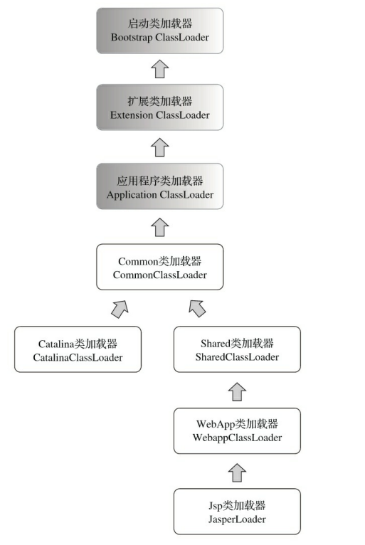

# 第9章 类加载及执行子系统的案例与实战

> 代码编译的结果从本地机器码转变为字节码，是存储格式发展的一小步，却是编程语言发展的一 大步。

## 9.1 概述

> 在Class文件格式与执行引擎这部分里，用户的程序能直接参与的内容并不太多，Class文件以何种 格式存储，类型何时加载、如何连接，以及虚拟机如何执行字节码指令等都是由虚拟机直接控制的行 为，用户程序无法对其进行改变。能通过程序进行操作的，主要是字节码生成与类加载器这两部分的 功能，但仅仅在如何处理这两点上，就已经出现了许多值得欣赏和借鉴的思路，这些思路后来成为许 多常用功能和程序实现的基础。在本章中，我们将看一下前面所学的知识在实际开发之中是如何应用 的。

- 类的加载、链接、执行都无法控制
- 自定义类加载器以及字节码生成 在效范围控制JVM运行
- 接下来看具体应用

## 9.2 案例分析

> 在案例分析部分，笔者准备了4个例子，关于类加载器和字节码的案例各有两个。并且这两个领域 的案例中又各有一个案例是大多数Java开发人员都使用过的工具或技术，另外一个案例虽然不一定每 个人都使用过，但却能特别精彩地演绎出这个领域中的技术特性。希望后面的案例能引起读者的思 考，并给读者的日常工作带来灵感。

### 9.2.1 Tomcat：正统的类加载器架构

- web服务器都有自己的类加载器，为了解决如下问题

  - 一个服务器多个web程序，使用的类应该隔离，类库独立
  - Java类库共享，例如多个spring部署的应用程序，每个都独立 浪费资源，主要是内存资源浪费
    - 同名类是否意义相同的问题

  - 服务器自身的类库与应用程序的类库隔离
  - JSP自身场景带来的热部署问题=》class的热替换

- tomcat的实例 如何区分用户/公共

  - 四组目录

    - /common ： tomcat+所有web应用程序可用 例如spring？
    - /server 仅tomcat可见
    - /shared 应用程序可见 tomcat不可见
    - /WebApp/WEB-INF 仅特定应用程序可见，其他应用程序或tomcat不可见

  - 自定义类加载器，双亲委派模型 tomcat类加载模型

    

  - 类加载器

    - common=》/common
    - catalina=》/server
    - shared=》/shared
    - webApp=》/WebApp/WEB-INF/*
    - 其中webApp/Jsp都有多个实例对应多个web应用

  - jsp的热替换，common是公共的 Catalina是服务端限定，shared是客户端通用，webApp是不同客户端限定，JSP是不同客户端的JSP限定

  - tomcat6之后变为 将common server shared和为一个Lib目录

  - 那么被Common类加载器或Shared类加载器加载的Spring如何访问并不在其加载范围内的用户程序呢

    - 由于双亲委派机制的限制导致只能向上加载无法向下加载，解决方案就是破坏现有类加载机制

  - 

### 9.2.2 OSGi：灵活的类加载器架构

> 曾经在Java程序社区中流传着这么一个观点：“学习Java EE规范，推荐去看JBoss源码；学习类加 载器的知识，就推荐去看OSGi源码。”尽管“Java EE规范”和“类加载器的知识”并不是一个对等的概 念，不过，既然这个观点能在部分程序员群体中流传开来，也从侧面说明了OSGi对类加载器的运用确 实有其独到之处。

- 通过bundle来模糊化类加载器，各个类使用统一类加载器，只有bundle与package绑定才有上下级关系
- 树形加载器结构=》网状

### 9.2.3 字节码生成技术与动态代理的实现

动态代理

```java
public class DynamicProxyTest {
	interface IHello {
		void sayHello();
	}
	static class Hello implements IHello {
		@Override
		public void sayHello() {
			System.out.println("hello world");
		}
	}
	static class DynamicProxy implements InvocationHandler{
		Object originObject;

		Object bind(Object originObject) {
			this.originObject = originObject;
			return Proxy.newProxyInstance(originObject.getClass().getClassLoader(), originObject.getClass().getInterfaces(), this);
		}


		@Override
		public Object invoke(Object proxy, Method method, Object[] args) throws Throwable {
			System.out.println("welcome");
			return method.invoke(originObject,args);
		}
	}

	public static void main(String[] args) {
		IHello hello = (IHello) new DynamicProxy().bind(new Hello());
		hello.sayHello();
	}
}
```

### 9.2.4 Backport工具：Java的时光机器

- 逆向加载 ，正常高版本兼容低版本代码，但是反之不行，可以通过将高版本代码编译为低版本代码实现低版本运行

  > 幸好，我们没有办法把19寸 显示器变成32寸的，但却可以跨越JDK版本之间的沟壑，把高版本JDK中编写的代码放到低版本JDK 环境中去部署使用。为了解决这个问题，一种名为“Java逆向移植”的工具（Java Backporting Tools）应 运而生，Retrotranslator [1]和Retrolambda是这类工具中的杰出代表。

- java的升级

  - 集合类API
  - 自动装箱/拆箱
  - 模块化
  - JMM

- 