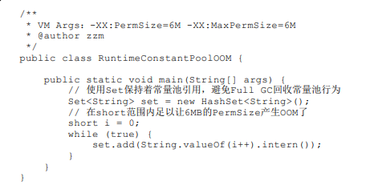

# 第二章 Java内存区域与内存溢出异常

Java与C++之间有一堵由内存动态分配和垃圾收集技术所围成的高墙，墙外面的人想进去，墙里 面的人却想出来。

## 2.1 概述

C++的内存分配每个对象从生命周期开始到结束都需要编程者管理

Java不需要管理delete/free代码

内存分配由虚拟机自动内存管理机制进行

平时不需要管理内存

但是一旦出现内存泄露和溢出方面的问题，如果不了解虚拟机如何使用内存那么排错，修正问题将很困难。

## 2.2 运行时数据区域

Java虚拟机在执行Java程序的过程中会把它所管理的内存划分为若干个不同的数据区域。这些区域 有各自的用途，以及创建和销毁的时间，有的区域随着虚拟机进程的启动而一直存在，有些区域则是 依赖用户线程的启动和结束而建立和销毁。根据《Java虚拟机规范》的规定，Java虚拟机所管理的内存 将会包括以下几个运行时数据区域，如图2-1所示。

JVM虚拟机划分的内存模型：


### 程序计数器

程序计数器（Program Counter Register）是一块较小的内存空间，它可以看作是当前线程所执行的 字节码的行号指示器。在Java虚拟机的概念模型里[1]，字节码解释器工作时就是通过改变这个计数器 的值来选取下一条需要执行的字节码指令，它是**程序控制流的指示器，分支、循环、跳转、异常处 理、线程恢复等基础功能都需要依赖这个计数器来完成**。

JVM的多线程是线程切换的并发实现的，一个处理器某个时刻只会出路一条线程中的指令。因 此，为了线程切换后能恢复到正确的执行位置，**每条线程都需要有一个独立的程序计数器**，各条线程 之间计数器互不影响，独立存储，我们称这类内存区域为“线程私有”的内存。

如果线程正在执行的是一个Java方法，这个计数器记录的是正在执行的虚拟机字节码指令的地 址；如果正在执行的是本地（Native）方法，这个计数器值则应为空（Undefined）。此内存区域是唯 一一个在《Java虚拟机规范》中没有规定任何OutOfMemoryError情况的区域。

**程序计数器用于控制单线程的程序执行流程，每个线程内置一个PC，PC之间互相隔离**

### Java虚拟机栈

与程序计数器一样，Java虚拟机栈（Java Virtual Machine Stack）也是线程私有的，它的生命周期 与线程相同。**虚拟机栈描述的是Java方法执行的线程内存模型**：每个方法被执行的时候，Java虚拟机都 会同步创建一个栈帧[1]（Stack Frame）用于存储局部变量表、操作数栈、动态连接、方法出口等信 息。**每一个方法被调用直至执行完毕的过程，就对应着一个栈帧在虚拟机栈中从入栈到出栈的过程。**

**虚拟机栈中存放Java方法的执行信息，每个线程都有独立的Java虚拟机栈，一个方法的执行等于栈帧（Stack Frame）从入栈到出栈的功能。**

**所以：如果方法不断递归调用自身会导致JVM的虚拟机栈溢出**

经常有人把Java内存区域笼统地划分为堆内存（Heap）和栈内存（Stack），这种划分方式直接继 承自传统的C、C++程序的内存布局结构，在Java语言里就显得有些粗糙了，实际的内存区域划分要比 这更复杂。不过这种划分方式的流行也间接说明了程序员最关注的、**与对象内存分配关系最密切的区 域是“堆”和“栈”两块**。其中，“堆”在稍后笔者会专门讲述，而**“栈”通常就是指这里讲的虚拟机栈**，或 者更多的情况下**只是指虚拟机栈中局部变量表部分**。

**primitive及变量引用存放在变量表中**

局部变量表存放了编译期可知的各种Java虚拟机基本数据类型（boolean、byte、char、short、int、 float、long、double）、对象引用（reference类型，它并不等同于对象本身，可能是一个指向对象起始 地址的引用指针，也可能是指向一个代表对象的句柄或者其他与此对象相关的位置）和returnAddress 类型（指向了一条字节码指令的地址）。

这些数据类型在局部变量表中的存储空间以局部变量槽（Slot）来表示，其中**64位长度的long和 double类型的数据会占用两个变量槽**，其余的数据类型只占用一个。局部变量表所需的内存空间在编 译期间完成分配，当进入一个方法时，这个方法需要在栈帧中分配多大的局部变量空间是完全确定 的，在方法运行期间不会改变局部变量表的大小。请读者注意，这里说的“大小”是指变量槽的数量， 虚拟机真正使用多大的内存空间（譬如按照1个变量槽占用32个比特、64个比特，或者更多）来实现一 个变量槽，这是完全由具体的虚拟机实现自行决定的事情。

在《Java虚拟机规范》中，对这个内存区域规定了两类异常状况：如果线程请求的栈深度大于虚 拟机所允许的深度，将抛出StackOverflowError异常；如果Java虚拟机栈容量可以动态扩展[2]，当栈扩 展时无法申请到足够的内存会抛出OutOfMemoryError异常。

**方法的重复运行，比如递归，不断循环调用自己的递归或深度太深导致stckOverFlowError**

**栈溢出->Java虚拟机栈->栈帧超出内存限制**

### 本地方法栈

本地方法栈（Native Method Stacks）与虚拟机栈所发挥的作用是非常相似的，其区别只是虚拟机 栈为虚拟机执行Java方法（也就是字节码）服务，而本地方法栈则是为虚拟机使用到的本地（Native） 方法服务。

《Java虚拟机规范》对本地方法栈中方法使用的语言、使用方式与数据结构并没有任何强制规 定，因此具体的虚拟机可以根据需要自由实现它，甚至有的Java虚拟机（譬如Hot-Spot虚拟机）直接 就把本地方法栈和虚拟机栈合二为一。与虚拟机栈一样，本地方法栈也会在栈深度溢出或者栈扩展失 败时分别抛出StackOverflowError和OutOfMemoryError异常。

**Java虚拟机栈 和本地方法栈功能相同，都是用于存储方法调用产生的栈帧、基本数据类型/对象引用，两者服务的对象不同一者Java方法一者本地方法**

### Java堆

对于Java应用程序来说，Java堆（Java Heap）是虚拟机所管理的内存中最大的一块。Java堆是被所 有线程共享的一块内存区域，在虚拟机启动时创建。此内存区域的唯一目的就是存放对象实例，Java 世界里“几乎”所有的对象实例都在这里分配内存。在《Java虚拟机规范》中对Java堆的描述是：“所有 的对象实例以及数组都应当在堆上分配[1]”，而这里笔者写的“几乎”是指从实现角度来看，随着Java语 言的发展，现在已经能看到些许迹象表明日后可能出现值类型的支持，即使只考虑现在，**由于即时编 译技术的进步，尤其是逃逸分析技术的日渐强大，栈上分配、标量替换[2]优化手段已经导致一些微妙 的变化悄然发生，所以说Java对象实例都分配在堆上也渐渐变得不是那么绝对了。**

**Java堆（Java Heap）存放对象实例。几乎所有对象实例及数组都在堆上分配内存。**

Java堆是垃圾收集器管理的内存区域，因此一些资料中它也被称作“GC堆”（Garbage Collected Heap，幸好国内没翻译成“垃圾堆”）。从回收内存的角度看，由于现代垃圾收集器大部分都是基于分 代收集理论设计的，所以Java堆中经常会出现“新生代”“老年代”“永久代”“Eden空间”“From Survivor空 间”“To Survivor空间”等名词，这些概念在本书后续章节中还会反复登场亮相，在这里笔者想先说明的 是这些区域划分仅仅是一部分垃圾收集器的共同特性或者说设计风格而已，而非某个Java虚拟机具体 实现的固有内存布局，更不是《Java虚拟机规范》里对Java堆的进一步细致划分。不少资料上经常写着 类似于“Java虚拟机的堆内存分为新生代、老年代、永久代、Eden、Survivor……”这样的内容。在十年 之前（以G1收集器的出现为分界），作为业界绝对主流的HotSpot虚拟机，它内部的垃圾收集器全部 都基于“经典分代” [3]来设计，需要新生代、老年代收集器搭配才能工作，在这种背景下，上述说法还 算是不会产生太大歧义。但是到了今天，垃圾收集器技术与十年前已不可同日而语，HotSpot里面也出 现了不采用分代设计的新垃圾收集器，再按照上面的提法就有很多需要商榷的地方了。

**堆中空间分配是根据GC的算法设计决定的，随着G1收集器的出现，堆空间的划分出现了变化**

如果从分配内存的角度看，所有线程共享的Java堆中可以划分出多个线程私有的分配缓冲区 （Thread Local Allocation Buffer，TLAB），以提升对象分配时的效率。不过无论从什么角度，无论如 何划分，都不会改变Java堆中存储内容的共性，无论是哪个区域，存储的都只能是对象的实例，将Java 堆细分的目的只是为了更好地回收内存，或者更快地分配内存。在本章中，我们仅仅针对内存区域的 作用进行讨论，Java堆中的上述各个区域的分配、回收等细节将会是下一章的主题。


根据《Java虚拟机规范》的规定，Java堆可以处于物理上不连续的内存空间中，但在逻辑上它应该 被视为连续的，这点就像我们用磁盘空间去存储文件一样，并不要求每个文件都连续存放。但对于大 对象（典型的如数组对象），多数虚拟机实现出于实现简单、存储高效的考虑，很可能会要求连续的 内存空间。

**堆的对象存储在逻辑上使用连续的内存，实际并不一定是连续的，大对象（数组）常采用连续内存分配存储**

Java堆既可以被实现成固定大小的，也可以是可扩展的，不过当前主流的Java虚拟机都是按照可扩 展来实现的（通过参数-Xmx和-Xms设定）。如果在Java堆中没有内存完成实例分配，并且堆也无法再 扩展时，Java虚拟机将会抛出OutOfMemoryError异常。

### 方法区

方法区（Method Area）与Java堆一样，是各个线程共享的内存区域，它**用于存储已被虚拟机加载 的类型信息、常量、静态变量、即时编译器编译后的代码缓存等数据**。虽然《Java虚拟机规范》中把 方法区描述为堆的一个逻辑部分，但是它却有一个别名叫作“非堆”（Non-Heap），目的是与Java堆区 分开来。

说到方法区，不得不提一下“永久代”这个概念，尤其是在JDK 8以前，许多Java程序员都习惯在 HotSpot虚拟机上开发、部署程序，很多人都更愿意把方法区称呼为“永久代”（Permanent Generation），或将两者混为一谈。本质上这两者并不是等价的，因为仅仅是当时的HotSpot虚拟机设 计团队选择把收集器的分代设计扩展至方法区，或者说使用永久代来实现方法区而已，这样使得 HotSpot的垃圾收集器能够像管理Java堆一样管理这部分内存，省去专门为方法区编写内存管理代码的 工作。但是对于其他虚拟机实现，譬如BEA JRockit、IBM J9等来说，是不存在永久代的概念的。原则 上如何实现方法区属于虚拟机实现细节，不受《Java虚拟机规范》管束，并不要求统一。但现在回头 来看，当年使用永久代来实现方法区的决定并不是一个好主意，这种设计导致了Java应用更容易遇到 内存溢出的问题（永久代有-XX：MaxPermSize的上限，即使不设置也有默认大小，而J9和JRockit只要 没有触碰到进程可用内存的上限，例如32位系统中的4GB限制，就不会出问题），而且有极少数方法 （例如String::intern()）会因永久代的原因而导致不同虚拟机下有不同的表现。当Oracle收购BEA获得了 JRockit的所有权后，准备把JRockit中的优秀功能，譬如Java Mission Control管理工具，移植到HotSpot 虚拟机时，但因为两者对方法区实现的差异而面临诸多困难。考虑到HotSpot未来的发展，在JDK 6的 时候HotSpot开发团队就有放弃永久代，逐步改为采用本地内存（Native Memory）来实现方法区的计 划了[1]，到了JDK 7的HotSpot，已经把原本放在永久代的字符串常量池、静态变量等移出，而到了 JDK 8，终于完全废弃了永久代的概念，改用与JRockit、J9一样在本地内存中实现的元空间（Metaspace）来代替，把JDK 7中永久代还剩余的内容（主要是类型信息）全部移到元空间中。 

**永久带的概念仅在hotspot中产生，不一定对所有虚拟机都生效，通过在方法去中扩展一部分内存作为也可以被垃圾收集器管理堆使用，但方法区并不只保存这部分永久带的对象实例还包括类型信息、常量、静态变量、即时编译器编译后的代码缓存等数据**

**使用本地内存来代替永久带从而突破内存限制带来的OOM**

《Java虚拟机规范》对方法区的约束是非常宽松的，除了和Java堆一样不需要连续的内存和可以选 择固定大小或者可扩展外，甚至还可以选择不实现垃圾收集。相对而言，垃圾收集行为在这个区域的 确是比较少出现的，但并非数据进入了方法区就如永久代的名字一样“永久”存在了。这区域的内存回 收目标主要是针对常量池的回收和对类型的卸载，一般来说这个区域的回收效果比较难令人满意，尤 其是类型的卸载，条件相当苛刻，但是这部分区域的回收有时又确实是必要的。以前Sun公司的Bug列 表中，曾出现过的若干个严重的Bug就是由于低版本的HotSpot虚拟机对此区域未完全回收而导致内存 泄漏。

方法区内存不够会抛出OOM

### 运行时常量池

运行时常量池（Runtime Constant Pool）是方法区的一部分。Class文件中除了有类的版本、字 段、方法、接口等描述信息外，还有一项信息是常量池表（Constant Pool Table），用于存放编译期生 成的各种字面量与符号引用，这部分内容将在类加载后存放到方法区的运行时常量池中。

Java虚拟机对于Class文件每一部分（自然也包括常量池）的格式都有严格规定，如每一个字节用 于存储哪种数据都必须符合规范上的要求才会被虚拟机认可、加载和执行，但对于运行时常量池， 《Java虚拟机规范》并没有做任何细节的要求，不同提供商实现的虚拟机可以按照自己的需要来实现 这个内存区域，不过一般来说，除了保存Class文件中描述的符号引用外，还会把由符号引用翻译出来 的直接引用也存储在运行时常量池中

运行时常量池相对于Class文件常量池的另外一个重要特征是具备动态性，Java语言并不要求常量 一定只有编译期才能产生，也就是说，并非预置入Class文件中常量池的内容才能进入方法区运行时常 量池，运行期间也可以将新的常量放入池中，这种特性被开发人员利用得比较多的便是String类的 intern()方法。

既然运行时常量池是方法区的一部分，自然受到方法区内存的限制，当常量池无法再申请到内存 时会抛出OutOfMemoryError异常。

**heap OOM 方法区OOM 运行时常量池OOM**

### 直接内存

直接内存（Direct Memory）并不是虚拟机运行时数据区的一部分，也不是《Java虚拟机规范》中 定义的内存区域。但是这部分内存也被频繁地使用，而且也可能导致OutOfMemoryError异常出现，所 以我们放到这里一起讲解。

在JDK 1.4中新加入了NIO（New Input/Output）类，引入了一种基于通道（Channel）与缓冲区 （Buffer）的I/O方式，它可以使用Native函数库直接分配堆外内存，然后通过一个存储在Java堆里面的 DirectByteBuffer对象作为这块内存的引用进行操作。这样能在一些场景中显著提高性能，因为避免了 在Java堆和Native堆中来回复制数据。

显然，本机直接内存的分配不会受到Java堆大小的限制，但是，既然是内存，则肯定还是会受到 本机总内存（包括物理内存、SWAP分区或者分页文件）大小以及处理器寻址空间的限制，一般服务 器管理员配置虚拟机参数时，会根据实际内存去设置-Xmx等参数信息，但经常忽略掉直接内存，使得 各个内存区域总和大于物理内存限制（包括物理的和操作系统级的限制），从而导致动态扩展时出现 OutOfMemoryError异常。

**直接内存分配产生OOM**

**NIO中的方法直接在DM中分配内存，内存受限于物理内存，当超过物理内存则产生OOM**

## 2.3 HotSpot虚拟机对象探秘

介绍完Java虚拟机的运行时数据区域之后，我们大致明白了Java虚拟机内存模型的概况，相信读者 了解过内存中放了什么，也许就会更进一步想了解这些虚拟机内存中数据的其他细节，譬如它们是如 何创建、如何布局以及如何访问的。对于这样涉及细节的问题，必须把讨论范围限定在具体的虚拟机 和集中在某一个内存区域上才有意义。基于实用优先的原则，笔者以最常用的虚拟机HotSpot和最常用 的内存区域Java堆为例，深入探讨一下HotSpot虚拟机在Java堆中对象**分配、布局和访问**的全过程。

### 2.3.1 对象的创建

Java是一门面向对象的编程语言，Java程序运行过程中无时无刻都有对象被创建出来。在语言层面 上，创建对象通常（例外：复制、反序列化）仅仅是一个new关键字而已，而在虚拟机中，对象（文中讨论的对象限于普通Java对象，不包括数组和Class对象等）的创建又是怎样一个过程呢？

当Java虚拟机遇到一条字节码new指令时，首先将去检查这个指令的参数是否能在常量池中定位到 一个类的符号引用，并且检查这个符号引用代表的类是否已被加载、解析和初始化过。如果没有，那 必须先执行相应的类加载过程，本书第7章将探讨这部分细节。

在类加载检查通过后，接下来虚拟机将为新生对象分配内存。对象所需内存的大小在类加载完成 后便可完全确定（如何确定将在2.3.2节中介绍），为对象分配空间的任务实际上便等同于把一块确定 大小的内存块从Java堆中划分出来。假设Java堆中内存是绝对规整的，所有被使用过的内存都被放在一 边，空闲的内存被放在另一边，中间放着一个指针作为分界点的指示器，那所分配内存就仅仅是把那 个指针向空闲空间方向挪动一段与对象大小相等的距离，这种分配方式称为“指针碰撞”（Bump The Pointer）。但如果Java堆中的内存并不是规整的，已被使用的内存和空闲的内存相互交错在一起，那 就没有办法简单地进行指针碰撞了，虚拟机就必须维护一个列表，记录上哪些内存块是可用的，在分 配的时候从列表中找到一块足够大的空间划分给对象实例，并更新列表上的记录，这种分配方式称 为“空闲列表”（Free List）。选择哪种分配方式由Java堆是否规整决定，而Java堆是否规整又由所采用 的垃圾收集器是否带有空间压缩整理（Compact）的能力决定。因此，当使用Serial、ParNew等带压缩 整理过程的收集器时，系统采用的分配算法是指针碰撞，既简单又高效；而当使用CMS这种基于清除 （Sweep）算法的收集器时，理论上[1]就只能采用较为复杂的空闲列表来分配内存。

**指针碰撞与空闲列表两种方式基于内存是否规整来进行内存分配**

**带整理的压缩算法+指针碰撞快捷有效，CMS基于清除则需要配合复杂的空闲列表**

除如何划分可用空间之外，还有另外一个需要考虑的问题：对象创建在虚拟机中是非常频繁的行 为，即使仅仅修改一个指针所指向的位置，在并发情况下也并不是线程安全的，可能出现正在给对象 A分配内存，指针还没来得及修改，对象B又同时使用了原来的指针来分配内存的情况。解决这个问题 有两种可选方案：一种是对分配内存空间的动作进行同步处理——实际上虚拟机是采用CAS配上失败 重试的方式保证更新操作的原子性；另外一种是把内存分配的动作按照线程划分在不同的空间之中进 行，即每个线程在Java堆中预先分配一小块内存，称为本地线程分配缓冲（Thread Local Allocation Buffer，TLAB），哪个线程要分配内存，就在哪个线程的本地缓冲区中分配，只有本地缓冲区用完 了，分配新的缓存区时才需要同步锁定。虚拟机是否使用TLAB，可以通过-XX：+/-UseTLAB参数来 设定。

**内存分配在并发创建对象时会产生冲突，可使用CAS+重试保证线程安全（原子性），另一种方式通过每个线程分配一小块内存的来隔离每个线程的内存分配过程实现同步这种策略为本地线程分配缓冲（Thread Local Allocation Buffer，TLAB），可以通过-XX：+/-UseTLAB参数来设定。**

内存分配完成之后，虚拟机必须将分配到的内存空间（但不包括对象头）都初始化为零值，如果 使用了TLAB的话，这一项工作也可以提前至TLAB分配时顺便进行。这步操作保证了对象的实例字段 在Java代码中可以不赋初始值就直接使用，使程序能访问到这些字段的数据类型所对应的零值。

**基本数据类型在对象初始化时未被赋初值也会有对应的零值可直接使用**

在上面工作都完成之后，从虚拟机的视角来看，一个新的对象已经产生了。但是从Java程序的视 角看来，对象创建才刚刚开始——构造函数，即Class文件中的()方法还没有执行，所有的字段都 为默认的零值，对象需要的其他资源和状态信息也还没有按照预定的意图构造好。一般来说（由字节 码流中new指令后面是否跟随invokespecial指令所决定，Java编译器会在遇到new关键字的地方同时生成 这两条字节码指令，但如果直接通过其他方式产生的则不一定如此），new指令之后会接着执行 ()方法，按照程序员的意愿对对象进行初始化，这样一个真正可用的对象才算完全被构造出来。

**分配内存空间，初始化内存空间参数，之后还需要执行初始化方法对象才算创建完成**

HotSpot运作过程：

1. 确保常量池中存放的是已解释的类
2. 断言确保是klassOop和instanceKlassOop（这部分下一节介绍）
3. 确保对象所属类型已经经过初始化阶段
4. 取对象长度
5. 记录是否需要将对象所有字段置零值
6. 是否在TLAB中分配对象
7. 直接在eden中分配对象
8. cmpxchg是x86中的CAS指令，这里是一个C++方法，通过CAS方式分配空间，并发失败的 话，转到retry中重试直至成功分配为止
9. 如果需要，为对象初始化零值
10. 根据是否启用偏向锁，设置对象头信息
11. 将对象引用入栈，继续执行下一条指令


1. 分配空间
2. 初始化零值
3. 设值对象头信息
4. 虚拟机的对象初始化完成引用入栈


### 2.3.2 对象的内存布局

在HotSpot虚拟机里，对象在堆内存中的存储布局可以划分为三个部分：对象头（Header）、实例 数据（Instance Data）和对齐填充（Padding）。

HotSpot虚拟机对象的对象头部分包括两类信息。第一类是用于存储对象自身的运行时数据，如哈 希码（HashCode）、GC分代年龄、锁状态标志、线程持有的锁、偏向线程ID、偏向时间戳等，这部 分数据的长度在32位和64位的虚拟机（未开启压缩指针）中分别为32个比特和64个比特，官方称它 为“Mark Word”。对象需要存储的运行时数据很多，其实已经超出了32、64位Bitmap结构所能记录的 最大限度，但对象头里的信息是与对象自身定义的数据无关的额外存储成本，考虑到虚拟机的空间效 率，Mark Word被设计成一个有着动态定义的数据结构，以便在极小的空间内存储尽量多的数据，根 据对象的状态复用自己的存储空间。例如在32位的HotSpot虚拟机中，如对象未被同步锁锁定的状态 下，Mark Word的32个比特存储空间中的25个比特用于存储对象哈希码，4个比特用于存储对象分代年 龄，2个比特用于存储锁标志位，1个比特固定为0，在其他状态（轻量级锁定、重量级锁定、GC标 记、可偏向）[1]下对象的存储内容如表2-1所示。

HotSpot虚拟机对象头Mark Word

| 存储内容                             | 标志位 | 状态               |
| ------------------------------------ | ------ | ------------------ |
| 对象哈希码、对象分代年龄             | 01     | 未锁定             |
| 指向锁记录的指针                     | 00     | 轻量级锁定         |
| 指向重量级锁的指针                   | 10     | 膨胀（重量级锁定） |
| 空。不需要记录信息                   | 11     | GC标记             |
| 偏向线程ID、偏向时间戳、对象分代年龄 | 01     | 可偏向             |

对象头两类数据

1. 自身运行时数据
2. 类型指针

**对象头的另外一部分是类型指针，即对象指向它的类型元数据的指针，Java虚拟机通过这个指针 来确定该对象是哪个类的实例。**并不是所有的虚拟机实现都必须在对象数据上保留类型指针，换句话 说，查找对象的元数据信息并不一定要经过对象本身，这点我们会在下一节具体讨论。此外，如果对 象是一个Java**数组**，那在对象头中还必须有**一块用于记录数组长度的数据**，因为虚拟机可以通过普通 Java对象的元数据信息确定Java对象的大小，但是如果数组的长度是不确定的，将无法通过元数据中的 信息推断出数组的大小。

接下来实例数据部分是对象真正存储的有效信息，即我们在程序代码里面所定义的各种类型的字段内容，无论是从父类继承下来的，还是在子类中定义的字段都必须记录起来。这部分的存储顺序会 受到虚拟机分配策略参数（-XX：FieldsAllocationStyle参数）和字段在Java源码中定义顺序的影响。 HotSpot虚拟机默认的分配顺序为longs/doubles、ints、shorts/chars、bytes/booleans、oops（Ordinary Object Pointers，OOPs），从以上默认的分配策略中可以看到，相同宽度的字段总是被分配到一起存 放，在满足这个前提条件的情况下，在父类中定义的变量会出现在子类之前。如果HotSpot虚拟机的 +XX：CompactFields参数值为true（默认就为true），那子类之中较窄的变量也允许插入父类变量的空 隙之中，以节省出一点点空间。

对象头之后是实例数据

对象中包含父类的一些数据？而不是指向父类对象？

父类不一定被实例化，被实例化的只有子类？

类的初始化会遵循上溯原则，找到最合适的类进行对象实例化

**对象实例化将把父类/子类中的所有定义字段都记录放在内存对象中的数据实例部分**

对象的第三部分是对齐填充，这并不是必然存在的，也没有特别的含义，它仅仅起着占位符的作 用。由于HotSpot虚拟机的自动内存管理系统要求对象起始地址必须是8字节的整数倍，换句话说就是 任何对象的大小都必须是8字节的整数倍。对象头部分已经被精心设计成正好是8字节的倍数（1倍或者 2倍），因此，如果对象实例数据部分没有对齐的话，就需要通过对齐填充来补全。

- 对象头 

  对象的描述

- 实例数据 

  对象中包含的数据

- 对齐填充

  保证每个对象占用的内存空间大小遵循一定的单位（8字节的整倍数）

### 2.3.3 对象的访问定位

**栈上的引用指向真正对象存在的内存空间❌**

**该引用只是能访问到对象并没有说明用什么方法去访问**

创建对象自然是为了后续使用该对象，我们的Java程序会通过栈上的reference数据来操作堆上的具体对象。由于reference类型在《Java虚拟机规范》里面只规定了它是一个指向对象的引用，并没有定义 这个引用应该通过什么方式去定位、访问到堆中对象的具体位置，所以对象访问方式也是由虚拟机实 现而定的，主流的访问方式主要有使用句柄和直接指针两种：

·如果使用句柄访问的话，Java堆中将可能会划分出一块内存来作为句柄池，reference中存储的就 是对象的句柄地址，而句柄中包含了对象实例数据与类型数据各自具体的地址信息，其结构如图2-2所 示。

·如果使用直接指针访问的话，Java堆中对象的内存布局就必须考虑如何放置访问类型数据的相关 信息，reference中存储的直接就是对象地址，如果只是访问对象本身的话，就不需要多一次间接访问 的开销，如图2-3所示。

1. 句柄访问那么reference存储的就是句柄地址（句柄中包含如何正确访问到对象的方法
2. 直接指针存储，reference存储的就是对象地址

这两种对象访问方式各有优势，使用句柄来访问的最大好处就是reference中存储的是稳定句柄地 址，在对象被移动（垃圾收集时移动对象是非常普遍的行为）时只会改变句柄中的实例数据指针，而 reference本身不需要被修改。


**两者比较：句柄更灵活（对象变动只改变句柄而不是reference），直接指针更快**


基本数据类型是什么？基本数据类型直接是值而不是reference

reference又有两种访问方式


## 2.4 实战：OutOfMemoryError异常

在《Java虚拟机规范》的规定里，除了程序计数器外，虚拟机内存的其他几个运行时区域都有发 生OutOfMemoryError（下文称OOM）异常的可能，本节将通过若干实例来验证异常实际发生的代码 场景（代码清单2-3～2-9），并且将初步介绍若干最基本的与自动内存管理子系统相关的HotSpot虚拟 机参数。

栈溢出 堆溢出

内存溢出

本节实战的目的有两个：第一，通过代码验证《Java虚拟机规范》中描述的各个运行时区域储存 的内容；第二，希望读者在工作中遇到实际的内存溢出异常时，能根据异常的提示信息迅速得知是哪 个区域的内存溢出，知道怎样的代码可能会导致这些区域内存溢出，以及出现这些异常后该如何处 理。

验证，处理

本节代码清单开头都注释了执行时需要设置的虚拟机启动参数（注释中“VM Args”后面跟着的参 数），这些参数对实验的结果有直接影响，请读者调试代码的时候不要忽略掉。如果读者使用控制台 命令来执行程序，那直接跟在Java命令之后书写就可以。如果读者使用Eclipse，则可以参考图2-4在 Debug/Run页签中的设置，其他IDE工具均有类似的设置。

### 2.4.1 Java堆溢出

Java堆用于储存对象实例，我们只要不断地创建对象，并且保证GC Roots到对象之间有可达路径 来避免垃圾回收机制清除这些对象，那么随着对象数量的增加，总容量触及最大堆的容量限制后就会 产生内存溢出异常。

代码清单2-3中限制Java堆的大小为20MB，不可扩展（将堆的最小值-Xms参数与最大值-Xmx参数 设置为一样即可避免堆自动扩展），通过参数-XX：+HeapDumpOnOutOf-MemoryError可以让虚拟机 在出现内存溢出异常的时候Dump出当前的内存堆转储快照以便进行事后分析[1]。

测试代码

```java
package priv.wzb.jvm.oom.book;

import java.util.ArrayList;
import java.util.List;

/**
 * @program: Design_Pattern
 * @author: yuzuki
 * @create: 2020-11-05 18:05
 * @description:
 * Java堆内存溢出异常测试
 * VM Args：-Xms20m -Xmx20m -XX:+HeapDumpOnOutOfMemoryError
 **/

public class HeapOOM {
   /**
    * 静态内部类用于演示OOM（堆
    */
   static class OOMObject{

   }

   public static void main(String[] args) {
      List<OOMObject> list = new ArrayList<>();
      // 不断创建对象导致堆内存溢出
      while (true){
         list.add(new OOMObject());
      }
   }
}
```

结果

```java
java.lang.OutOfMemoryError: Java heap space
Dumping heap to java_pid26760.hprof ...
Heap dump file created [28356395 bytes in 0.095 secs]
Exception in thread "main" java.lang.OutOfMemoryError: Java heap space
	at java.util.Arrays.copyOf(Arrays.java:3210)
	at java.util.Arrays.copyOf(Arrays.java:3181)
	at java.util.ArrayList.grow(ArrayList.java:267)
	at java.util.ArrayList.ensureExplicitCapacity(ArrayList.java:241)
	at java.util.ArrayList.ensureCapacityInternal(ArrayList.java:233)
	at java.util.ArrayList.add(ArrayList.java:464)
	at priv.wzb.jvm.oom.book.HeapOOM.main(HeapOOM.java:27)

Process finished with exit code 1
```

降低JVM占用的内存大小快速OOM

Java堆内存的OutOfMemoryError异常是实际应用中最常见的内存溢出异常情况。出现Java堆内存 溢出时，异常堆栈信息“java.lang.OutOfMemoryError”会跟随进一步提示“Java heap space”。

要解决这个内存区域的异常，常规的处理方法是首先通过内存映像分析工具（如Eclipse Memory Analyzer）对Dump出来的堆转储快照进行分析。第一步首先应确认内存中导致OOM的对象是否是必 要的，也就是要先分清楚到底是出现了**内存泄漏（Memory Leak）还是内存溢出（Memory Overflow）**。图2-5显示了使用Eclipse Memory Analyzer打开的堆转储快照文件。

**内存快照分析**

如果是内存泄漏，可进一步通过工具查看泄漏对象到GC Roots的引用链，找到泄漏对象是通过怎 样的引用路径、与哪些GC Roots相关联，才导致垃圾收集器无法回收它们，根据泄漏对象的类型信息 以及它到GC Roots引用链的信息，一般可以比较准确地定位到这些对象创建的位置，进而找出产生内 存泄漏的代码的具体位置。

通过快照进行分析

是内存泄露/内存溢出

泄露东拓引用链找寻无法回收的原因

如果不是内存泄漏，换句话说就是内存中的对象确实都是必须存活的，那就应当检查Java虚拟机 的堆参数（-Xmx与-Xms）设置，与机器的内存对比，看看是否还有向上调整的空间。再从代码上检查 是否存在某些对象生命周期过长、持有状态时间过长、存储结构设计不合理等情况，尽量减少程序运 行期的内存消耗。

以上是处理Java堆内存问题的简略思路，处理这些问题所需要的知识、工具与经验是后面三章的 主题，后面我们将会针对具体的虚拟机实现、具体的垃圾收集器和具体的案例来进行分析，这里就先 暂不展开

### 2.4.2 虚拟机栈和本地方法栈溢出

由于HotSpot虚拟机中并不区分虚拟机栈和本地方法栈，因此对于HotSpot来说，-Xoss参数（设置 本地方法栈大小）虽然存在，但实际上是没有任何效果的，栈容量只能由-Xss参数来设定。关于虚拟 机栈和本地方法栈，在《Java虚拟机规范》中描述了两种异常：

1）如果线程请求的栈深度大于虚拟机所允许的最大深度，将抛出StackOverflowError异常。

2）如果虚拟机的栈内存允许动态扩展，当扩展栈容量无法申请到足够的内存时，将抛出 OutOfMemoryError异常。

《Java虚拟机规范》明确允许Java虚拟机实现自行选择是否支持栈的动态扩展，而HotSpot虚拟机 的选择是不支持扩展，所以除非在创建线程申请内存时就因无法获得足够内存而出现 OutOfMemoryError异常，否则在线程运行时是不会因为扩展而导致内存溢出的，**只会因为栈容量无法 容纳新的栈帧而导致StackOverflowError异常。**

为了验证这点，我们可以做两个实验，先将实验范围限制在单线程中操作，尝试下面两种行为是 否能让HotSpot虚拟机产生OutOfMemoryError异常：

·使用-Xss参数减少栈内存容量。

结果：抛出StackOverflowError异常，异常出现时输出的堆栈深度相应缩小。

定义了大量的本地变量，增大此方法帧中本地变量表的长度。

结果：抛出StackOverflowError异常，异常出现时输出的堆栈深度相应缩小。

测试

```java
package priv.wzb.jvm.oom.book;

/**
 * @program: Design_Pattern
 * @author: yuzuki
 * @create: 2020-11-05 18:17
 * @description:
 * VM Args：-Xss128k
 *
 **/

public class JavaVMStackSOF {
   private int stackLength = 1;
   public void stackLeak() {
      stackLength++;
      stackLeak();
   }
   public static void main(String[] args) throws Throwable {
      JavaVMStackSOF oom = new JavaVMStackSOF();
      try {
         oom.stackLeak();
      } catch (Throwable e) {
         System.out.println("stack length:" + oom.stackLength);
         throw e;
      }
   }
}
```

结果：

```java
stack length:997
Exception in thread "main" java.lang.StackOverflowError
	at priv.wzb.jvm.oom.book.JavaVMStackSOF.stackLeak(JavaVMStackSOF.java:15)
```

对于不同版本的Java虚拟机和不同的操作系统，栈容量最小值可能会有所限制，这主要取决于操 作系统内存分页大小。譬如上述方法中的参数-Xss128k可以正常用于32位Windows系统下的JDK 6，但 是如果用于64位Windows系统下的JDK 11，则会提示栈容量最小不能低于180K，而在Linux下这个值则 可能是228K，如果低于这个最小限制，HotSpot虚拟器启动时会给出如下提示：

The Java thread stack size specified is too small. Specify at least 228k

我们继续验证第二种情况，这次代码就显得有些“丑陋”了，为了多占局部变量表空间，笔者不得 不定义一长串变量，具体如代码清单2-5所示。

大量基本数据类型

结果

stack length:5675 Exception in thread "main" java.lang.StackOverflowError at org.fenixsoft.oom. JavaVMStackSOF.leak(JavaVMStackSOF.java:27) at org.fenixsoft.oom. JavaVMStackSOF.leak(JavaVMStackSOF.java:28) at org.fenixsoft.oom. JavaVMStackSOF.leak(JavaVMStackSOF.java:28) ……后续异常堆栈信息省略

实验结果表明：**无论是由于栈帧太大还是虚拟机栈容量太小，当新的栈帧内存无法分配的时候， HotSpot虚拟机抛出的都是StackOverflowError异常。**可是如果在允许动态扩展栈容量大小的虚拟机 上，相同代码则会导致不一样的情况。譬如远古时代的Classic虚拟机，这款虚拟机可以支持动态扩展 栈内存的容量，在Windows上的JDK 1.0.2运行代码清单2-5的话（如果这时候要调整栈容量就应该改 用-oss参数了），得到的结果是：

不断创建线程也会导致OOM

```java
package priv.wzb.jvm.oom;

/**
 * @author Satsuki
 * @time 2020/7/6 15:24
 * @description:
 * 不要轻易测试否则容易死机
 * 在VM环境中测试程序创建线程过多会无法退出只能切换至root强制杀死某个程序
 * VM Args：-Xss2M （这时候不妨设大些，请在32位系统下运行）
 */
public class UnableCreateNewThreadDemo {
    public static void main(String[] args) {
        // 调用两次start方法
        // 报错：Exception in thread "main" java.lang.IllegalThreadStateException
        // 原因是调用一次后Thread内部的参数改变已经开启一个线程再次调用报错
        // started = true;

//        Thread thread = new Thread();
//        thread.start();
//        thread.start();

        for (int i = 0; ; i++) {
            System.out.println("******************i=" + i);
            new Thread(()->{
                try {
                    Thread.sleep(Integer.MAX_VALUE);
                } catch (InterruptedException e) {
                    e.printStackTrace();
                }
            },""+i).start();

        }
    }
}

```

Exception in thread "main" java.lang.OutOfMemoryError: unable to create native thread

出现StackOverflowError异常时，会有明确错误堆栈可供分析，相对而言比较容易定位到问题所 在。如果使用HotSpot虚拟机默认参数，栈深度在大多数情况下（因为每个方法压入栈的帧大小并不是 一样的，所以只能说大多数情况下）到达1000~2000是完全没有问题，对于正常的方法调用（包括不能 做尾递归优化的递归调用），这个深度应该完全够用了。**但是，如果是建立过多线程导致的内存溢 出，在不能减少线程数量或者更换64位虚拟机的情况下，就只能通过减少最大堆和减少栈容量来换取 更多的线程。这种通过“减少内存”的手段来解决内存溢出的方式，如果没有这方面处理经验，一般比 较难以想到，**这一点读者需要在开发32位系统的多线程应用时注意。也是由于这种问题较为隐蔽，从 JDK 7起，以上提示信息中“unable to create native thread”后面，虚拟机会特别注明原因可能是“possibly out of memory or process/resource limits reached”。

### 2.4.3 方法区和运行时常量池溢出

由于运行时常量池是方法区的一部分，所以这两个区域的溢出测试可以放到一起进行。前面曾经 提到HotSpot从JDK 7开始逐步“去永久代”的计划，并在JDK 8中完全使用元空间来代替永久代的背景 故事，在此我们就以测试代码来观察一下，使用“永久代”还是“元空间”来实现方法区，对程序有什么 实际的影响。

String::intern()是一个本地方法，它的作用是如果字符串常量池中已经包含一个等于此String对象的 字符串，则返回代表池中这个字符串的String对象的引用；否则，会将此String对象包含的字符串添加 到常量池中，并且返回此String对象的引用。在JDK 6或更早之前的HotSpot虚拟机中，常量池都是分配 在永久代中，我们可以通过-XX：PermSize和-XX：MaxPermSize限制永久代的大小，即可间接限制其 中常量池的容量，具体实现如代码清单2-7所示，请读者测试时首先以JDK 6来运行代码。



结果:

Exception in thread "main" java.lang.OutOfMemoryError: PermGen space at java.lang.String.intern(Native Method) at org.fenixsoft.oom.RuntimeConstantPoolOOM.main(RuntimeConstantPoolOOM.java: 18)

从运行结果中可以看到，运行时常量池溢出时，在OutOfMemoryError异常后面跟随的提示信息 是“PermGen space”，说明运行时常量池的确是属于方法区（即JDK 6的HotSpot虚拟机中的永久代）的 一部分。

Java HotSpot(TM) 64-Bit Server VM warning: ignoring option PermSize=6M; support was removed in 8.0
Java HotSpot(TM) 64-Bit Server VM warning: ignoring option MaxPermSize=6M; support was removed in 8.0

而使用JDK 7或更高版本的JDK来运行这段程序并不会得到相同的结果，无论是在JDK 7中继续使 用-XX：MaxPermSize参数或者在JDK 8及以上版本使用-XX：MaxMeta-spaceSize参数把方法区容量同 样限制在6MB，也都不会重现JDK 6中的溢出异常，循环将一直进行下去，永不停歇[1]。出现这种变 化，是因为自JDK 7起，原本存放在永久代的字符串常量池被移至Java堆之中，所以在JDK 7及以上版 本，限制方法区的容量对该测试用例来说是毫无意义的。这时候使用-Xmx参数限制最大堆到6MB就能 够看到以下两种运行结果之一，具体取决于哪里的对象分配时产生了溢出：


这段代码在JDK 6中运行，会得到两个false，而在JDK 7中运行，会得到一个true和一个false。产 生差异的原因是，在JDK 6中，intern()方法会把首次遇到的字符串实例复制到永久代的字符串常量池 中存储，返回的也是永久代里面这个字符串实例的引用，而由StringBuilder创建的字符串对象实例在 Java堆上，所以必然不可能是同一个引用，结果将返回false。

而JDK 7（以及部分其他虚拟机，例如JRockit）的intern()方法实现就不需要再拷贝字符串的实例 到永久代了，既然字符串常量池已经移到Java堆中，那只需要在常量池里记录一下首次出现的实例引 用即可，因此intern()返回的引用和由StringBuilder创建的那个字符串实例就是同一个。而对str2比较返 回false，这是因为“java” [2]这个字符串在执行String-Builder.toString()之前就已经出现过了，字符串常量 池中已经有它的引用，不符合intern()方法要求“首次遇到”的原则，“计算机软件”这个字符串则是首次 出现的，因此结果返回true。

我们再来看看方法区的其他部分的内容，方法区的主要职责是用于存放类型的相关信息，如类 名、访问修饰符、常量池、字段描述、方法描述等。对于这部分区域的测试，基本的思路是运行时产 生大量的类去填满方法区，直到溢出为止。虽然直接使用Java SE API也可以动态产生类（如反射时的 GeneratedConstructorAccessor和动态代理等），但在本次实验中操作起来比较麻烦。在代码清单2-8里 笔者借助了CGLib [3]直接操作字节码运行时生成了大量的动态类。

值得特别注意的是，我们在这个例子中模拟的场景并非纯粹是一个实验，类似这样的代码确实可 能会出现在实际应用中：当前的很多主流框架，如Spring、Hibernate对类进行增强时，都会使用到 CGLib这类字节码技术，当增强的类越多，就需要越大的方法区以保证动态生成的新类型可以载入内存。另外，很多运行于Java虚拟机上的动态语言（例如Groovy等）通常都会持续创建新类型来支撑语 言的动态性，随着这类动态语言的流行，与代码清单2-9相似的溢出场景也越来越容易遇到。


方法区溢出也是一种常见的内存溢出异常，一个类如果要被垃圾收集器回收，要达成的条件是比 较苛刻的。在经常运行时生成大量动态类的应用场景里，就应该特别关注这些类的回收状况。这类场 景除了之前提到的程序使用了CGLib字节码增强和动态语言外，常见的还有：**大量JSP或动态产生JSP 文件的应用（JSP第一次运行时需要编译为Java类）、基于OSGi的应用（即使是同一个类文件，被不同 的加载器加载也会视为不同的类）等。**

在JDK 8以后，永久代便完全退出了历史舞台，元空间作为其替代者登场。在默认设置下，前面 列举的那些正常的动态创建新类型的测试用例已经很难再迫使虚拟机产生方法区的溢出异常了。不过 为了让使用者有预防实际应用里出现类似于代码清单2-9那样的破坏性的操作，HotSpot还是提供了一 些参数作为元空间的防御措施，主要包括：

·-XX：MaxMetaspaceSize：设置元空间最大值，默认是-1，即不限制，或者说只受限于本地内存 大小。

·-XX：MetaspaceSize：指定元空间的初始空间大小，以字节为单位，达到该值就会触发垃圾收集 进行类型卸载，同时收集器会对该值进行调整：如果释放了大量的空间，就适当降低该值；如果释放 了很少的空间，那么在不超过-XX：MaxMetaspaceSize（如果设置了的话）的情况下，适当提高该值。

### 2.4.4 本机直接内存溢出

直接内存（Direct Memory）的容量大小可通过-XX：MaxDirectMemorySize参数来指定，如果不 去指定，则默认与Java堆最大值（由-Xmx指定）一致，代码清单2-10越过了DirectByteBuffer类直接通 过反射获取Unsafe实例进行内存分配（Unsafe类的getUnsafe()方法指定只有引导类加载器才会返回实 例，体现了设计者希望只有虚拟机标准类库里面的类才能使用Unsafe的功能，在JDK 10时才将Unsafe 的部分功能通过VarHandle开放给外部使用），因为虽然使用DirectByteBuffer分配内存也会抛出内存溢 出异常，但它抛出异常时并没有真正向操作系统申请分配内存，而是通过计算得知内存无法分配就会 在代码里手动抛出溢出异常，真正申请分配内存的方法是Unsafe::allocateMemory()。

```java
package priv.wzb.jvm.oom.book;

import sun.misc.Unsafe;

import java.lang.reflect.Field;

/**
 * @program: Design_Pattern
 * @author: yuzuki
 * @create: 2020-11-05 19:33
 * @description:
 * VM Args：-Xmx20M -XX:MaxDirectMemorySize=10M
 **/

public class DirectMemoryOOM {
   private static final int _1MB = 1024 * 1024;

   public static void main(String[] args) throws Exception {
      Field unsafeField = Unsafe.class.getDeclaredFields()[0];
      unsafeField.setAccessible(true);
      Unsafe unsafe = (Unsafe) unsafeField.get(null);
      while (true) {
         unsafe.allocateMemory(_1MB);
      }
   }

}
```

直接分配出错

```
Error:Abnormal build process termination: 
```

而不是

Exception in thread "main" java.lang.OutOfMemoryError

不加VM参数则出现OOM

由直接内存导致的内存溢出，一个明显的特征是在Heap Dump文件中不会看见有什么明显的异常 情况，**如果读者发现内存溢出之后产生的Dump文件很小，而程序中又直接或间接使用了 DirectMemory（典型的间接使用就是NIO），那就可以考虑重点检查一下直接内存方面的原因了。**

## 2.5 本章小结

到此为止，我们明白了虚拟机里面的内存是如何划分的，哪部分区域、什么样的代码和操作可能 导致内存溢出异常。虽然Java有垃圾收集机制，但内存溢出异常离我们并不遥远，本章只是讲解了各 个区域出现内存溢出异常的原因，下一章将详细讲解Java垃圾收集机制为了避免出现内存溢出异常都 做了哪些努力。

内存溢出情况分为StackOverflow和OutOfMemory两种分别对应栈溢出和堆溢出

栈溢出可能的两种情况：栈帧层次太深（调用的方法太深，使用递归太深/造成死循环等情况

栈宽度不够：分配了太多常量

内存溢出的几种情况：

java.lang.OutOfMemoryError: Java heap space （不断创建新对象导致堆空间不足

java.lang.OutOfMemoryError: unable to create new native thread（不断创建线程导致OOM

java.lang.OutOfMemoryError （直接使用Unsafe去分配内存导致内存不足，常见NIO，直接内存不足


## [常量池](https://blog.csdn.net/xiaojin21cen/article/details/105300521)

- class常量池
  - class对象包含的各类信息，版本号、常量池、全限定名、接口、字段、方法等
  - 在元空间，编译阶段
- 字符串常量池
  - JVM中所有字符串的常量
  - 在堆中
- 运行时常量池
  - 类对象加载后 将class常量池的对象放到运行时常量池中 在解析阶段符号引用替换为直接引用 与字符串常量池中的内容相同