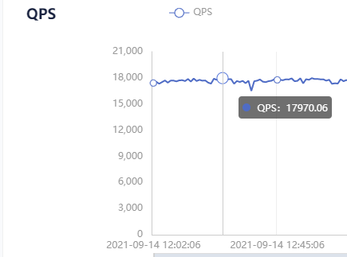

# Reids stream 非阻塞轮询导致QPS飙到1.8W



**QPS监控** 触发报警机制，最近redis被用来做简化版消息队列了

在测试环境也发现这个现象，打印执行中的堆栈命令

```shell
jstack -l xxxx > jstack.log
```

```java
	at org.springframework.data.redis.stream.StreamPollTask.doLoop(StreamPollTask.java:138)
	at org.springframework.data.redis.stream.StreamPollTask.run(StreamPollTask.java:123)
```

观察到在StreamPollTask方法中不断循环

- 翻阅`DefaultStreamMessageListenerContainer`源码发现`StreamPollTask`是用于执行循环轮询接收消息的线程

- 消费者注册到container中通过register方法

  ```java
  	@Override
  	public Subscription register(StreamReadRequest<K> streamRequest, StreamListener<K, V> listener) {
          // 关键在于getReadTask
  		return doRegister(getReadTask(streamRequest, listener));
  	}
  ```

  

- 获取读取任务，该task会放到线程中执行

  ```java
  	private StreamPollTask<K, V> getReadTask(StreamReadRequest<K> streamRequest, StreamListener<K, V> listener) {
  
          // 核心代码在这，getReadFunction生成具体的读取命令并使用函数式编程作为方法传递
  		Function<ReadOffset, List<ByteRecord>> readFunction = getReadFunction(streamRequest);
  		Function<ByteRecord, V> deserializerToUse = getDeserializer();
  
  		TypeDescriptor targetType = TypeDescriptor
  				.valueOf(containerOptions.hasHashMapper() ? containerOptions.getTargetType() : MapRecord.class);
  
  		return new StreamPollTask<>(streamRequest, listener, errorHandler, targetType, readFunction, deserializerToUse);
  	}
  ```

  

- 生成读取命令

  ```java
  	private Function<ReadOffset, List<ByteRecord>> getReadFunction(StreamReadRequest<K> streamRequest) {
  
  		byte[] rawKey = ((RedisSerializer<K>) template.getKeySerializer())
  				.serialize(streamRequest.getStreamOffset().getKey());
  
  		if (streamRequest instanceof StreamMessageListenerContainer.ConsumerStreamReadRequest) {
  
  			ConsumerStreamReadRequest<K> consumerStreamRequest = (ConsumerStreamReadRequest<K>) streamRequest;
  
              // 这是read命令的具体参数
              // 这个参数点进去可以看到 block/count 两个参数 分别对应阻塞时间/每次读取的消息数量
  			StreamReadOptions readOptions = consumerStreamRequest.isAutoAcknowledge() ? this.readOptions.autoAcknowledge()
  					: this.readOptions;
  			Consumer consumer = consumerStreamRequest.getConsumer();
  
  			return (offset) -> template.execute((RedisCallback<List<ByteRecord>>) connection -> connection.streamCommands()
  					.xReadGroup(consumer, readOptions, StreamOffset.create(rawKey, offset)));
  		}
  
  		return (offset) -> template.execute((RedisCallback<List<ByteRecord>>) connection -> connection.streamCommands()
  				.xRead(readOptions, StreamOffset.create(rawKey, offset)));
  	}
  ```

  

- read参数依赖于生成`StreamReadOptions`时的配置

  ```java
  	private static StreamReadOptions getStreamReadOptions(StreamMessageListenerContainerOptions<?, ?> options) {
  
  		StreamReadOptions readOptions = StreamReadOptions.empty();
  
  		if (options.getBatchSize().isPresent()) {
  			readOptions = readOptions.count(options.getBatchSize().getAsInt());
  		}
  
          // 可以看到若设置PollTimeout为0则非阻塞
  		if (!options.getPollTimeout().isZero()) {
  			readOptions = readOptions.block(options.getPollTimeout());
  		}
  
  		return readOptions;
  	}
  ```

  

- 若设置PollTimeout为0则非阻塞，非阻塞轮询导致redisQPS极具增高

- 解决方案

  - 生成`StreamMessageListenerContainerOptions`时指定pollTimeout

    ```java
    // 这个是循环阻塞时间，若不设置则无限轮询
    		StreamMessageListenerContainerOptions
    				.builder()	
                	// 这个是循环阻塞时间，若不设置则无限轮询
            		.pollTimeout(Duration.ofSeconds(10))
    ```

    

- 