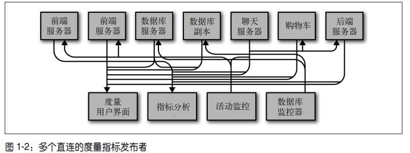
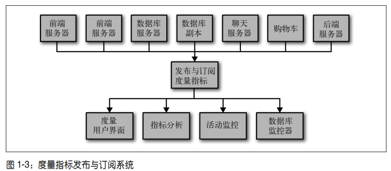
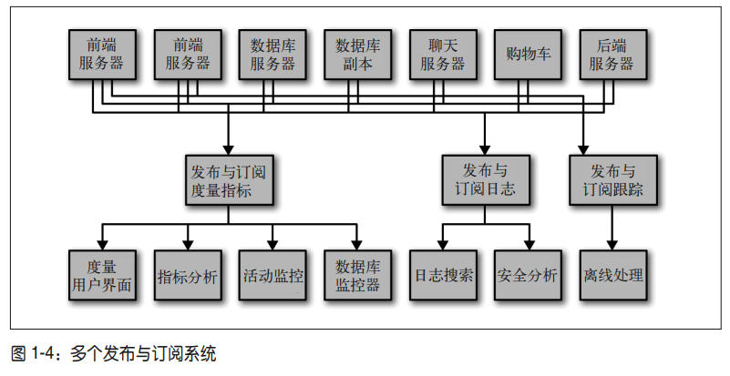

# 第 1 章 初识Kafka

> 每一次科学家们发生分歧，都是因为掌握的数据不够充分。所以我们可以先就获 取哪一类数据达成一致。只要获取了数据，问题也就迎刃而解了。要么我是对 的，要么你是对的，要么我们都是错的。然后我们继续研究。
>
> 数据——信息——知识——智慧

## 1.1　发布与订阅消息系统

> 在正式讨论 Apache Kafka（以下简称 Kafka）之前，先来了解发布与订阅消息系统的概念， 并认识这个系统的重要性。数据（消息）的发送者（发布者）不会直接把消息发送给接收 者，这是发布与订阅消息系统的一个特点。发布者以某种方式对消息进行分类，接收者 （订阅者）订阅它们，以便接收特定类型的消息。发布与订阅系统一般会有一个 broker，也 就是发布消息的中心点。

- 发送者不会直接把消息发送给接收者
- 发送者消息分类，接收者订阅特定消息
- 消息队列的作用
  - 进程间通信
  - 解耦

### 1.1.1　如何开始

- 发布于订阅消息的场景

  - 简单的消息队列
  - 进程间通道

- 消息发送者和消费者直接连接，强耦合，随着场景的复杂化导致技术负债，一个改动需要改动大量地方

  

- 可通过中间层解耦来降低复杂度，同一管理消息的发布与订阅

  

- 

### 1.1.2　独立的队列系统

- 不同场景都构建自己的发布订阅系统

  

- 缺陷

  - 大量重复代码
  - 扩展不方便
  - 不便于管理

- 聚合多个单一订阅发布系统，统一集中管理

## 1.2 Kafka登场

> Kafka 就是为了解决上述问题而设计的一款基于发布与订阅的消息系统。它一般被称为 “分布式提交日志”或者“分布式流平台”。文件系统或数据库提交日志用来提供所有事务 的持久记录，通过重放这些日志可以重建系统的状态。同样地，Kafka 的数据是按照一定 顺序持久化保存的，可以按需读取。此外，Kafka 的数据分布在整个系统里，具备数据故 障保护和性能伸缩能力。

- 基于发布 订阅的消息系统，解决进程通信/消息队列
- 持久化、分布式
- 故障保护/性能伸缩

### 1.2.1　消息和批次

- kafka中数据单元叫**消息**
- 一条消息类似数据库一行记录
- 字节数组组成消息 消息没有格式/含义
- <key,message> key用作数据分析 一致性hash算法
- 批次=》一组消息，可以组为单位写入主题和分区
  - 提升吞吐量
  - 提高网络延迟 大量消息传输

### 1.2.2　模式

- 解决消息的难以阅读
- 模式定义消息内容的类型，消息元数据
- Apache Avro
- 模式+序列化

### 1.2.3　主题和分区

- Kafka 的消息通过**主题**进行分类。
  - 主题=表/文件夹
- 一个主题多个**分区**
  - 分区=提交日志
  - 主题整体消息顺序乱序，但分区内消息有序
  - 分区可分布在不同服务器提供分布式+消息冗余能力
- **流**数据处理机制
  - Kafka Streams、Apache Samza 和 Storm 这些框 架以实时的方式处理消息，也就是所谓的流式处理。
- 