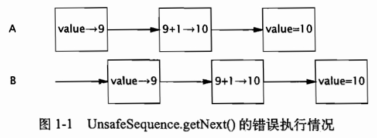

# 第一章 简介

> 编写正确的程序很难，而编写正确的并发程序难上加难。

## 1.1 并发简史

- 发挥多核处理能力

- 计算机引入操作系统的原因

  - 资源利用率
    - 方便在等待时执行其他程序提高资源利用率
  - 公平性
    - 时间分片（Time Slicing）方便用户程序共享计算机资源
  - 便利性
    - 多个任务=》多个程序
    - 操作系统=》一个程序 多个任务

- 人如何做事高效

  - 串行和并行，喝早茶，煮茶时可以去做别的事，煮完提醒并继续执行

    > 但凡做事高效的人，总能在串行性和异步性之间找到合理的平衡，堆程序来说同样如此。

- 引入操作系统=》多进程/多线程

  - 线程共享进程内资源，例如内存/文件 句柄，每个线程又有自己的程序计数器、栈（局部变量表、操作数栈、动态连接、返回地址）
  - 线程在堆上分配对象，若没有同步机制，导致不可预测的结果产生

- 

## 1.2 线程的优势

- 降低程序的开发/维护等成本，提升复杂应用性能
- GUI =》提高响应灵敏度
- 简化JVM

### 1.2.1 发挥多处理器的强大能力

- 提高时钟频率变的困难促进多核CPU
- I/O 阻塞变为非阻塞

### 1.2.2 建模的简单性

- 单任务执行优势=》只需关注单任务，一个一个线性执行
  - 一种类型的任务，编码简单、错误少、易于测试
  - 单线程机制=》redis，辅以合适的数据结构 形成高性能内存数据库基础
- 多任务的复杂性=》任务优先级/任务切换带来的额外开销
  - 每种类型任务一个线程，多线程类似串行执行，执行与调度交替执行，异步IO与资源等待问题分离
  - 线程=》复杂异步的工作流进一步分解为简单同步的工作流
  - 多线程执行，互不干涉，只在有需要时交互数据
- 现有框架：Servket/RMI.框架负责解决一些细节问题，例如请求管理 线程创建 负载均衡，并在正确的时刻将请求分发给正确的应用组件
- 在编写servlet时无须关心线程创建，socket连接，重写service方法处理，就像同步一样

### 1.2.3 异步事件的简化处理

- 多线程+同步IO降低开发难度
- 单线程处理多个请求NIO ，更加复杂
- 早期操作系统限制 线程数量几百个，因此操作系统提供高效方法处理多路IO 例如select和poll等系统调用
- 现在每个请求一个线程页是可行的

### 1.2.4 响应更灵敏的用户界面

- 传统GUI 单线程 主线程循环处理效率低
- AWT/Swing 事件分发线程
- 耗时操作放到异步线程，提高界面响应度=》Android
- 

## 1.3  线程带来的风险

- Java对线程支持拥有对应的语言和库以及一种明确的跨平台内存模型，但同时提高对开发人员的要求

### 1.3.1 安全性问题

- 多线程带来的线程安全问题
- 例如++操作，看似一个，但是非原子，包含读取、+1、写回三个操作
  - 
- @ThreadSafe / @NotThreadSafe
- ++产生的常见并发问题=》竞态条件（Race Condition）
- 多线程共享相同的内存空间地址=》访问其他线程在用的变量
  - 避免繁琐的线程数据交互
  - 引发线程安全问题
- 通过同步机制（各类同步器）避免线程安全问题
  - synchronized
  - lock
  - atomic
- 无同步=》安排执行顺序
- 由于缓存机制带来的变量不可见，带来额外负担，需判断多线程共享方法，是否具有临界资源

### 1.3.2 活跃性问题

- 安全性=》永远不发生糟糕的事情
- 活跃性=》某件正确的事情最终会发生
  - 死锁
  - 饥饿
  - 活锁

### 1.3.3 性能问题

- 服务事件过长
- 响应不灵敏
- 吞吐率过低
- 资源消耗过高
- 线程带来额外开销
  - 上下文切换，调度，现场保存和回复
  - 线程共享数据 同步机制 更多共享内存的数据流动，减少缓存
  - 编译器无法优化

## 1.4 线程无处不在

- 框架创建线程
  - 框架与用户代码的回调
- JVM启动创建多个线程 GC 终结 main
- servlet 线程池
  - servletContext/HttpSession等存储的共享对象需要保证线程安全
- 

## 1.5 小结

- 由于多核CPU+更高效的处理事件引发了并发的出现
- 线程优势
  - 发会多核CPU的能力
  - 框架负责细节处理，自动的多线程使用
  - 相对NIO的单线程多请求与多线程多请求，多线程更简单
  - 防主阻塞主程序，例如main/swing代表的主页面
- 线程风险
  - 多线程带来的线程安全问题
  - 多线程带来的死锁、饥饿、活锁
  - 上下文切换，禁用缓存等带来的性能问题
- 各类框架/JVM等都会用到线程