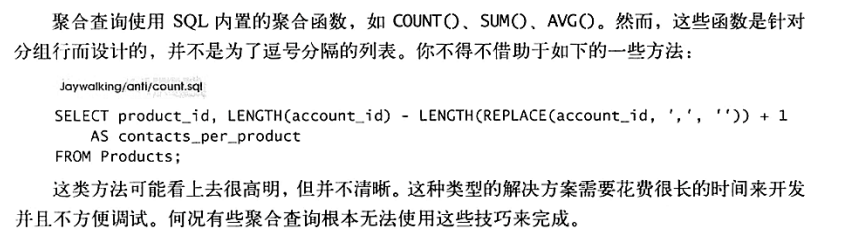
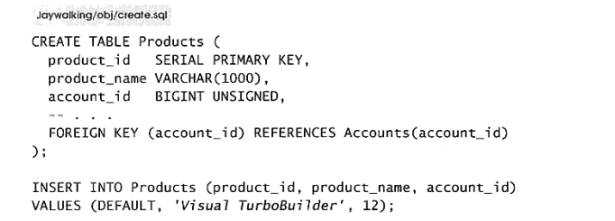
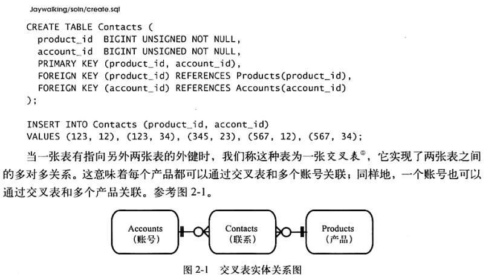
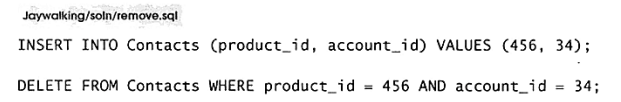

## 乱穿马路

需求：每个产品都可能有多个联系人

简单方案：将单值存储改为逗号分隔存储多值

常用逗号分隔的列表来避免在多对多关系中创建交叉表，这是一种反模式，称为乱穿马路(Jaywalking),因为可以避免十字路口

## 目标：存储多值属性

如何在一列中存储一系列相关数据的集合

一个账号对应多个产品

每个产品对应一个联系人

但每个产品可能对应多个联系人

## 反模式：格式化的逗号分隔列表

### 查询指定账号的产品

查询异常困难，不能再用等号

**不得不借助模式匹配**

困难出错且无法带来性能的优势

### 查询指定产品的账号

多表连接也不合适

### 执行聚合查询

很糟糕

**缺陷：**

1. 困难出错且无法带来性能的优势
2. 多表连接也不合适
3. 聚合查询很糟糕
4. 更新过于麻烦
5. 验证麻烦
6. 选择合适的分隔符，存储的是字符串使用逗号就不合适，甚至使用任何可能出现的新字符都不合适
7. 列表长度限制

## 识别

1. 列表最多支持存放多少数据
2. 如何分词查询
3. 哪个字符不会出现在任何一个列表中

## 合理使用

可能会需要，也可能没必要使用这样的单独项。如果数据源是这样的值，并且只做存储不做修改就每必要分开。

谨慎使用，尽可能用规范化的，更加灵活可变

## 解决方案：创建一张交叉表

将account_id存储在单独的一张表中而不是products表，每个独立的account_id都可占据一行

展现了products和accounts的多对多

**问题解决**：

1. 通过账号查询产品和反查，使用连接查询，由于能使用索引更加高效，且更加简单

   select p.* from products as p join constracts as c on(p.product_id = c.product_id) where c.account = 34;

2. 聚合查询

   select product_id,count(*)  from constracts group by product_id

3. 更新指定产品的相关联系人

   

   

4. 验证产品id

   约束数据类型

5. 不用分隔符

6. 没有长度限制

7. 用到索引，效率更改，添加额外属性，比如记录一个联系人被加入产品的具体日期，或产品的第一、第二联系人

区域被添加到活动的日期，活动的主要区域、次级区域等

每个值都应该存储在各自的行与列中。

**创建交叉表**

