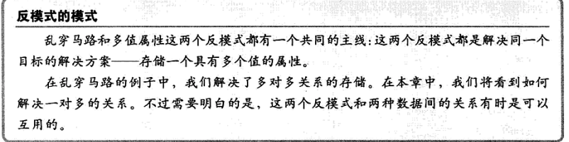

# 多列属性

> 超群和荒谬的分界线往往非常模糊，很难明确地区分。

如果数据库的某个语义的字段会无限扩展应该如何存储?例如电话号码：多个手机号、助理的号码、外地的号码等等  。

## 目标：存储多值属性

一个属性看上去只属于一张表，但同时可能会有多个值。多值合并用逗号分隔，难以验证，难以读取或者改变某个值，同时也对聚合公式（诸如统计不同值的数量）非常不友好。

**更新、增、删、聚合查询都很麻烦**

## 反范式：创建多个列

每个tag给一个列

使用传统属性设计的时候，简单的任务变得复杂。

根据给定标签查询所有bug记录，必须搜索所有的列，因为可能放在不同地方

多列不同值bug的tag可用in来简化

更新操作在并发场景可能带来覆盖的问题

使用NULLIF来规避

**缺陷**

1. 查询复杂
2. 更新复杂
3. 无法确保唯一性
4. 值集合会不断增长，可增加新列，但仍然会耗时，已有的 SQL语句都需要修改

乱穿马路和多值属性解决同一个问题-存储一个具有多个值的属性。乱穿马路是多对多，本章是一对多。

本章反范式使用场景：

1. 支持最大标签数量？多值属性定义多少列？
2. 怎么才能在SQL查询中同时搜索多列？

## 合理使用反范式

**使用场景：**

1. 如果候选值数量固定，且数量不大
2. 创建从属表，一对多来标识关系，可能导致第六章EAV的问题

## 解决方案：创建从属表

**由多列转为多行**

**优势**

1. 使用比多值属性反范式更简单的方法来添加/移除数据间的关系——只要简单地添加/删除从属表的记录。不需要检查是否有空列可添加记录
2. 可无限制打标签，将具有同样意义的值存在同一列

相同语义的值存储在一列，每个值应该存储在各自的行于列