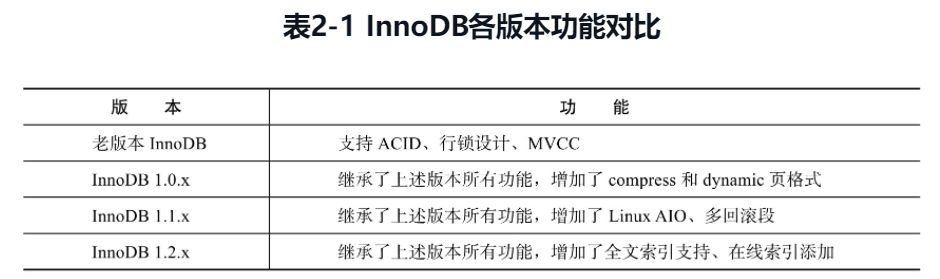
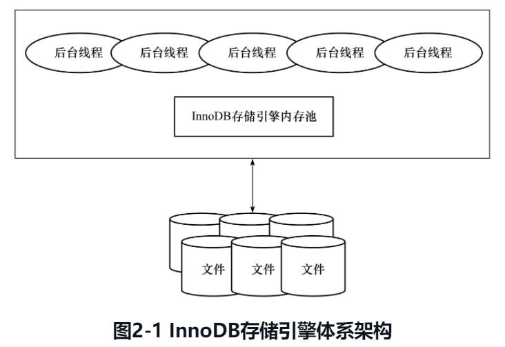

# 2.InnoDB存储引擎

> InnoDB通过使用多版本并发控制（MVCC）来获得高并发性，并且实现了SQL标准的4种隔离级别，默认为REPEATABLE级别。同时，使用一种被称为next-keylocking的策略来避免幻读（phantom）现象的产生。除此之外，InnoDB储存引擎还提供了插入缓冲（insert buffer）、二次写（double write）、自适应哈希索引（adaptive hash index）、预读（read ahead）等高性能和高可用的功能。对于表中数据的存储，InnoDB存储引擎采用了聚集（clustered）的方式，因此每张表的存储都是按主键的顺序进行存放。如果没有显式地在表定义时指定主键，InnoDB存储引擎会为每一行生成一个6字节的ROWID，并以此作为主键。

冲就完事了，有问题还有google，无事不可为，以凡人之智行上帝之能

innoDB与MyISAM的对比

1. innoDB支持行锁 myisam只支持表锁
2. innodb支持mvcc
3. innodb支持事务
4. innodb不支持全文索引myisam支持
5. innodb支持外键


常用的连接协议是TCP/IP socket

## 2.1概述

> InnoDB存储引擎是第一个完整支持ACID事务的MySQL存储引擎（BDB是第一个支持事务的MySQL存储引擎，现在已经停止开发），其特点是行锁设计、支持MVCC、支持外键、提供一致性非锁定读，同时被设计用来最有效地利用以及使用内存和CPU。

InnoDB是一个高性能、高可用、高可扩展的存储引擎。

## 2.2InnoDB存储引擎的版本


5.1后支持自定义存储引擎版本，解耦存储引起与数据库版本的强绑定。

InnoDB版本与特性



InnoDB Plugin和InnoDB1.1是不同的，与1.1之前的版本功能一致


## 2.3InnoDB体系架构

InnoDB架构图



和Java一样通过linux内核的compchg命令来实现MVCC？

多线程竞争共享资源的问题，事务，隔离

由线程和内存构成，通过线程去操作内存，内存与磁盘交互，交互操作由内存管理子系统完成

redo log的记录从而实现持久性，容灾

后台线程的功能

1. 从磁盘读取最近的文件到内存

   内存块，程序运行的局部性原理

2. 将内存的更改写回磁盘

3. 保证故障恢复

   通过记录redo log

### 2.3.1后台线程

多线程处理多任务

**1.Master Thread**

核心后台线程

1. 内存数据刷回磁盘

   脏页刷新（clear thread

2. 保证数据一致性

3. 插入缓存（InsertBuffer）

4. UNDO页的回收(可交给purge thread)

**2.IO Thread**

AIO(Async IO)异步IO提高性能

IO Thread负责IO回调

1.0之前的四个IO Thread

1. write

2. read

3. insert buffer

   提高数据录入效率，批量插入

4. log IO thread


在windows平台可通过innodb_file_io_threads 增大IO Thread。

1.0.x后增加read与write线程

> 从InnoDB 1.0.x版本开始，read thread和write thread分别增大到了4个，并且不再使用innodb_file_io_threads参数，而是分别使用innodb_read_io_threads和innodb_write_io_threads参数进行设置

查看当前版本的innodb引擎及其读写线程数

```mysql
show variables like 'innodb_version'
innodb_version	8.0.21
show variables like 'innodb_%io_threads'
innodb_read_io_threads	4
innodb_write_io_threads	4
show engine innodb status
InnoDB		
=====================================
2021-07-09 12:51:48 0x7f2b100ca700 INNODB MONITOR OUTPUT
=====================================
Per second averages calculated from the last 56 seconds
-----------------
BACKGROUND THREAD
-----------------
srv_master_thread loops: 1224074 srv_active, 0 srv_shutdown, 18376440 srv_idle
srv_master_thread log flush and writes: 0
----------
SEMAPHORES
----------
OS WAIT ARRAY INFO: reservation count 47825
OS WAIT ARRAY INFO: signal count 642432
RW-shared spins 253997, rounds 258175, OS waits 4303
RW-excl spins 177940, rounds 891818, OS waits 14218
RW-sx spins 13675, rounds 190447, OS waits 2312
Spin rounds per wait: 1.02 RW-shared, 5.01 RW-excl, 13.93 RW-sx
------------------------
LATEST DETECTED DEADLOCK
------------------------
2021-06-08 17:34:45 0x7f2a4383d700
*** (1) TRANSACTION:
TRANSACTION 46881052, ACTIVE 1 sec starting index read
mysql tables in use 1, locked 1
LOCK WAIT 5 lock struct(s), heap size 1136, 99 row lock(s)
MySQL thread id 4513002, OS thread handle 139820514199296, query id 1945188259 10.249.105.31 ready_command updating
UPDATE event_product_instance_relation  SET organization_id=8,
business_unit_id=48,
product_line_id=112,
product_name_id=324,
product_series_id=1277,
product_serial_code='QbJK/87jR',
product_type_id=4755,
product_version_id=10314,
product_instance_id=5105,
major_customer_id=81,
using_status=1,
maintenance_owner_user_no='a002847',

node_path='8/48/112/324/1277/4755/10314',

status_code=1,

create_time='2021-03-30 00:00:00',

update_time='2021-06-07 00:00:00'  WHERE id=5105


--------
FILE I/O
--------
I/O thread 0 state: waiting for completed aio requests (insert buffer thread)
I/O thread 1 state: waiting for completed aio requests (log thread)
I/O thread 2 state: waiting for completed aio requests (read thread)
I/O thread 3 state: waiting for completed aio requests (read thread)
I/O thread 4 state: waiting for completed aio requests (read thread)
I/O thread 5 state: waiting for completed aio requests (read thread)
I/O thread 6 state: waiting for completed aio requests (write thread)
I/O thread 7 state: waiting for completed aio requests (write thread)
I/O thread 8 state: waiting for completed aio requests (write thread)
I/O thread 9 state: waiting for completed aio requests (write thread)
Pending normal aio reads: [0, 0, 0, 0] , aio writes: [0, 0, 0, 0] ,
 ibuf aio reads:, log i/o's:, sync i/o's:
Pending flushes (fsync) log: 0; buffer pool: 1382
20750 OS file reads, 74922403 OS file writes, 28919387 OS fsyncs
0.00 reads/s, 0 avg bytes/read, 3.45 writes/s, 2.37 fsyncs/s
-------------------------------------
INSERT BUFFER AND ADAPTIVE HASH INDEX
-------------------------------------
Ibuf: size 1, free list len 147, seg size 149, 502 merges
merged operations:
 insert 504, delete mark 278266, delete 571
discarded operations:
 insert 0, delete mark 0, delete 0
Hash table size 1328213, node heap has 821 buffer(s)
Hash table size 1328213, node heap has 876 buffer(s)
Hash table size 1328213, node heap has 491 buffer(s)
Hash table size 1328213, node heap has 138 buffer(s)
Hash table size 1328213, node heap has 547 buffer(s)
Hash table size 1328213, node heap has 148 buffer(s)
Hash table size 1328213, node heap has 752 buffer(s)
Hash table size 1328213, node heap has 597 buffer(s)
4923.50 hash searches/s, 2330.71 non-hash searches/s
---
LOG
---
Log sequence number          27991964822
Log buffer assigned up to    27991964822
Log buffer completed up to   27991964822
Log written up to            27991964822
Log flushed up to            27991964822
Added dirty pages up to      27991964822
Pages flushed up to          27991964822
Last checkpoint at           27991964822
37147334 log i/o's done, 1.09 log i/o's/second
----------------------
BUFFER POOL AND MEMORY
----------------------
Total large memory allocated 5494538240
Dictionary memory allocated 4839260
Buffer pool size   327680
Free buffers       234697
Database pages     88613
Old database pages 32691
Modified db pages  0
Pending reads      0
Pending writes: LRU 0, flush list 0, single page 0
Pages made young 67550, not young 1109917
0.00 youngs/s, 0.00 non-youngs/s
Pages read 20255, created 419729, written 21458475
0.00 reads/s, 0.00 creates/s, 0.00 writes/s
Buffer pool hit rate 1000 / 1000, young-making rate 0 / 1000 not 0 / 1000
Pages read ahead 0.00/s, evicted without access 0.00/s, Random read ahead 0.00/s
LRU len: 88613, unzip_LRU len: 0
I/O sum[45]:cur[0], unzip sum[0]:cur[0]
--------------
ROW OPERATIONS
--------------
0 queries inside InnoDB, 0 queries in queue
0 read views open inside InnoDB
Process ID=10816, Main thread ID=139819464496896 , state=sleeping
Number of rows inserted 4352647, updated 18445124, deleted 818083, read 105572281029
0.00 inserts/s, 0.04 updates/s, 0.00 deletes/s, 7563.58 reads/s
Number of system rows inserted 1271455, updated 107193, deleted 1261344, read 14743585
0.04 inserts/s, 0.00 updates/s, 0.00 deletes/s, 0.00 reads/s
----------------------------
END OF INNODB MONITOR OUTPUT
============================


```

可以看到一个insert buffer thread 一个 io thread 后面根据innodb_read/write_io_theads来控制线程数

**3.Purge Thread**

处理事务提交后的可能无效的undo log

purge thread 回收无效的undo log 页

通过配置开启

```mysql
[mysqld]
innodb_purge_threads = 1
```

- redo log 持久化 崩溃恢复
- undo log 事务回滚

```mysql
show variables like 'innodb_purge_threads'
innodb_purge_threads	4
```

**4.page clear thread**

减轻master thread的负担，承载脏页刷新	

### 2.3.2 内存

**1.缓冲池**


- 索引缓存
- 数据缓存
- 自适应hash索引
- 锁
- insert buffer
- 字典


- redo log
- 额外内存


## 索引

- MySQL索引

  - 自适应hash索引的 触发条件：以某个访问模式重复访问页多次

  - 二分查找

    - 通过在有序集合中折半搜索的方式提高查找效率，让查找时间复杂度从O(n)变为O(logn)

  - 树的演化

    - 二叉搜索树 BST

      由于结构没有规律，导致可能退化为线性查找的效率

    - 平衡二叉搜索树 AVL

      任意节点的两个子树的最大高度差不能超过1

      需通过一次或多次旋转来保证特性

    - B Tree

      很少用

    - B+ Tree（red black tree / skip list）

      - 是B树的索引顺序访问方法（ISAM）
      - 为了磁盘等直接存取设备设计
      - 在数据插入过程中根据 数据要存放的 leaf page 以及 index page是否已满进行不同情况处理
        - 都没满直接录入
        - lp 满了 ip没满，则lp拆分 中间节点放入ip
        - 两者都满了则lp先拆，然后ip拆分，ip中间节点放入新的节点
      - 删除时通过删除因子（fill factor）来控制变化 最小50%
        - lp 和ip都不小于ff直接删除,ip则使用（lp中的）右节点代替
        - lp小于合并叶子节点 更新ip
        - 都小于合并叶子节点 更新ip 合并ip

  - 数据库B+树的高度大概在2-4 ，聚集索引和非据集索引的区别在于叶子节点是否存放了完整记录是否需要回表查询

    - 聚集索引存储数据，数据页双向连表关联，数据页存放完整记录，索引页只存放指针
    - 物理存储不连续，只是逻辑上通过双向连表+主键的顺序看上去像有序，连续的存储着
    - 主键索引命中查询速度快
    - 非据集索引的书签指向行数据所在聚集索引的索引键，每张表只有一个聚集索引
    - 非据集索引的数据搜索会先在非据集索引B+树上找到主键索引，然后使用主键索引去聚集索引中寻找完整记录

  - 索引的使用

    - 划分应用类型 OLTP OLAP
    - 索引应建立在区分较高的列上，并且搜索数据量少
    - OLAP中，很少对单个做搜索，根据具体情况分析，一版对事件索引收益较大，OLAP大多连表查询，连表字段的索引要建立
    - 联合索引
      - 联合索引页是B+TREE但是键值是大于等于2
      - 同样有序，不过排序规则分为主要次序，次要次序等等的有序数据结构
      - 底层的多顺序结构决定了联合索引的左前缀原则，不可跨字段
      - 联合索引是有序的，若排序用到索引则按照索引顺序取出数据就是有序的无须二次排序
      - 覆盖索引，从辅助索引中直接找到数据返回，不需要去聚集索引查询，并且由于覆盖索引的数据量少减少大量IO
      - 覆盖索引在count操作时效率很高 extra中出现using index
    - 由于数据量的问题，大量数据的离散读取在机械硬盘上慢于顺序读取因此不一定用到辅助索引
    - 索引提示
      - 使用情况：1.优化器使用索引错误2.索引过多，选择时间长
      - from table using index/force index 来建议/强制 优化器使用某个索引
      - 一个查询可以使用多个索引
    - MRR优化
    - Index Condition Pushdown优化，将所有的使用放到存储引擎层
    - 索引合并 代表一条SQL可以使用多个索引，多个索引查询的交集/并集可能更快，但消耗CPU资源，可以尝试使用合适的联合索引来代替

  - 

- order by 必须筛选 group by 不需要 顺序不能错 方向不能反

- 最左前缀匹配原则，is null ,%,计算，范围，覆盖 or

