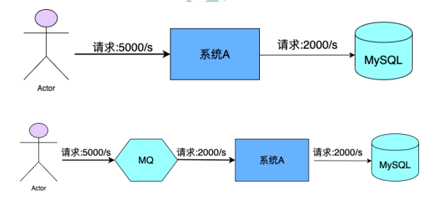
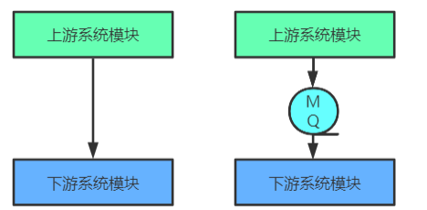
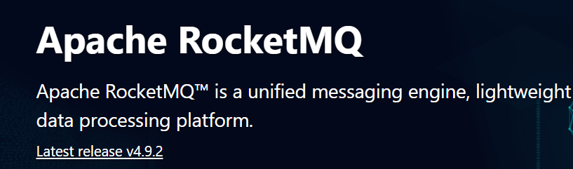
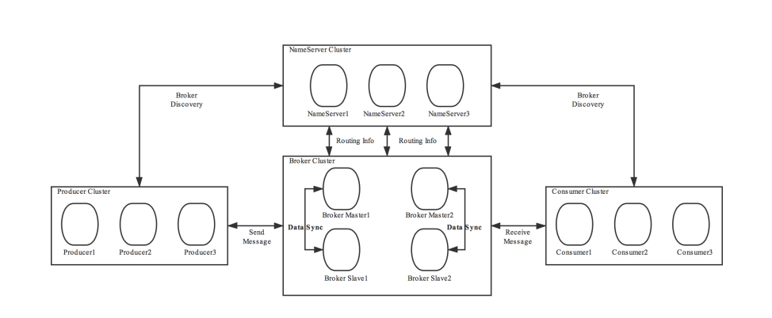
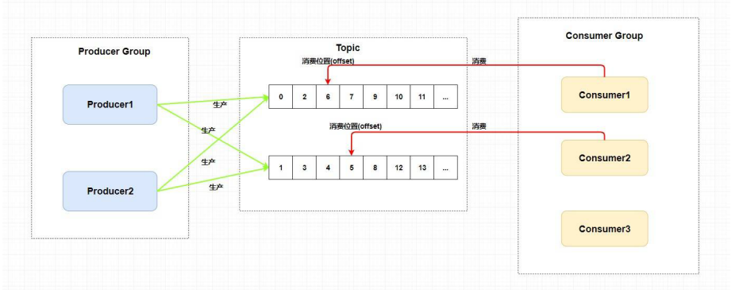

# RocketMQ

## 第1章 RocketMQ概述

### 1.MQ概述

#### 简介

MQ，Message Queue，是一种提供消息队列服务的中间件，也称为消息中间件，是一套提供了消息生 产、存储、消费全过程API的软件系统。消息即数据。一般消息的体量不会很大。

FIFO的数据存储、消费中间件，用于削峰、解耦、

#### 用途

- 限流削峰
  - 
  - 一次消息量过大可先存储MQ用作缓存、缓冲 ，之后逐步消费确保数据一致性又能保证高并发
  - **MQ可以将系统的超量请求暂存其中，以便系统后期可以慢慢进行处理，从而避免了请求的丢失或系统 被压垮。**
- 异步解耦
  - 
  - 不同关系（上下游）系统之间通过MQ做异步解耦，加快响应，降低耦合度
  - 上游系统对下游系统的调用若为同步调用，则会大大降低系统的吞吐量与并发度，且系统耦合度太高。 而异步调用则会解决这些问题。所以两层之间若要实现由同步到异步的转化，一般性做法就是，在这两 层间添加一个MQ层。
- 数据收集
  - 分布式系统会产生海量级数据流，如：业务日志、监控数据、用户行为等。针对这些数据流进行实时或 批量采集汇总，然后对这些数据流进行大数据分析，这是当前互联网平台的必备技术。通过MQ完成此 类数据收集是最好的选择。

#### 常见MQ

- ActiveMQ
  - ActiveMQ是使用Java语言开发一款MQ产品。早期很多公司与项目中都在使用。但现在的社区活跃度已 经很低。现在的项目中已经很少使用了。
- RabbitMQ
  - RabbitMQ是使用ErLang语言开发的一款MQ产品。其吞吐量较Kafka与RocketMQ要低，且由于其不是 Java语言开发，所以公司内部对其实现定制化开发难度较大。
- Kafka
  - Kafka是使用Scala/Java语言开发的一款MQ产品。其最大的特点就是高吞吐率，常用于大数据领域的实 时计算、日志采集等场景。其没有遵循任何常见的MQ协议，而是使用自研协议。对于Spring Cloud Netçix，其仅支持RabbitMQ与Kafka。
- RocketMQ
  - RocketMQ是使用Java语言开发的一款MQ产品。经过数年阿里双11的考验，性能与稳定性非常高。其 没有遵循任何常见的MQ协议，而是使用自研协议。对于Spring Cloud Alibaba，其支持RabbitMQ、 Kafka，但提倡使用RocketMQ。

**对比**

| 关键词      | ActiveMQ | RabbitMQ | Kafka                        | RocketMQ                     |
| ----------- | -------- | -------- | ---------------------------- | ---------------------------- |
| 开发语言    | Java     | ErLang   | Java                         | Java                         |
| 单机吞吐 量 | 万级     | 万级     | 十万级                       | 十万级                       |
| Topic       |          |          | 百级Topic时会影响系统吞吐 量 | 千级Topic时会影响系统吞吐 量 |
| 社区活跃 度 | 低       | 高       | 高                           | 高                           |

#### MQ常见协议

- JMS
  - JMS，Java Messaging Service（Java消息服务）。是Java平台上有关MOM（Message Oriented Middleware，面向消息的中间件 PO/OO/AO）的技术规范，它便于消息系统中的Java应用程序进行消 息交换，并且通过提供标准的产生、发送、接收消息的接口，简化企业应用的开发。ActiveMQ是该协 议的典型实现。
- STOMP
  - STOMP，Streaming Text Orientated Message Protocol（面向流文本的消息协议），是一种MOM设计 的简单文本协议。STOMP提供一个可互操作的连接格式，允许客户端与任意STOMP消息代理 （Broker）进行交互。ActiveMQ是该协议的典型实现，RabbitMQ通过插件可以支持该协议。
- AMQP
  - AMQP，Advanced Message Queuing Protocol（高级消息队列协议），一个提供统一消息服务的应用 层标准，是应用层协议的一个开放标准，是一种MOM设计。基于此协议的客户端与消息中间件可传递 消息，并不受客户端/中间件不同产品，不同开发语言等条件的限制。 RabbitMQ是该协议的典型实 现。
  - 多语言支持
- MQTT
  - MQTT，Message Queuing Telemetry Transport（消息队列遥测传输），是IBM开发的一个即时通讯协 议，是一种二进制协议，主要用于服务器和低功耗IoT（物联网）设备间的通信。该协议支持所有平 台，几乎可以把所有联网物品和外部连接起来，被用来当做传感器和致动器的通信协议。 RabbitMQ通 过插件可以支持该协议。
  - IOT交互

### 2.RocketMQ概述

#### RocketMQ简介

> Apache RocketMQ™ is a unified messaging engine, lightweight data processing platform.

RocketMQ是一个**统一消息引擎、轻量级数据处理平台**。

RocketMQ是⼀款阿⾥巴巴开源的消息中间件。2016年11⽉28⽇，阿⾥巴巴向 Apache 软件基⾦会捐赠 RocketMQ，成为 Apache 孵化项⽬。2017 年 9 ⽉ 25 ⽇，Apache 宣布 RocketMQ孵化成为 Apache 顶 级项⽬（TLP ），成为国内⾸个互联⽹中间件在 Apache 上的顶级项⽬。

https://rocketmq.apache.org/

#### RocketMQ发展历程

- 2007年，阿里开始五彩石项目，Notify作为项目中交易核心消息流转系统，应运而生。Notify系统是 RocketMQ的雏形
- 2010年，B2B大规模使用ActiveMQ作为阿里的消息内核。阿里急需一个具有海量堆积能力的消息系 统。
- 2011年初，**Kafka开源**。淘宝中间件团队在对Kafka进行了深入研究后，开发了一款新的MQ，MetaQ。
- 2012年，MetaQ发展到了v3.0版本，在它基础上进行了进一步的抽象，形成了RocketMQ，然后就将其 进行了开源。
- 2015年，阿里在RocketMQ的基础上，又推出了一款专门针对阿里云上用户的消息系统Aliware MQ。.
- 2016年双十一，RocketMQ承载了万亿级消息的流转，跨越了一个新的里程碑。11⽉28⽇，阿⾥巴巴 向 Apache 软件基⾦会捐赠 RocketMQ，成为 Apache 孵化项⽬。
- 2017 年 9 ⽉ 25 ⽇，Apache 宣布 RocketMQ孵化成为 Apache 顶级项⽬（TLP ），成为国内⾸个互联 ⽹中间件在 Apache 上的顶级项⽬。

## 第2章 Ro	cketMQ的安装与启动

### 一、基本概念

#### 1 消息（Message）

- 数据载体，猜测二进制存储
- 消息是指，消息系统所传输信息的物理载体，生产和消费数据的最小单位，每条消息必须属于一个主 题。

#### 2 主题（Topic）

- 消息一级分类 主题=stream的名称
- Topic表示一类消息的集合，每个主题包含若干条消息，每条消息只能属于一个主题，是RocketMQ进行 消息订阅的基本单位。 topic:message 1:n message:topic 1:1
- 一个生产者可以同时发送多种Topic的消息；而一个消费者只对某种特定的Topic感兴趣，即只可以订阅 和消费一种Topic的消息。 producer:topic 1:n consumer:topic 1:1

主题=stream的名称

一个消费者只能消费一个queue中消息

为什么一个消费者只能对应一个topic，是因为消费者属于topic而非独立么，消费者在某个topic下才有实际意义？

-  stream是多个消费者消费一个队列
- rocketMQ中是队列分区后再被多个消费者消费，stream得益于单线程分发快，而rocketMQ是多线程分发 利用多线程优势
- 推论：消费者组概念相同，只不过rocketMQ对消息分类由stream的一级改为topic+tag的二级分类，存储在topic下的queue中
- 实际：一个Topic的Queue中的消息只能被一个消费者组中的一个消费者消费
- 对了一般，消费者组同样是多个消费者集合且整体看上去就是一个消费者 但是组的形式 池化思路加快处理，监听的按queue分类
- 理解queue和tag的区别

#### 3 标签（Tag）

为消息设置的标签，用于同一主题下区分不同类型的消息。来自同一业务单元的消息，可以根据不同业 务目的在同一主题下设置不同标签。标签能够有效地保持代码的清晰度和连贯性，并优化RocketMQ提 供的查询系统。消费者可以根据Tag实现对不同子主题的不同消费逻辑，实现更好的扩展性。

- tag挂在消息上，消息属于topic/topic下的queue/partition

Topic是消息的一级分类，Tag是消息的二级分类。

- Topic：货物
- tag=上海
- tag=江苏
- tag=浙江
- ------- 消费者 -----
- topic=货物 tag = 上海
- topic=货物 tag = 上海|浙江
- topic=货物 tag = *

#### 4 队列（Queue）

存储消息的物理实体。一个Topic中可以包含多个Queue，每个Queue中存放的就是该Topic的消息。一 个Topic的Queue也被称为一个Topic中消息的分区（Partition）。

一个Topic的Queue中的消息只能被一个消费者组中的一个消费者消费。一个Queue中的消息不允许同 一个消费者组中的多个消费者同时消费。

在学习参考其它相关资料时，还会看到一个概念：分片（Sharding）。分片不同于分区。在RocketMQ 中，分片指的是存放相应Topic的Broker。每个分片中会创建出相应数量的分区，即Queue，每个 Queue的大小都是相同的。

- 队列/分区用于存储topic下的message，message有tag属性
- 多个queue可聚合为一个sharding分片

- 上面是queue和broker的关系
- broker是物理服务器 queue是topic下的逻辑存储
- 一个broker多个queue
- 一个topic多个queue可存储在不同broker上
- topic下的message有tag区分

- 消费者组 广播
- 广播用多个消费者组实现
- 同一个消费者组中的多个消费者不能同时挂在一个queue下放置重复消费

- broker存储topic或其分片 ，服务器 硬件存储 底层支持
- 分片/分区 不一样
- 推论：实际存储是topic一级，分区二级，然而消息上有tag

标识 id

- stream中一个message都有一个唯一ID 时间戳-数字 并且限定于stream
- id记录信息

#### 5 消息标识（MessageId/Key）

RocketMQ中每个消息拥有唯一的MessageId，且可以携带具有业务标识的Key，以方便对消息的查询。 不过需要注意的是，MessageId有两个：在生产者send()消息时会自动生成一个MessageId（msgId)， 当消息到达Broker后，Broker也会自动生成一个MessageId(offsetMsgId)。msgId、offsetMsgId与key都 称为消息标识。

- msgId：由producer端生成，其生成规则为：
  - producerIp + 进程pid + MessageClientIDSetter类的ClassLoader的hashCode + 当前时间 + AutomicInteger自增计数器
  - 类似stream中的message-id
- offsetMsgId：由broker端生成，其生成规则为：brokerIp + 物理分区的offset（Queue中的 偏移量）
  - 物理存储的id
- key：由用户指定的业务相关的唯一标识
  - 用户提供区分业务 tag？

### 二、系统架构

RocketMQ架构上主要分为四部分构成：

#### 1 Producer

消息生产者，负责生产消息。Producer通过MQ的负载均衡模块选择相应的Broker集群队列进行消息投 递，投递的过程支持快速失败并且低延迟。

> 例如，业务系统产生的日志写入到MQ的过程，就是消息生产的过程
>
> 再如，电商平台中用户提交的秒杀请求写入到MQ的过程，就是消息生产的过程

RocketMQ中的消息生产者都是以生产者组（Producer Group）的形式出现的。生产者组是同一类生产 者的集合，这类Producer发送相同Topic类型的消息。一个生产者组可以同时发送多个主题的消息。

生产者

生产者组的形式，概念与消费者组类似，生产者组生产同一类topic的消息

#### 2 Consumer

消息消费者，负责消费消息。一个消息消费者会从Broker服务器中获取到消息，并对消息进行相关业务 处理。

> 例如，QoS系统从MQ中读取日志，并对日志进行解析处理的过程就是消息消费的过程。 再如，电商平台的业务系统从MQ中读取到秒杀请求，并对请求进行处理的过程就是消息消费的 过程。

RocketMQ中的消息消费者都是以消费者组（Consumer Group）的形式出现的。消费者组是同一类消 费者的集合，这类Consumer消费的是同一个Topic类型的消息。消费者组使得在消息消费方面，实现 负载均衡（将一个Topic中的不同的Queue平均分配给同一个Consumer Group的不同的Consumer，注 意，并不是将消息负载均衡）和容错（一个Consmer挂了，该Consumer Group中的其它Consumer可 以接着消费原Consumer消费的Queue）的目标变得非常容易。

消费者组中Consumer的数量应该小于等于订阅Topic的Queue数量。如果超出Queue数量，则多出的 Consumer将不能消费消息。

- consumer与producer的相同和不同
  - 都是生产/消费 同一topic
  - 都有相似的负载均衡机制
  - 都有组的概念
  - 生产者可以向同一topic的不同queue生产，而消费者只能消费固定topic的固定queue
- 

不过，一个Topic类型的消息可以被多个消费者组同时消费。

> 注意， 1）消费者组只能消费一个Topic的消息，不能同时消费多个Topic消息 
>
> 2）一个消费者组中的消费者必须订阅完全相同的Topic

而消费者组的消费者只能从同一topic消费

但是生产者和消费者都以组的形式来看就是向任意topic推送以及消费

消费者组的容错，只要一个存活就可以继续消费但压力增大/消费速度变慢

topic queue的负载均衡，其实也可以看做消息的负载均衡
