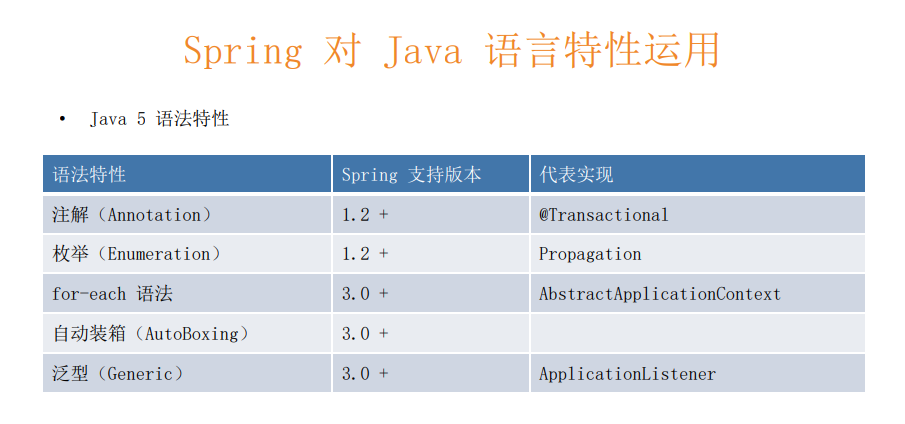

# spring framework总览


## 准备

- 心态
  - 戒骄戒躁
  - 谨慎豁达
  - 如履薄冰
- 方法
  - 基础
  - 思考
  - 分析
  - 实践
- 工具
  - JDK 8
  - Spring Framework 5.2.2
  - IDEA
  - maven 3.2+

## 核心特性

- IOC容器（IOC Container）
- spring 事件（Events）
- 资源管理（Resources）
- 国际化（i18n）
- 校验（validation）
- 数据绑定（Data Binding）
- 类型转换（Type Conversion）
- spring表达式（spring express language）
- 面向切面编程（AOP）

## 数据存储

- JDBC
- 事务抽象（Transactions）
- DAO支持
- O/R映射（O/R Mapping）
- XML编列（XML Marshalling）

## web技术

- Web Servlet技术栈
  - spring mvc
  - websocket
  - sockJS
- Web Reactive技术栈
  - Spring WebFlux
  - WebClient
  - WebSocket

## 技术整合

- 远程调用（Remoting）
- Java消息服务（JMS）
- Java连接架构 JCA
- Java管理扩展 JMX
- Java邮件客户端 Email
- 本地任务 Tasks
- 本地调度 Scheduling
- 缓存抽象 Caching
- spring 测试 Testing

## 测试

- 模拟对象
- TestContext框架
- spring mvc 测试
- web测试客户端

## Java版本依赖与支持


- spring的主次版本
- Java5 之前 J2SE 
  - Java1.3 动态代理 servlet 
- 3 注解 注解驱动 事件驱动
- 4 Java 8 版本特性支持
- spring boot 2 =》spring5

## spring 模块化设计

- 模块划分 按需分配
- spring-aop
- spring-aspects 
- spring-context-indexer 
- spring-context-support 
- spring-context 
- spring-core 
- spring-expression 
- spring-instrument 
- spring-jcl 
- spring-jdbc 
- spring-jms 
- spring-messaging 
- spring-orm 
- spring-oxm 
- spring-test 
- spring-tx 
- spring-web 
- spring-webflux 
- spring-webmvc 
- spring-websocket


- spring=》同一各类复杂组件提供统一接口
- JAX-RS Java标准注解

## spring中的Java语法特性


- 2004 spring framework 发布 
- Diamond语法 new<>自动适配 try-with-resouce 资源自动关闭(语法糖 字节码还是一样的不过自动生成)
- Java8 一个类/方法可拥有多个注解



- Propagation 事务传播


- lambda 去掉匿名类

## 08 | JDK API实践：Spring怎样取舍Java I/O、集合、反射、动态代理等API的使用？


- 反射 1.2 Java beans
- 可插拔注解处理=》APT 编译处理注解 spring5 提升性能
- JSR=》Java Specification Request Java的规范请求
- NIO 2.0路径抽象 异步NIO
- JSR166 复杂并行计算
- 字节码支持其他语言
- API层面自旋锁 java9
- 异常堆栈CPU消耗大 Java9替换与优化


- 格式化：不同语言系统的数据展示


- APT编译时运用 运行时辅助测试


- @PropertySources spring实现的多注解支持
- CF的适配支持

## 09 | Java EE API整合：为什么Spring要与“笨重”的Java EE共舞？


- SOAP Simple Object Access Protocol 简单对象访问协议
- Java对websocket实现较晚


- 事务抽象 JTA的封装


- JMS消息驱动bean

## 10 | Spring编程模型：Spring实现了哪些编程模型？


### 面向对象

- OOP

  - Aware 

    - BeanFactoryAware

      ```java
      void setApplicationContext(ApplicationContext applicationContext) throws BeansException;
      ```

      

    - ApplicationContextAware

      ```java
      void setBeanFactory(BeanFactory beanFactory) throws BeansException;
      ```

    - 这是一个接口 代表一些步骤执行完成后的回调，通过aware可以获取一些对象

    - 使用实例:通过`ApplicationContextAware`获取上下文进而根据名称/类型获取对应bean

  - `BeanPostProcessor`

    - 提供bean初始化前后的前置/后置方法进行其他特殊处理:例如修改某个属性等
    - java8 default 接口默认实现

- 设计模式

  - 观察者

    - listener 事件
    - ApplicationEvent
      - SimpleApplicationEventMulticaster#multicastEvent
      - 观察 广播 事件状态回调

  - 组合

    - CompositeCacheManager

    - ```java
      public class CompositeCacheManager implements CacheManager, InitializingBean {
          // 一个接口不同实现 组合在一起使用 组合模式
      	private final List<CacheManager> cacheManagers = new ArrayList<>();
      ```

    - 

  - 模板

    - RestTemplate

- 对象继承

  - AbstractApplicationContext

- 

### 面向切面

- `AopProxy`

  - JdkDynamicAopProxy

  - CglibAopProxy 内联cglib

    - ```java
      @see org.springframework.cglib.proxy.Enhancer
      ```

- 

### 面向元编程

- 模式注解
  - Component DDD的实现
  - 注解元标注=》类似注解继承
- 抽象
  - Environment
    - profile 多环境用户配置 
  - 
- 泛型
  - GenericType
  - ResolveType
  - ParameterizedType简化泛型操作

### 函数驱动

- FuntionalInterface

  - ApplicationListener

    - ```java
      @FunctionalInterface
      public interface ApplicationListener<E extends ApplicationEvent> extends EventListener {
      ```

    - 函数接口不包含Object的一些实现

  - 

- 

### 模块驱动

- maven
- java9
- spring @Enable 打包组装
  - EnableCaching
  - EnableTransactionManagement
  - EnableWebFlux
- 

## 11 | Spring核心价值：我们能从Spring Framework中学到哪些经验和教训呢？


## 12 | 面试题精选

### 沙雕

#### 什么是spring framework

> Spring makes it easy to create Java enterprise applications. It provides everything you need to embrace the Java language in an enterprise environment, with support for Groovy and Kotlin as alternative languages on the JVM, and with the flexibility to create many kinds of architectures depending on an application’s needs.

- 开源开发框架 企业级框架 POJO的编程模型
- 最广泛被应用的JavaEE框架 DI AOP 复杂环境 松耦合 提供大量
- spring framework提供一个完整的 可配置的模型 基于Java企业级应用 开发平台
- spring 让开发更容易,提供Java语言企业级环境中所需的一切，支持允许在JVM上的其他语言例如Groovy 和 kotlin 并且根据应用程序需要创建多种框架（借助spring 可以更容易的使用各种框架）。

### 996

#### spring framework有哪些模块

- spring-core spring基础API模块，如资源管理，泛型管理，对于Java代码的上一层抽象封装出适合spring的一些基本结构
  - Resource
  - GenericTypeResolver
- spring-beans spring bean相关，依赖查找，依赖注入
  - BeanFactory
- spring-aop spring aop处理，如动态代理， AOP字节码提升
- spring-context:事件驱动、注解驱动、模块驱动等
- spring-expression:spring 表达式语言模块

### 劝退

#### spring framework的优势和不足

**答案贯穿整个系列**

任何问题需要反复斟酌，了解特性和自己的思考