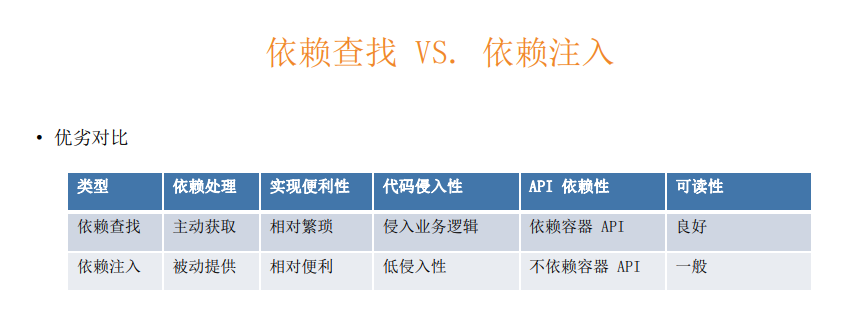

# 第二章 重新认识 IoC

## 13 | IoC发展简介：你可能对IoC有些误会？

- 什么是IoC

  > In software engineering, inversion of control (IoC) is a programming principle. IoC inverts the flow of control as compared to traditional control flow. In IoC, custom-written portions of a computer program receive the flow of control from a generic framework. A software architecture with this design inverts control as compared to traditional procedural programming: in traditional programming, the custom code that expresses the purpose of the program calls into reusable libraries to take care of generic tasks, but with inversion of control, it is the framework that calls into the custom, or task-specific, code
  >
  > 控制反转是一种编程风格，与传统的控制流相比，IOC反转控制流，例如由new创建的变味了由IOC容器提供，之前是由人员主动调用代码，变为由框架调用带来以提供更为丰富的其他功能：例如提供AOP的增强支持

- 简史

  - 1983年，Richard E. Sweet 在《The Mesa Programming Environment》中提出“Hollywood Principle”（好莱坞原则）
    - 响应式编程 反向
  - 1988年，Ralph E. Johnson & Brian Foote 在《Designing Reusable Classes》中提出“Inversion of control”（控制反转）
  - 1996年，Michael Mattsson 在《Object-Oriented Frameworks, A survey of methodological issues》中将“Inversion of control”命名为 “Hollywood principle”
  - 2004年，Martin Fowler 在《Inversion of Control Containers and the Dependency Injection pattern》中提出了自己对 IoC 以及 DI 的理解
    - 最终来源 容器/依赖注入
  - 2005年，Martin Fowler 在 《InversionOfControl》对 IoC 做出进一步的说明

- 

## 14 | IoC主要实现策略：面试官总问IoC和DI的区别，他真的理解吗？

维基百科（https://en.wikipedia.org/wiki/Inversion_of_control）

“In object-oriented programming, there are several basic techniques to implement inversion of control. These are: 

• Using a service locator pattern 

• Using dependency injection, for example 

​	• Constructor injection 

​	• Parameter injection 

​	• Setter injection 

​	• Interface injection 

• Using a contextualized lookup 

• Using template method design pattern 

• Using strategy design pattern

- 主要关注DI、上下文查找、模板方法模式

- IoC 主要实现策略

  - > • 《Expert One-on-One™ J2EE™ Development without EJB™》提到的主要实现策略： “IoC is a broad concept that can be implemented in different ways. There are two main types: • Dependency Lookup: The container provides callbacks to components, and a lookup context. This is the EJB and Apache Avalon approach. It leaves the onus on each component to use container APIs to look up resources and collaborators. The Inversion of Control is limited to the container invoking callback methods that application code can use to obtain resources. • Dependency Injection: Components do no look up; they provide plain Java methods enabling the container to resolve dependencies. The container is wholly responsible for wiring up components, passing resolved objects in to JavaBean properties or constructors. Use of JavaBean properties is called Setter Injection; use of constructor arguments is called Constructor Injection.”

  - IOC是一种能被不同方式实现的广泛的概念主要两种实现方式

    - 依赖查找
      - 容器提供回调来组装/查找上下文，每个组件都可通过容器查找相关资源（所需对象）
      - 自定义消息模块的实现中工厂查找具体bean属于依赖查找
    - 依赖注入
      - 组件不需要查找提供通过Java中的各种特性（例如注解/xml配置等等 通过反射特性）来实现组件的自动注入，**由容器通过构造方法/对象参数连接组件**（参数注入/构造注入），通过setter注入或者构造注入
      - 普通autowired等属于依赖注入

- DI只是IOC的一种实现，另一种是依赖查找


## 15 | IoC容器的职责：IoC除了依赖注入，还涵盖哪些职责呢？

- 面向对象的补充=》实现和执行任务解耦
- 关注某个特定任务模块的设计
- JavaEE JDNI解耦，模块从被假设为在其他系统中怎么做释放出来依赖于契约
- 解决去掉某个模块带来的副作用，依赖变更
- 好莱坞原则，`Don't call us,we'll call you` 
  - us 资源
  - you 你的系统/模块

- 通用职责
  - 依赖处理 容器查找，类型转换
    - 依赖查找 主动
    - 依赖注入 容器
  - 生命周期管理
    - 容器 容器自身的生命周期
    - 托管的资源（Java Beans 或其他资源） bean 事件
  - 配置
    - 容器 定时器的启动 IOC
    - 外部化配置 
    - 托管的资源（Java Beans 或其他资源）spring boot 上下文影响容器， mvc 容器影响mvc
  - 解耦，通过容器的管理来辅助从而更容易的达成某些目的，比如资源的查找，依赖处理，对象生命周期管理包括容器自身，各类配置


## 16 | 除了Spring，还有其它的IOC容器实现吗？ 

-  Java SE
  - Java Beans
    - GUI IOC
  - Java ServiceLoader SPI
    - netBeans
  - JNDI（Java Naming and Directory Interface）
    - java命名目录服务接口 查找资源
- Java EE
  - EJB（Enterprise Java Beans）
    - 3.0 依赖注入+查找
  - Servlet
    - model2设计模式 JNDI获取数据库连接池等
- 开源
  - Apache Avalon（http://avalon.apache.org/closed.html） 类似ejb
  - PicoContainer（http://picocontainer.com/）
  - Google Guice（https://github.com/google/guice）
  - Spring Framework（https://spring.io/projects/spring-framework）
  - 

- SE EE 主流IOC实现 三种


## 17 | 传统IoC容器实现：JavaBeans也是IoC容器吗？

IoC解耦对象的创建，对象的创建从人new对象变为由spring 容器来进行从而提供更丰富的功能，spring的Ioc容器实现依赖查找/依赖注入，管理bean对象的生命周期，让配置更加简单。

- Java Beans 作为 IoC 容器

- 特性

  - 依赖查找

  - 生命周期管理

  - 配置元信息

    - ```java
      propertyDescriptor = java.beans.PropertyDescriptor[name=age; propertyType=class java.lang.Integer; readMethod=public java.lang.Integer priv.wzb.spring.ioc.java.beans.Person.getAge(); writeMethod=public void priv.wzb.spring.ioc.java.beans.Person.setAge(java.lang.Integer)]
      propertyDescriptor = java.beans.PropertyDescriptor[name=name; propertyType=class java.lang.String; readMethod=public java.lang.String priv.wzb.spring.ioc.java.beans.Person.getName(); writeMethod=public void priv.wzb.spring.ioc.java.beans.Person.setName(java.lang.String)]
      ```

    - 

  - 事件 java事件机制 spring bean类似

  - 自定义

  - 资源管理

  - 持久化

- 规范

  - JavaBeans：https://www.oracle.com/technetwork/java/javase/tech/index-jsp-138795.html
  - BeanContext：https://docs.oracle.com/javase/8/docs/technotes/guides/beans/spec/beancontext.html

传统JavaBean具体实现

```java
public class BeanInfoDemo {
   @Test
   public void testArrayTest(){
//    Object[] objects = new Object[10];
//    ClassLayout classLayout = ClassLayout.parseInstance(new Person[1]);
//    ClassLayout classLayout = ClassLayout.parseInstance(new Person());
//    System.out.println(classLayout.toPrintable());
   }
   public static void main(String[] args) throws IntrospectionException {
      // 防止Object 的class带来的影响
      BeanInfo beanInfo = Introspector.getBeanInfo(Person.class,Object.class);
      Stream.of(beanInfo.getPropertyDescriptors())
            .forEach(propertyDescriptor-> {
               // propertyDescriptor允许添加属性编辑器 propertyEditor
               // GUI-> text(string) -> propertyType
               // name -> string
               // age -> Integer
               System.out.println("propertyDescriptor = " + propertyDescriptor);
               String name = propertyDescriptor.getName();
               if ("age".equals(name)){
                  // 为“age”字段/属性 增加propertyEditor String->Integer
                  propertyDescriptor.setPropertyEditorClass(StringToIntegerEditor.class);
//                propertyDescriptor.createPropertyEditor()
               }
            }
      );

   }

   /**
    * 自定义PropertyEditor,原先接口难用，尝试用PropertyEditorSupport 直接支持重写了大部分接口方法
    */
   class StringToIntegerEditor extends PropertyEditorSupport{
      @Override
      public void setAsText(String text) throws IllegalArgumentException {
         // spring 3.0之前大量基于PropertiesEditor 类型元信息转换 或者其他数据操作
         Integer value = Integer.valueOf(text);
         // 转换后的set 方便后续get
         setValue(value);
      }
   }
}

/**
 * @program: Design_Pattern
 * @author: 
 * @create: 2021-10-19 14:33
 * @description: 贫血模型 getter/setter javabeans 可读/可写
 **/
@Data
public class Person {
	// String to String
	String name; // property
	// String to Integer
	Integer age;


}
```

## 18 | 轻量级IoC容器：如何界定IoC容器的“轻重”？

EJB是重量级框架，spring的IOC容器一直说自己是轻量级，但spring随着迭代代码量也是重量级

《J2EE Development without EJB》的定义

- 容器管理应用代码
  - 管理代码运行，生命周期
- 容器快速启动
- 容器不需要特殊开发步骤开发容器对象 ，不需要特殊配置
  - 针对EJB
- 容器占用空间小最小化API依赖，多环境允许
- 容器需要可管控的渠道，帮助我们部署和管理细粒度对象和粗粒度组件
- 好处
  - 释放聚式（单体）容器 执行和管理分离
  - 最大化代码复用
  - 更大程度面向对象
  - 最大化产品化
  - 更好的测试能力，单元/集成测试
- 


- 容易使用，快速启动，占用资源少，最小化API依赖，管控对象的动作和生命周期


## 19 | 依赖查找 VS. 依赖注入：为什么Spring总会强调后者，而选择性忽视前者？



- 依赖注入，被动、便利、低侵入
- 依赖注入便于使用注解使用，代码侵入低，不需要在业务逻辑写查找逻辑
- BeanFactory的依赖查找，@Autowired的依赖注入
- 使用场景不同，通常编码用注入即可，如果需要通过spring容器快速定位bean对象例如自定义的工厂实现可接入容器这时用依赖查找较好

## 20 | 构造器注入 VS. Setter 注入：为什么Spring官方文档的解读会与作者的初心出现偏

**Spring Framework 对构造器注入与 Setter 的论点**

> “The Spring team generally **advocates constructor injection**, as it lets you implement application components as immutable objects and ensures that required dependencies are not null. Furthermore, constructor-injected components are always returned to the client (calling) code in a fully initialized state. As a side note, a large number of constructor arguments is a bad code smell, implying that the class likely has too many responsibilities and should be refactored to better address proper separation of concerns
>
> **Setter injection should primarily only be used for optional dependencies** that can be assigned reasonable default values within the class. Otherwise, not-null checks must be performed everywhere the code uses the dependency. One benefit of setter injection is that setter methods make objects of that class amenable to reconfiguration or reinjection later. Management through JMX MBeans is therefore a compelling use case for setter injection.”

- 推荐构造注入  依赖对象不能为空
  - ObjectProvider可以解决 spring boot常用
  - 防止构造完成直接使用忘记属性注入
- 构造注入参数过多 代码不好，一个类不应该承担太多职则 effective java 方法参数不宜过多
- setter注入仅用于可选性注入 set注入可以
- 

**Development without EJB**

> “**Advantages of Setter Injection include**:
>
> JavaBean properties are **well supported in IDEs**
>
> JavaBean properties are **self-documenting**
>
> JavaBean properties are inherited by subclasses without the need for any code.
>
> It's possible to use **the standard JavaBeans property-editor machinery for type conversions** if necessary.
>
> Many existing JavaBeans can be used within a JavaBean-oriented IoC container without modification
>
> If there is a corresponding getter for each setter (making the property readable, as well as writable), it is possible to ask the component for its current configuration state. This is particularly useful if we want to persist that state: for example, in an XML form or in a database. With Constructor Injection, there's no way to find the current state.
>
> Setter Injection works well for objects that have default values, meaning that not all properties need to be supplied at runtime.”

- setter更优
- 适合IDE
- 属性自己就是文档
- 支持面向对象的集成
- 支持JavaBeans的property-editor机制来类型转换
- 缺点：无法判断set属性的顺序，构造器有序
- 提供InitializingBean来提供对象初始化
- 构造器赋值 final 不可变 面向对象 鼓励 对象不变防止问题
  - Java引用传递对象修改带来一些问题


- 偏向构造注入 防止小伙伴随时set一把
- 偏向对象的final提高程序可维护性
- 但是构造注入无法避免循环引用的问题，因为三级缓存只有对象创建完才能存入，构造意味着还没创建或者创建过程中发现这个问题


## 21 | 面试题精选

### 什么是 IoC

IoC(Inversion of Control) 控制反转，通过IOC容器管理对象的生命周期和具体使用，让对象获取从new变为从容器获取，对象的统一管理可增加对象方法或者对对象生命周期进行监控

- 控制反转 类似好莱坞原则，由容器帮忙注入对象特性主要有依赖查找和依赖注入两种实现
- javabeans /servlet都是ioc spring framework
- 消息也算，被动，消息、事件 反向的都算IOC


### 依赖查找和依赖注入的区别

主要是用法不同

- 依赖查找用于容器初始化完成后使用查找容器中的对象 通常借助IOC容器实现自己的程序结构，例如方法模式的IOC容器下实现更为简单
  - 主动，需要一个介质执行查找，名称/路径等
- 依赖注入在初始化过程中就会进行
  - 手动/被动绑定 不需要依赖外部API


### Spring 作为 IoC 容器有什么优势

- 轻量级IOC容器与EJB相比启动快不需要大量额外配置
- 支持依赖查找/注入
- 支持对象的增强以及生命周期管理
- 对配置友好
- 代码非侵入
- 典序IOC管理 查找/照顾如 AOP抽象 事务抽象  事件机制 SPI扩展 强大第三方整合 易测试 更好的面向对象