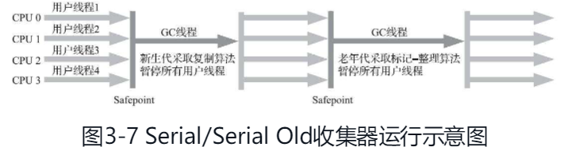
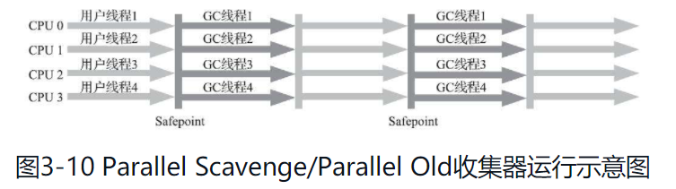
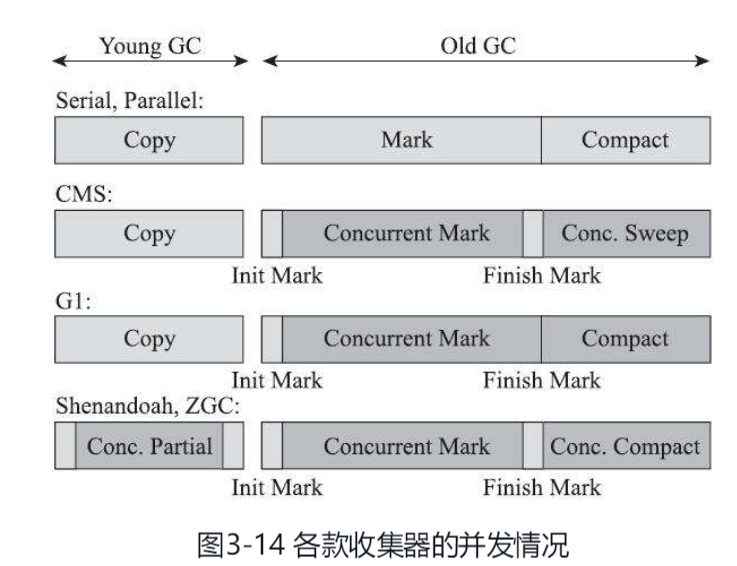
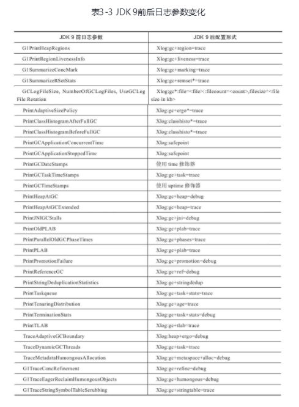

# 3.垃圾收集器与内存分配策略

## 3.1 概述

垃圾收集（Garbage Collect,GC）并非Java独有，GC主要解决以下三个问题

1. 哪些对象（内存）需要回收

   判断对象已死，引用计数 /GC Roots追溯

2. 什么时候回收

   safe point?

   完成标记后？

3. 如何回收

   垃圾收集算法

   标记-清除

   标记-复制

   标记-整理


**为什么要了解垃圾收集和内存分配？**

> 当需要排查各种内存溢出、内存泄漏问题时，当垃圾收集成为系统达到更高并发量的瓶颈时，我们就必须对这些“自动化”的技术实施必要的监控和调节。


**什么内存需要回收？**

JMM中将内存划分为五个部分，其中PC，本地方法栈、虚拟机栈都是线程私有的，随着线程的创建，方法的调用而产生内存占用，随着线程、方法的结束而自动释放内存，因此这些部分不需要GC。

垃圾收集器主要关注堆与方法区占用的内存，这部分的内存占用多少会随着运行动态变化。

## 3.2 对象已死？

> 在堆里面存放着Java世界中几乎所有的对象实例，垃圾收集器在对堆进行回收前，第一件事情就是要确定这些对象之中哪些还“存活”着，哪些已经“死去”（“死去”即不可能再被任何途径使用的对象）了。

### 3.2.1 引用计数法

引用计数（Reference Counting）判断每个对象被多少个其他对象引用，若存在被引用说明对象存活

问题：循环引用

### 3.2.2可达性分析算法

可达性分析（Reachability Analysis）通过GC Roots 作为起始节点向下搜索被GC Roots引用的对象，若对象到GC Roots对象有引用链说明对象可达。

GC Roots对象

- 栈帧本地变量表中存在的参数、局部变量，临时变量
- 静态变量 常量
- 本地方法对象
- Java虚拟机内部引用或反应内部情况的对象
- 被锁定的对象


GC Roots对象基本上就是Java运行时所需的对象

### 3.2.3再谈引用

> 我们希望能描述一类对象：当内存空间还足够时，能保留在内存之中，如果内存空间在进行垃圾收集后仍然非常紧张，那就可以抛弃这些对象——很多系统的缓存功能都符合这样的应用场景

为此，诞生了Java的四种引用：

- 强引用（Strongly Reference）

  即使内存溢出也不会被回收，就是运行时需要的对象，new出来的对象基本都是强引用对象

- 软引用（Soft Reference）

  还有用但非必要对象，内存溢出前会把这些对象二次回收

  ```java
  /**
   * @author Satsuki
   * @time 2020/7/4 11:27
   * @description:
   * 软引用
   * 内存足够不被回收
   * 内存不够会被回收
   * 用于缓存
   */
  public class SoftReferenceDemo {
  
  
      public static void softRefMemoryEnough(){
          Object o1 = new Object();
          SoftReference<Object> softReference = new SoftReference<>(o1);
          System.out.println(o1);
          System.out.println(softReference.get());
  
          // 回收下，内存够用不被回收
          o1 = null;
          System.gc();
  
          System.out.println(o1);
          System.out.println(softReference.get());
  
      }
  
      /**
       * JVM配置创建大对象配置小内存导致OOM，内存不够用，看软引用是否被回收
       * -Xms5m -Xmx5m -XX:+PrintGCDetails
       *
       */
      public static void softRefMemoryNotEnough(){
          Object o1 = new Object();
          SoftReference<Object> softReference = new SoftReference<>(o1);
          System.out.println(o1);
          System.out.println(softReference.get());
  
          o1 = null;
          System.gc();
  
          try {
              // 分配超大对象占完内存空间导致OOM
              byte[] bytes = new byte[30*1024*1024];
          } catch (Exception e) {
              e.printStackTrace();
          } finally {
              // finally语句块中定义即使OOM也打印下看软引用是否在OOM之前触发被回收
              System.out.println(o1);
              System.out.println(softReference.get());
          }
  
      }
  
      public static void main(String[] args) {
  
  //        softRefMemoryEnough();
  
          softRefMemoryNotEnough();
  
      }
  
  }
  ```

  

- 弱引用（Weak Reference）

  一旦GC工作就被回收

  ```java
  public static void main(String[] args) {
      Object o1 = new Object();
      WeakReference<Object> weakReference = new WeakReference<>(o1);
      System.out.println(o1);
      System.out.println(weakReference.get());
  
      // 回收前把o1置null否则还是强引用
      o1 = null;
      // 回收
      System.gc();
  
      System.out.println(o1);
      System.out.println(weakReference.get());
  
  }
  ```

- 虚引用（Phantom Reference）

  无法通过需引用获取对象实例，只是为了在虚引用对象被GC回首时收到一个系统通知，用于追踪GC运行过程

  ```java
  public static void main(String[] args) throws InterruptedException {
      Object o1 = new Object();
      ReferenceQueue<Object> referenceQueue = new ReferenceQueue<>();
      PhantomReference<Object> phantomReference = new PhantomReference<>(o1,referenceQueue);
      // GC前，虚引用不管啥get都返回null
      System.out.println(o1);
      System.out.println(phantomReference.get());
      System.out.println(referenceQueue.poll());
  
      System.out.println("==================");
  
      // 回收对象查看引用队列
      o1 = null;
      System.gc();
      Thread.sleep(500);
  
  
      // 回收后都是null但引用队列在回收前添加了一个被回收的对象
      // 虚引用GC后会放入引用队列
      // 虚引用一般配合引用队列使用
      System.out.println(o1);
      System.out.println(phantomReference.get());
      System.out.println(referenceQueue.poll());
  }
  ```


### 3.2.4 生存还是死亡

对象若重写`finalize()`方法可通过这个方法的执行让自己与GC Roots对象挂钩来复活，但这个方法只能使用一次，并且占用额外资源，尽量不要用。

### 3.2.5回收方法区

回收方法区性价比很低ZGC中没有方法区的概念（暂时）只有大对象占用了一块符合自身大小的region这块区域不会被回收。

> 方法区的垃圾收集主要回收两部分内容：废弃的常量和不再使用的类型。

常量只要没有被引用就能被回收

类对象则需要

1. 没有实例化的对象
2. 没有类加载器
3. 没有被反射

> 在大量使用反射、动态代理、CGLib等字节码框架，动态生成JSP以及OSGi这类频繁自定义类加载器的场景中，通常都需要Java虚拟机具备类型卸载的能力，以保证不会对方法区造成过大的内存压力。

## 3.3垃圾收集算法

> 从如何判定对象消亡的角度出发，垃圾收集算法可以划分为“引用计数式垃圾收集”（Reference Counting GC）和“追踪式垃圾收集”（Tracing GC）两大类，这两类也常被称作“直接垃圾收集”和“间接垃圾收集”。

这里主要讨论追踪式垃圾收集

### 3.3.1分代收集理论

当前大多数垃圾收集器都遵循分代收集（Generational Collection）

分代收集建立在一些假说之上

1. 弱分代假说（Weak Generational Hypothesis）

   绝大多数对象都是朝生夕灭的

2. 强分代假说（Strong Generational Hypothesis）

   熬过越多次垃圾收集过程的对象就越难消亡


对象可根据生存周期进行划分

- 容易回收的对象放在一起方便执行高频率高回报的回收
- 不容易回收的对象放在一起进行低频率的回收

分代收集假说推出了对象要分代存放，并且根据不同区域使用不同的收集算法

JVM中一般将Java堆划分为两部分

1. 新生代（young generation）
2. 老年代（old generation）


分代收集理论引出一个问题：**对象不是孤立的，会存在跨代引用**

跨代引用通过整体遍历另一个对象空间会大量浪费资源，为了解决这个问题添加第三条推论

3.跨代引用假说（Intergenerational Reference Hypothesis）:跨代引用相对于同代引用来说仅占极少数

存在跨代引用的对象倾向同时消亡，在新生代存在对老年代的跨代引用，由于老年代对象一般难以回收，新生代对象会熬过多次GC从而进入老年代

**减少新生代对象跨代引用扫描整个老年代的解决方案记忆集（Remembered Set）**

1. 将老年代划分为若干个小块
2. 标识出老年代的哪一块内存会存在跨代引用，发生Minor GC只扫描这一块


**GC定义**

- 部分收集（Partial GC）

  - 新生代收集(Minor GC/Young GC)

  - 老年代收集(Major GC/Old GC)

    目前只有CMS支持老年代回收

  - 混合收集(Mixed GC)

- 整堆收集(Full GC)

### 3.3.2 标记-清除算法

两个阶段

1. 标记处要回收的对象
2. 统一回收


问题

1. 执行效率不稳定（大对象回收）
2. 内存碎片问题

### 3.3.3标记-复制算法

带整理的GC算法

解决标记清除算法随着要回收对象增加导致效率降低的问题，通过内存块复制到另一区域（并整理）来保证清理的效率以及内存的连续

Serial/ParNew/Parallel Scavenge新生代收集器都使用这种算法

问题

1. 内存浪费

解决

**通过8：1：1将新生代划分为Eden+两个survivor区域来避免内存浪费，因为新生代的特性每次回收大量内存，所以存货的对象占用内存不会很多，若超过survivor限制则直接进入老年代**

### 3.3.4标记-整理算法

标记与标记-清除算法一致，但最后回收是将所有对象移动到内存一端，然后清理掉边界以外的所有对象。

老年代算法，但移动对象与更新引用需要STW，避免运行对对象移动与清理造成影响

parallel scavenge注重吞吐量，CMS注重延迟

CMS是老年代垃圾收集器，采用标记-清理算法，在内存碎片太多后采用标记-整理算法

## 3.4 HotSpot的算法细节

### 3.4.1根节点枚举

GC Roots的节点主要在全局引用以及上下文引用，但对象过多

根节点枚举这个过程始终需要STW

HotSpot通过OopMap直接获取对象引用位置，在类加载完成，HotSpot计算对象引用，并记录引用位置

### 3.4.2安全点

使用OopMap会随着程序运行导致map变更，每条指令都要维护map成本太高

安全点就是更新OopMap的时间点，这个时间点不能太多也不能太少，太多影响性能太少影响准确性。

安全点选在程序长时间执行之前。

程序中断分为两种

1. 抢先式

   对程序运行不友好

2. 主动式

   设定标识位让线程沦陷然后主动终端

### 3.3.3 安全区域

在一段时间内对象关系不变的点，可理解为安全点的集合

### 3.4.4记忆集和卡表

为了解决跨代引用问题在新生代中维护记忆集来避免对整个老年代扫描。

记忆集的精度

- 字长精度

  每个机器字长（成本过高）

- 对象精度（对象内的跨代）

- 卡精度（一块区域）

  卡精度也称卡表（Card Table）是记忆集的一种实现方式

  卡表是一个数组，护具的每个元素都是一块内存叫卡页，成本低

### 3.4.5写屏障

解决怎么去维护记忆集的问题，通过写屏障（Write Barrier）。

写屏障可理解你额为AOP，虚拟机对引用类型复制就是整个切面，鞋品张在这些对象赋值指令前后产生一个唤醒通知，供程序做额外动作。


卡表在高并发场景下由于操作系统底层的缓存行为单位存储 存在伪共享问题，多线程修改的变量位于同一缓存行，则变量的变更需提醒其他线程导致操作变慢。

假设一个卡页512B一个卡表64个卡页，只要操作的对象位于64*512 = 32KB的内存内就会造成伪共享问题。

解决方案：不无条件执行写屏障，先检查卡表标记，只有在卡表元素被修改过才将其标记为变脏

### 3.4.6 并发的可达性分析

GC Roots通过OopMap等优化时间段所以SWT 而并发标记阶段则占用大量时间不能STW 所以需要和用户程序一起执行，通过三色标记（Tri-color Marking）来保障一致性。

- 白色

  未被访问或不可达

- 黑色

  访问完成 可达

- 灰色

  至少还有一个引用未被访问


三色标记解决的问题：由于和用户线程并发执行导致对象引用变更，若改回收的对象标记为黑色那还好，等待下一次回收即可

但不该回收对象被标记为白色则会导致程序出错

两个将黑色对象错误的标记为白色的必要条件

1. 赋值器插入了一条或多条黑色到白色对象的引用
2. 赋值器删除了全部灰色对象到该白色对象的直接或间接引用


为了破坏这两个条件产生了两种方案

1. 增量更新（Increment update）

   黑色对象一旦新插入了对白色对象的引用变回灰色对象需要从他开始重新扫描，类似MVCC 与乐观锁，加入对象变更导致重要数据变化需要重新扫描

2. 原始快照（Snapshot at the beginning,STAB）

   下引用删除时记录这些对象，将其置为灰色重新扫描

两种都是在对象发生某一点的变更时记录并重新扫描

CMS 增量更新

G1 shenandoah 原始快照


### 3.4.7小结

HotSpot虚拟机下

1. 如何发起内存回收

   通过分代收集假说产生的分代收集算法发起

2. 如何加速内存回收

   OopMap加速GC Roots的寻找

   通过记忆集及其实现 卡表 快速找到新生代对老年代的跨代引用

3. 如何保证回收正确性及一致性

   通过三色算法保证回收的正确性及一致性

## 复习

- 什么内存需要回收

  线程私有的内存确定，且随着线程而生灭，较为容易，不用管理

  主要的内存管理区域是堆以及方法区

  方法区收集效率低

  垃圾判定算法

  - 引用计数

    循环引用问题，需要大量额外处理

    接用weakReference来打破循环引用

    判断是否引用并强制修改，对象循环引用判定算法，（之前我的实现是借助容器存储遍历过的节点，遍历过程中发现已经存在某个对象说明存在循环引用）

    存在循环引用打破循环，可采用弱引用，但产生野指针问题，需重构被弱引用回收的对象               

  - 可达性分析

    通过根节点(GC Roots)构建引用树，不在被树引用的就可以被标记清理， 不会产生循环引用的问题

    具体实现OOP 容器加速标记根节点对象

    根节点对象选择：不会被回收的对象

    - 静态变量，常量
    - jvm运行所需对象
    - 线程运行所需对象
    - 栈中方法调用所需对象
    - 被锁住的对象

- 什么时候回收

  什么情况触发GC

  空间不足

- 怎么回收

  垃圾收集算法

  标记-清除

  - 效率随着对象增多而降低
  - 内存碎片
  - CMS

  标记-复制

  - 解决标记清理的内存碎片问题
  - 最大问题内存利用率低，但这个问题在新生代的特性下可以不按1：1来划分而是8:1:1之类的规格划分从而更好的利用内存空间
  - serial parNew Parallel Scvange

  标记-整理

  - 解决空间浪费问题
  - 存在大对象移动负重高的问题
  - parallel Scavenge

  

  分代收集

  分代收集假说

  - 弱分代假说

    大多数对象朝生夕死

  - 强分代假说

    撑过越多次GC的对象越难被回收

  - 跨代收集假说

    跨代收集的对象只是少数，因为存在跨代引用的对象弱难以被回收会进入老年代进而消除跨代

  通过分代来划分出容易执行GC的内存和不易执行GC的内存从而更高效运行GC

  具体实现

  跨代收集需要维护记忆集，将空间按粒度划分可分为 对象 内存块等，卡表来实现记忆集从而更方便的跨代回收

- 三色标记

## 3.5经典垃圾收集器

1. Serial
2. ParNew
3. Parallel Scvange
4. CMS
5. SerialOld
6. Parallel Old


垃圾收集器是垃圾收集算法的实现 

收集器的组合使用随着版本会变更

根据环境选择合适收集器

### 3.5.1Serial

1. 会产生长时间STW
2. 简单，不会产生并发问题



在微服务场景下为每个服务分配的内存不会很多serial在不频繁收集的情况下可能也不错

### 3.5.2 ParNew收集器

Serial的多线程版本

能与CMS收集器配合

-XX：+UseConcMarkSweepGC 激活ParNew+CMS

-XX：+/-UseParNewGC 指定/禁用

JDK9取消ParNew+Serial Old / Serial+CMS

XX：ParallelGCThreads 限制收集线程数


> ·并行（Parallel）：并行描述的是多条垃圾收集器线程之间的关系，说明同一时间有多条这样的线程在协同工作，通常默认此时用户线程是处于等待状态。·并发（Concurrent）：并发描述的是垃圾收集器线程与用户线程之间的关系，说明同一时间垃圾收集器线程与用户线程都在运行。由于用户线程并未被冻结，所以程序仍然能响应服务请求，但由于垃圾收集器线程占用了一部分系统资源，此时应用程序的处理的吞吐量将受到一定影响。

并行指多个GC线程互相合作，在多线程场景下也可能是并发

这里的并发语义指GC线程与用户线程的运行情况，是交替运行还是暂停用户线程只允许GC线程

### 3.5.3 Parallel Scavenge

与CMS对比

- CMS注重用户线程的低延迟低停顿
- Parallel Scavenge注重吞吐量（大量时间给用户线程运行）

> 如果读者对于收集器运作不太了解，手工优化存在困难的话，使用Parallel Scavenge收集器配合自适应调节策略，把内存管理的调优任务交给虚拟机去完成也许是一个很不错的选择。只需要把基本的内存数据设置好（如-Xmx设置最大堆），然后使用-XX：MaxGCPauseMillis参数（更关注最大停顿时间）或-XX：GCTimeRatio（更关注吞吐量）参数给虚拟机设立一个优化目标，那具体细节参数的调节工作就由虚拟机完成了。自适应调节策略也是Parallel Scavenge收集器区别于ParNew收集器的一个重要特性。

PS+PO



实际上不管如何，Serial/Parallel 都是需要STW的，区别在于单线程还是多线程收集，或者说关注收集细节，但实质上还是STW


CMS关注停顿，而PS关注吞吐量（用户代码运行时间/(用户代码运行+GC时间)）
$$
\frac{用户代码运行时间}{用户代码运行时间+GC时间}
$$
可自适应调节。

若GC运行的时间少，并不会加快，反而说明清理空间少，那么GC会更频繁

### 3.5.6 CMS收集器

解决GC时产生的STW导致服务不可用

> CMS（Concurrent Mark Sweep）收集器是一种以获取最短回收停顿时间为目标的收集器。目前很大一部分的Java应用集中在互联网网站或者基于浏览器的B/S系统的服务端上，这类应用通常都会较为关注服务的响应速度，希望系统停顿时间尽可能短，以给用户带来良好的交互体验。CMS收集器就非常符合这类应用的需求。

分为四个步骤

1. 初始标记

2. 并发标记

   时间长但是可与用户线程并发执行

   通过三色算法，主要的思想就是在标记的过程中一旦对象的引用发生改变则记录下来，标记完成后发现还有问题就从对象引用关系变化处重新搜索标记

3. 重新标记

   解决并发标记阶段由并发执行用户线程产生的引用变化问题

4. 并发清除


由于最耗时的两个阶段与用户线程并发执行，所以总体而言可看作与用户线程并发执行的收集器。

> CMS默认启动的回收线程数是（处理器核心数量+3）/4，也就是说，如果处理器核心数在四个或以上，并发回收时垃圾收集线程只占用不超过25%的处理器运算资源，并且会随着处理器核心数量的增加而下降。


但CMS堆CPU的要求高,核心数少说明处理线程能力弱，多线程带来的切换负担增加反而可能降低性能。

由于采用标记-清理 算法 所以没有连续空间分配对象内存的时候会产生Full GC 并且是带着整理的，这段对象移动产生的消耗无法变短。（shenandoah/ZGC 可进行并发移动对象）

**CMS默认启动的回收线程数是（处理器核心数量+3）/4，也就是说，如果处理器核心数在四个或以上**

### 3.5.7 Garbage First 收集器

基于Region的内存布局与管理。

JDK9后G1是默认收集器取代PS+PO。

JDK10后进行实现解耦，抽取接口实现与抽象分离从而方便编译器的扩展与替换也进一步替换CMS。

G1将内存划分为一个个区域，区域又被标记为新生代（Eden、Survivor）、老年代 。

跨代引用问题，需要采用双向卡表结构来解决，额外消耗内存大约10%-20%左右的内存用户解决跨代引用问题。

**并发运行问题**

1. CMS通过增量更新
2. G1采用原始快照SATB

> 相比起增量更新算法，原始快照搜索能够减少并发标记和重新标记阶段的消耗，避免CMS那样在最终标记阶段停顿时间过长的缺点，但是在用户程序运行过程中确实会产生由跟踪引用变化带来的额外负担。

**运行过程**

1. 初始标记

   与MinorGC同步进行，实际不消耗时间

2. 并发标记

3. 最终标记

   SWT处理SATB

4. 筛选回收

   存活对象移动到空的region再整体清空region，但可根据用户指定的期望时间来定制回收计划。

   


并发收集器选择

> 按照笔者的实践经验，目前在小内存应用上CMS的表现大概率仍然要会优于G1，而在大内存应用上G1则大多能发挥其优势，这个优劣势的Java堆容量平衡点通常在6GB至8GB之间，当然，以上这些也仅是经验之谈，不同应用需要量体裁衣地实际测试才能得出最合适的结论，随着HotSpot的开发者对G1的不断优化，也会让对比结果继续向G1倾斜。


**G1的跨代引用问题更严重，内存集需维护双向卡表结构。占用内存更多**

## 3.6低延迟垃圾收集器

衡量垃圾收集器的指标

- 内存占用（footprint）
- 吞吐量（throughput）
- 低延迟（latency）


硬件提升 内存扩大 提高吞吐量 要被回收的内存也更多，将提高延迟通过三色标记算法并发执行GC以及用户线程从而提高效率

CMS会带来内存碎片问题从而STW G1虽然通过粒度细化减少停顿但毕竟还是有停顿



### 3.6.1shenandoah

目标:任何内存大小下都只有10ms停顿

G1后继者，G1借助shenandoah实现多线程Full GC

> Shenandoah摒弃了在G1中耗费大量内存和计算资源去维护的记忆集，改用名为“连接矩阵”（Connection Matrix）的全局数据结构来记录跨Region的引用关系，降低了处理跨代指针时的记忆集维护消耗，也降低了伪共享问题（见3.4.4节）的发生概率

工作流程

- 初始标记

- 并发标记

- 最终标记

- 并发清理

  清理无存活对象的region与G1不同

- 并发回收

  将回收集存活对象移动到其他空闲区域

  通过读屏障和BrooksPointers 解决对象转移的与用户线程一起运行的并发问题

  并发回收阶段运行的时间长短取决于回收集的大小。

- 初始引用更新

  设置线程集合点，准备引用更新

- 并发引用更新

  不需要遍历对象图的更新

- 最终引用更新

  修改GC Roots中的引用

- 并发清理

  引用更新后所有的回收集都不存在存活对象，此时全部清空即可

**若访问过期对象通过保护陷阱自动转发对象引用**

> Brooks提出的新方案不需要用到内存保护陷阱，而是在原有对象布局结构的最前面统一增加一个新的引用字段，在正常不处于并发移动的情况下，该引用指向对象自己

使用CAS解决对象移动与对象变化产生的并发问题


**对象访问通过内存屏障解决并发问题，读屏障比写屏障多 shenandoah使用读屏障，后改为引用访问屏障降低原生操作的影响**

### 3.6.2 ZGC

> ZGC收集器是一款基于Region内存布局的，（暂时）不设分代的，使用了读屏障、染色指针和内存多重映射等技术来实现可并发的标记-整理算法的，以低延迟为首要目标的一款垃圾收集器。

shenandoah基于G1 使用分代，使用读屏障 三色标记，brook pointer

ZGC的Region具有动态性，容量分为小（256KB）、中（4MB）、大（4MB以上）。复制大对象代价昂贵

**并发整理**

- shenandoah使用读屏障+brook pointer(转发指针)

- ZGC使用染色指针

  > ZGC的染色指针是最直接的、最纯粹的，它直接把标记信息记在引用对象的指针上，这时，与其说可达性分析是遍历对象图来标记对象，还不如说是遍历“引用图”来标记“引用”了。
  >
  > ZGC的染色指针技术继续盯上了这剩下的46位指针宽度，将其高4位提取出来存储四个标志信息。通过这些标志位，虚拟机可以直接从指针中看到其引用对象的三色标记状态、是否进入了重分配集（即被移动过）、是否只能通过finalize()方法才能被访问到


染色指针三大优势

- region划分更细 其中对象移出后方便回收
- 减少读写屏障使用
- 便于扩展


**运行过程**

- 并发标记

  > 与G1、Shenandoah不同的是，ZGC的标记是在指针上而不是在对象上进行的，标记阶段会更新染色指针中的Marked 0、Marked 1标志位。

- 并发预备重分配

  找到要清理的region

- 并发重分配

  对象移动 **记录转发表** 可自愈，对象引用发生变化第一次根据指针标记了解变化后通过转发表将指针改为正确位置，并且修改标记从而自愈

- 并发重映射

  在下一次遍历时顺便重分配，提高效率，因为自愈功能无须着急进行引用更新


## 3.7选择合适的垃圾收集器

### 3.7.1 Epsilon

不带回收的GC只拥有对象分配，堆内存管理、布局与解释器、编译器、监控子系统写作等功能。

### 3.7.2 收集器的权衡

- 应用程序的关注点

  是更希望程序多运行还是低延迟还是低内存

  分别对应科学计算、面向用户、嵌入式

- 运行环境

  例如操作系统等

- JDK发行商及版本


> ·如果你有充足的预算但没有太多调优经验，那么一套带商业技术支持的专有硬件或者软件解决方案是不错的选择，Azul公司以前主推的Vega系统和现在主推的ZingVM是这方面的代表，这样你就可以使用传说中的C4收集器了。
>
> ·如果你虽然没有足够预算去使用商业解决方案，但能够掌控软硬件型号，使用较新的版本，同时又特别注重延迟，那ZGC很值得尝试。
>
> ·如果你对还处于实验状态的收集器的稳定性有所顾虑，或者应用必须运行在Win-dows操作系统下，那ZGC就无缘了，试试Shenandoah吧。
>
> ·如果你接手的是遗留系统，软硬件基础设施和JDK版本都比较落后，那就根据内存规模衡量一下，对于大概4GB到6GB以下的堆内存，CMS一般能处理得比较好，而对于更大的堆内存，可重点考察一下G1。


参数总结




## 3.8实战:内存分配与回收策略

> Java技术体系的自动内存管理，最根本的目标是自动化地解决两个问题：自动给对象分配内存以及自动回收分配给对象的内存。

### 3.8.1对象优先在eden分配

对象优先在eden分配，空间不够引发minor gc，若设置了PretenureSizeThreshold 则超过指定大小的对象直接进入老年代

通过-XX：MaxTenuringThreshold设置存活多少次可以进入老年代


### 3.8.2动态对象年龄判定

> 为了能更好地适应不同程序的内存状况，HotSpot虚拟机并不是永远要求对象的年龄必须达到-XX：MaxTenuringThreshold才能晋升老年代，如果在Survivor空间中相同年龄所有对象大小的总和大于Survivor空间的一半，年龄大于或等于该年龄的对象就可以直接进入老年代，无须等到-XX：MaxTenuringThreshold中要求的年龄。

### 3.8.3 空间分配担保

> 在发生Minor GC之前，虚拟机必须先检查老年代最大可用的连续空间是否大于新生代所有对象总空间，如果这个条件成立，那这一次Minor GC可以确保是安全的。

**Minror GC是否安全取决于老年代是否有足够的连续空间分配新生代要晋升的对象**

## 3.9 本章小结

> 本章介绍了垃圾收集的算法、若干款HotSpot虚拟机中提供的垃圾收集器的特点以及运作原理。通过代码实例验证了Java虚拟机中自动内存分配及回收的主要规则。

**垃圾收集算法**

- 标记-清除
- 标记-整理
- 标记-复制


HotSpot虚拟机中提供的垃圾收集器的特点以及运作原理

1. Serial
2. ParNew
3. Parallel Scavenge
4. CMS
5. Serial Old
6. Parallel Old
7. G1
8. Shenandoah
9. ZGC